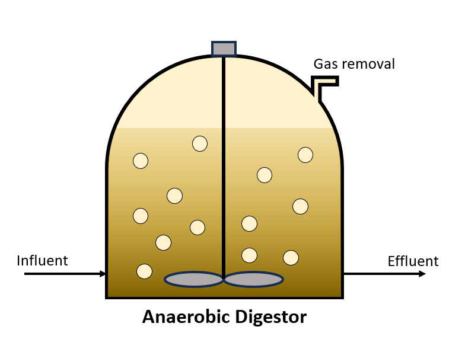

Anaerobic Digestion Model No. 1
===============================

Introduction
------------

The IWA created Anaerobic Digestion Model No. 1 with a mathematical model to predict anaerobic digestion scenarios. 
The objective of the mathematical model is to simulate biological reactions simultaneously with the disintegration, uptake, and decay of microorganisms
in anaerobic sludge. The property and reaction relationships `ADM1
<https://watertap.readthedocs.io/en/latest/technical_reference/property_models/ADM1.html>`_
of an anaerobic digestion model for industrial wastewater treatment from food and beverage production using an anaerobic digester as provided in 
`Batstone, D. J. et al. (2002) 
<https://iwaponline.com/wst/article-abstract/45/10/65/6034/The-IWA-Anaerobic-Digestion-Model-No-1-ADM1?redirectedFrom=fulltext>`_ and `Rosen, C. et al. 
(2006) <https://pubmed.ncbi.nlm.nih.gov/17037165/>`_
Implementation
--------------

Figure 1 shows the process flow diagram for ADM1 where the flowsheet only includes the anaerobic digester ehich processes sludge to produce a 
biogas stream and residual sludge. S_h2 and S_ch4 exist in both vapor phase and liquid phase, S_co2 exists vapor phase, and the other components 
only exist in the liquid phase. The amount of CO2 dissolved in the liquid phase is equivalent to S_IC - S_HCO3-.
The flowsheet relies on the following key assumptions:

   * supports steady-state only
   * property and reaction packages are provided for the anaerobic digester model (ADM)

    Figure 1. ADM1 flowsheet

Documentation for each of the unit models can be found below. All unit models were set up with their default configuration arguments.
    * `Anaerobic digester <https://watertap.readthedocs.io/en/latest/technical_reference/unit_models/anaerobic_digester.html>`_

Documentation for the property model can be found below.
    * `ADM1 <https://watertap.readthedocs.io/en/latest/technical_reference/property_models/ADM1.html>`_

Degrees of Freedom
------------------
The following variables are initially specified for simulating the ADM1 flowsheet (i.e., degrees of freedom = 0):
    * sludge conditions (flow, temperature, pressure, component concentrations, and alkalinity)
    * anaerobic digester liquid volume, vapor volume, and liquid outlet temperature

Flowsheet Specifications
------------------------

.. csv-table::
   :header: "Description", "Value", "Units"

   "**Sludge**:math:`^1`"
   "Volumetric flow","170", ":math:`\text{m}^3\text{/day}`"
   "Temperature", "308.15", ":math:`\text{K}`"
   "Pressure", "1", ":math:`\text{atm}`"
   "Monosaccharides (S_su) concentration", "10", ":math:`\text{mg/}\text{m}^3`"
   "Amino acids (S_aa) concentration", "1", ":math:`\text{mg/}\text{m}^3`"
   "Long chain fatty acids (S_fa) concentration", "1", ":math:`\text{mg/}\text{m}^3`"
   "Total valerate (S_va) concentration", "1", ":math:`\text{mg/}\text{m}^3`"
   "Total butyrates (S_bu) concentration", "1", ":math:`\text{mg/}\text{m}^3`"
   "Total propionate (S_pro) concentration", "1", ":math:`\text{mg/}\text{m}^3`"
   "Total acetate (S_ac) concentration", "1", ":math:`\text{mg/}\text{m}^3`"
   "Hydrogen gas (S_h2) concentration", "1e-5", ":math:`\text{mg/}\text{m}^3`"
   "Methane gas (S_ch4) concentration", "1e-2", ":math:`\text{mg/}\text{m}^3`"
   "Inorganic carbon (S_IC) concentration", "40", ":math:`\text{mmol/}\text{m}^3`"
   "Inorganic nitrogen (S_IN) concentration", "1", ":math:`\text{mmol/}\text{m}^3`"
   "Soluble inerts (S_I) concentration", "20", ":math:`\text{mg/}\text{m}^3`"
   "Composites (X_c) concentration", "2000", ":math:`\text{mg/}\text{m}^3`"
   "Carbohydrates (X_ch) concentration", "5000", ":math:`\text{mg/}\text{m}^3`"
   "Proteins (X_pr) concentration", "20000", ":math:`\text{mg/}\text{m}^3`"
   "Lipids (X_li) concentration", "5000", ":math:`\text{mmol/}\text{m}^3`"
   "Sugar degraders (X_su) concentration", "0", ":math:`\text{mmol/}\text{m}^3`"
   "Amino acid degraders (X_aa) concentration", "10", ":math:`\text{mmol/}\text{m}^3`"
   "Long chain fatty acid (LCFA) degraders (X_fa) concentration", "10", ":math:`\text{mg/}\text{m}^3`"
   "Valerate and butyrate degraders (X_c4) concentration", "10", ":math:`\text{mg/}\text{m}^3`"
   "Propionate degraders (X_pro) concentration", "10", ":math:`\text{mg/}\text{m}^3`"
   "Acetate degraders (X_ac) concentration", "10", ":math:`\text{mg/}\text{m}^3`"
   "Hydrogen degraders (X_h2) concentration", "10", ":math:`\text{mg/}\text{m}^3`"
   "Particulate inerts (X_I) concentration", "10", ":math:`\text{mg/}\text{m}^3`"
   "Total cation equivalents concentration (S_cat) concentration", "40", ":math:`\text{mmol/}\text{m}^3`"
   "Total anion equivalents concentration (S_an) concentration", "20", ":math:`\text{mmol/}\text{m}^3`"

   "**Anaerobic Digester**"
   "Anaerobic digester liquid volume", "3400", ":math:`\text{m}^3`"
   "Anaerobic digester vapor volume", "300", ":math:`\text{m}^3`"
   "Anaerobic digester liquid outlet temperature", "308.15", ":math:`\text{m}^3`"

Future Refinements
------------------

The following modifications to ADM1 are planned for development:
    * Adding thermal energy requirements to the anaerobic digester

References
----------
[1] Batstone, D.J., Keller, J., Angelidaki, I., Kalyuzhnyi, S.V., Pavlostathis, S.G., Rozzi, A., Sanders, W.T.M., Siegrist, H.A. and Vavilin, V.A., 2002.
The IWA anaerobic digestion model no 1 (ADM1).
Water Science and technology, 45(10), pp.65-73.
https://iwaponline.com/wst/article-abstract/45/10/65/6034

[2] Rosen, C. and Jeppsson, U., 2006.
Aspects on ADM1 Implementation within the BSM2 Framework.
Department of Industrial Electrical Engineering and Automation, Lund University, Lund, Sweden, pp.1-35.
https://www.iea.lth.se/WWTmodels_download/TR_ADM1.pdf