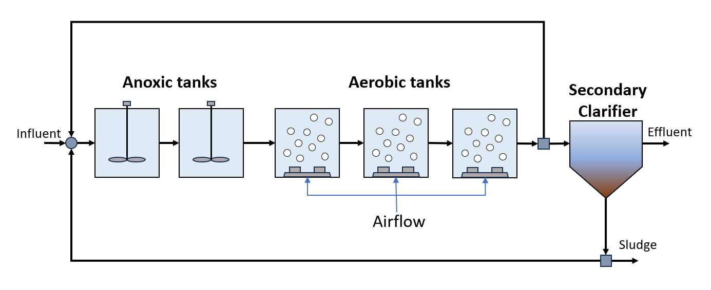

Activated Sludge Model No. 1
============================

Introduction
------------

Activated Sludge Model No. 1 was created by the IWA to create a mathematical model to predict the output of activated sludge 
models. The model aims to incorporate carbon oxidation, nitrification, and denitrification. The model quantifies 
the kinetics and stoichiometry of each process. The property and reaction relationships `ASM1
<https://watertap.readthedocs.io/en/latest/technical_reference/property_models/ASM1.html>`_
are based on the relationships provided for the activated sludge biological reactor provided in `Henze, M. et al. (1987) 
<https://belinra.inrae.fr/doc_num.php?explnum_id=4467>`_.

Implementation
--------------

Figure 1 shows the process flow diagram for ASM1, where influent wastewater is fed to a series of activated sludge
reactors and a secondary clarifier (secondary treatment). CSTRs are used to model the two anoxic reactors in the activated
sludge process and CSTRs with injection (which accounts for aeration tanks) are used to model the three aerobic reactors.
Finally, the effluent is passed through a clarifier. Note that a pressure changer is required in the recycle stream to ensure the
pressure inside the recycle loop, is bounded. As the inlet Mixer uses a pressure minimization constraint and there is no pressure 
drop in the reactors, if pressure is not specified at some point within the recycle loop then it becomes unbounded.
The flowsheet relies on the following key assumptions:

   * supports steady-state only
   * property and reaction packages are provided for the activated sludge model (ASM)
   * the clarifier is modeled as a separator with split fractions by components

    Figure 1. ASM1 flowsheet

Documentation for each of the unit models can be found below. All unit models were set up with their default configuration arguments.
    * `CSTR <https://idaes-pse.readthedocs.io/en/latest/reference_guides/model_libraries/generic/unit_models/cstr.html>`_
    * Aeration tank
    * Secondary clarifier

Documentation for the property model can be found below.
    * `ASM1 <https://watertap.readthedocs.io/en/latest/technical_reference/property_models/ASM1.html>`_

Degrees of Freedom
------------------
The following variables are initially specified for simulating the ASM1 flowsheet (i.e., degrees of freedom = 0):
    * feed water conditions (flow, temperature, pressure, component concentrations, and alkalinity)
    * volume of activated sludge reactors
    * component injection rates for aerobic reactors
    * secondary clarifier split fraction(s)
    * pressure changer outlet pressure (feeds into the activated sludge process)

Flowsheet Specifications
------------------------

.. csv-table::
   :header: "Description", "Value", "Units"

   "**Feed Water**:math:`^1`"
   "Volumetric flow","18446", ":math:`\text{m}^3\text{/day}`"
   "Temperature", "298.15", ":math:`\text{K}`"
   "Pressure", "1", ":math:`\text{atm}`"
   "Soluble inert organic matter (S_I) concentration", "30", ":math:`\text{g/}\text{m}^3`"
   "Readily biodegradable substrate (S_S) concentration", "69.5", ":math:`\text{g/}\text{m}^3`"
   "Particulate inert organic matter (X_I) concentration", "51.2", ":math:`\text{g/}\text{m}^3`"
   "Slowly biodegradable substrate (X_S) concentration", "202.32", ":math:`\text{g/}\text{m}^3`"
   "Active heterotrophic biomass (X_B,H) concentration", "28.17", ":math:`\text{g/}\text{m}^3`"
   "Active autotrophic biomass (X_B,A) concentration", "0", ":math:`\text{g/}\text{m}^3`"
   "Particulate products arising from biomass decay (X_P) concentration", "0", ":math:`\text{g/}\text{m}^3`"
   "Oxygen (S_O) concentration", "0", ":math:`\text{g/}\text{m}^3`"
   "Nitrate and nitrite nitrogen (S_NO) concentration", "0", ":math:`\text{g/}\text{m}^3`"
   "NH4 :math:`^{+}` + NH :math:`_{3}` Nitrogen (S_NH) concentration", "31.56", ":math:`\text{g/}\text{m}^3`"
   "Soluble biodegradable organic nitrogen (S_ND) concentration", "6.95", ":math:`\text{g/}\text{m}^3`"
   "Particulate biodegradable organic nitrogen (X_ND) concentration", "10.59", ":math:`\text{g/}\text{m}^3`"
   "Alkalinity (S_ALK)", "7", ":math:`\text{mol/}\text{m}^3`"

   "**Activated Sludge Process**"
   "Reactor 1 volume", "1000", ":math:`\text{m}^3`"
   "Reactor 2 volume", "1000", ":math:`\text{m}^3`"
   "Reactor 3 volume", "1333", ":math:`\text{m}^3`"
   "Reactor 4 volume", "1333", ":math:`\text{m}^3`"
   "Reactor 5 volume", "1333", ":math:`\text{m}^3`"
   "Reactor 3 injection rate for component j", "0", ":math:`\text{g/}\text{s}`"
   "Reactor 4 injection rate for component j", "0", ":math:`\text{g/}\text{s}`"
   "Reactor 5 injection rate for component j", "0", ":math:`\text{g/}\text{s}`"
   "Reactor 3 outlet oxygen (S_O) concentration", "0.00172", ":math:`\text{g/}\text{m}^3`"
   "Reactor 4 outlet oxygen (S_O) concentration", "0.00243", ":math:`\text{g/}\text{m}^3`"
   "Reactor 5 outlet oxygen (S_O) concentration", "0.00449", ":math:`\text{g/}\text{m}^3`"
   "Reactor 5 underflow split fraction", "0.6", ":math:`\text{dimensionless}`"
   "Reactor 3 oxygen mass transfer coefficient", "10", ":math:`\text{hr}^{-1}`"
   "Reactor 4 oxygen mass transfer coefficient", "10", ":math:`\text{hr}^{-1}`"
   "Secondary clarifier H2O split fraction", "0.48956", ":math:`\text{dimensionless}`"
   "Secondary clarifier S_I split fraction", "0.48956", ":math:`\text{dimensionless}`"
   "Secondary clarifier S_S split fraction", "0.48956", ":math:`\text{dimensionless}`"
   "Secondary clarifier X_I split fraction", "0.00187", ":math:`\text{dimensionless}`"
   "Secondary clarifier X_S split fraction", "0.00187", ":math:`\text{dimensionless}`"
   "Secondary clarifier X_BH split fraction", "0.00187", ":math:`\text{dimensionless}`"
   "Secondary clarifier X_BA split fraction", "0.00187", ":math:`\text{dimensionless}`"
   "Secondary clarifier X_P split fraction", "0.00187", ":math:`\text{dimensionless}`"
   "Secondary clarifier S_O split fraction", "0.48956", ":math:`\text{dimensionless}`"
   "Secondary clarifier S_NO split fraction", "0.48956", ":math:`\text{dimensionless}`"
   "Secondary clarifier S_NH split fraction", "0.48956", ":math:`\text{dimensionless}`"
   "Secondary clarifier S_ND split fraction", "0.48956", ":math:`\text{dimensionless}`"
   "Secondary clarifier X_ND split fraction", "0.00187", ":math:`\text{dimensionless}`"
   "Secondary clarifier S_ALK split fraction", "0.48956", ":math:`\text{dimensionless}`"
   "Separator recycle split fraction", "0.97955", ":math:`\text{dimensionless}`"
   "Recycle pump outlet pressure", "101325", ":math:`\text{Pa}`"

Future Refinements
------------------

The following modifications to ASM1 are planned for development:
    * Improving costing relationships in terms of detail, completeness, and reasonable validity
    * Accounting for temperature-dependence in the oxygen mass transfer coefficient (KLa) and oxygen concentration at saturation
    * Replacing the ideal-separator formulation in the secondary clarifier with the widely used double-exponential settling model (i.e., the Takacs model)

References
----------
[1] Henze, M., Grady, C.P.L., Gujer, W., Marais, G.v.R., Matsuo, T.,
"Activated Sludge Model No. 1", 1987, IAWPRC Task Group on Mathematical Modeling
for Design and Operation of Biological Wastewater Treatment.
https://belinra.inrae.fr/doc_num.php?explnum_id=4467

[2] Alex, J. et al. Benchmark Simulation Model no.1 (BSM1). Lund University, 2008, 5-6.
https://www.iea.lth.se/publications/Reports/LTH-IEA-7229.pdf