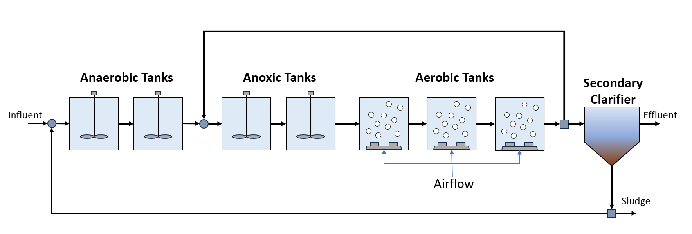

Activated Sludge Model No. 2d
=============================

Introduction
------------

The Activated Sludge Model No. 2d (ASM2d) represents a variation of the ASM1 model to account for biological phosphorus  with 
nitrification-denitrification. The  `ASM2d
<https://watertap.readthedocs.io/en/stable/technical_reference/property_models/ASM2D.html>`_ property and reaction relationships 
of an activated sludge model for biological nutrient removal from wastewater using an activated sludge biological reactor with 
biological phosphorus removal as provided in  `Henze, M. et al. (1999) 
<https://iwaponline.com/wst/article-abstract/39/1/165/4841/Activated-Sludge-Model-No-2d-ASM2D>`_.

Implementation
--------------

Figure 1 shows the process flow diagram for ASM2d, where influent wastewater is fed to a series of activated sludge
reactors and a secondary clarifier (secondary treatment). CSTRs are used to model the two anaerobic tanks and the two anoxic reactors 
in the activated sludge process and CSTRs with injection (which accounts for aeration tanks) are used to model the three aerobic reactors.
Finally, the effluent is passed through a clarifier. Note that a pressure changer is required in the recycle stream to ensure the
pressure inside the recycle loop, is bounded. As the inlet Mixer uses a pressure minimization constraint and there is no pressure 
drop in the reactors, if pressure is not specified at some point within the recycle loop then it becomes unbounded.
The flowsheet relies on the following key assumptions:

   * supports steady-state only
   * property and reaction packages are provided for the activated sludge model (ASM2d)
   * the clarifier is modeled as a separator with split fractions by components

    Figure 1. ASM2d flowsheet

Documentation for each of the unit models can be found below. All unit models were set up with their default configuration arguments.
    * `CSTR <https://idaes-pse.readthedocs.io/en/latest/reference_guides/model_libraries/generic/unit_models/cstr.html>`_
    * Aeration tank
    * Secondary clarifier

Documentation for the property model can be found below.
    * `ASM2d <https://watertap.readthedocs.io/en/stable/technical_reference/property_models/ASM2D.html>`_

Degrees of Freedom
------------------
The following variables are initially specified for simulating the ASM2d flowsheet (i.e., degrees of freedom = 0):
    * feed water conditions (flow, temperature, pressure, component concentrations, and alkalinity)
    * volume of activated sludge reactors
    * component injection rates for aerobic reactors
    * secondary clarifier split fraction(s)
    * pressure changer outlet pressure (feeds into the activated sludge process)

Flowsheet Specifications
------------------------

.. csv-table::
   :header: "Description", "Value", "Units"

   "**Feed Water**:math:`^1`"
   "Volumetric flow","18446", ":math:`\text{m}^3\text{/day}`"
   "Temperature", "298.15", ":math:`\text{K}`"
   "Pressure", "1", ":math:`\text{atm}`"
   "Dissolved oxygen (S_O2) concentration", "1e-6", ":math:`\text{g/}\text{m}^3`"
   "Fermentable, readily bio-degradable organic substrates (S_F) concentration", "30", ":math:`\text{g/}\text{m}^3`"
   "Fermentation products, considered to be acetate (S_A) concentration", "20", ":math:`\text{g/}\text{m}^3`"
   "Ammonium plus ammonia nitrogen (S_NH4) concentration", "16", ":math:`\text{g/}\text{m}^3`"
   "Nitrate plus nitrite nitrogen (S_NO3) concentration", "1e-6", ":math:`\text{g/}\text{m}^3`"
   "Inorganic soluble phosphorus (S_PO4) concentration", "3.6", ":math:`\text{g/}\text{m}^3`"
   "Inert soluble organic material (S_I) concentration", "30", ":math:`\text{g/}\text{m}^3`"
   "Dinitrogen (S_N2) concentration", "1e-6", ":math:`\text{g/}\text{m}^3`"
   "Inert particulate organic material (X_I) concentration", "25", ":math:`\text{g/}\text{m}^3`"
   "Slowly biodegradable substrates (X_S) concentration", "125", ":math:`\text{g/}\text{m}^3`"
   "Heterotrophic organisms (X_H) concentration", "30", ":math:`\text{g/}\text{m}^3`"
   "Phosphate-accumulating organisms (X_PAO) concentration", "1e-6", ":math:`\text{g/}\text{m}^3`"
   "Poly-phosphate (X_PP) concentration", "1e-6", ":math:`\text{g/}\text{m}^3`"
   "Poly-hydroxy-alkanoate (X_PHA) concentration", "1e-6", ":math:`\text{g/}\text{m}^3`"
   "Autotrophic nitrifying organisms (X_AUT) concentration", "1e-6", ":math:`\text{g/}\text{m}^3`"
   "Metal-hydroxides (X_MeOH) concentration", "1e-6", ":math:`\text{g/}\text{m}^3`"
   "Metal-phosphate (X_MeP) concentration", "1e-6", ":math:`\text{g/}\text{m}^3`"
   "Total suspended solids, TSS (X_TSS) concentration", "180", ":math:`\text{g/}\text{m}^3`"
   "Alkalinity (S_ALK)", "7", ":math:`\text{mol/}\text{m}^3`"

   "**Activated Sludge Process**"
   "Reactor 1 volume", "1000", ":math:`\text{m}^3`"
   "Reactor 2 volume", "1000", ":math:`\text{m}^3`"
   "Reactor 3 volume", "1000", ":math:`\text{m}^3`"
   "Reactor 4 volume", "1000", ":math:`\text{m}^3`"
   "Reactor 5 volume", "1333", ":math:`\text{m}^3`"
   "Reactor 6 volume", "1333", ":math:`\text{m}^3`"
   "Reactor 7 volume", "1333", ":math:`\text{m}^3`"
   "Reactor 5 injection rate for component j", "0", ":math:`\text{g/}\text{s}`"
   "Reactor 6 injection rate for component j", "0", ":math:`\text{g/}\text{s}`"
   "Reactor 7 injection rate for component j", "0", ":math:`\text{g/}\text{s}`"
   "Reactor 5 outlet oxygen (S_O) concentration", "0.00191", ":math:`\text{g/}\text{m}^3`"
   "Reactor 6 outlet oxygen (S_O) concentration", "0.00260", ":math:`\text{g/}\text{m}^3`"
   "Reactor 7 outlet oxygen (S_O) concentration", "0.00320", ":math:`\text{g/}\text{m}^3`"
   "Reactor 7 underflow split fraction", "0.6", ":math:`\text{dimensionless}`"
   "Reactor 5 oxygen mass transfer coefficient", "240", ":math:`\text{hr}^{-1}`"
   "Reactor 6 oxygen mass transfer coefficient", "240", ":math:`\text{hr}^{-1}`"
   "Reactor 7 oxygen mass transfer coefficient", "84", ":math:`\text{hr}^{-1}`"
   "Secondary clarifier H2O split fraction", "0.48956", ":math:`\text{dimensionless}`"
   "Secondary clarifier S_A split fraction", "0.48956", ":math:`\text{dimensionless}`"
   "Secondary clarifier S_F split fraction", "0.48956", ":math:`\text{dimensionless}`"
   "Secondary clarifier S_I split fraction", "0.48956", ":math:`\text{dimensionless}`"
   "Secondary clarifier S_N2 split fraction", "0.48956", ":math:`\text{dimensionless}`"
   "Secondary clarifier S_NH4 split fraction", "0.48956", ":math:`\text{dimensionless}`"
   "Secondary clarifier S_NO3 split fraction", "0.48956", ":math:`\text{dimensionless}`"
   "Secondary clarifier S_O2 split fraction", "0.48956", ":math:`\text{dimensionless}`"
   "Secondary clarifier S_PO4 split fraction", "0.48956", ":math:`\text{dimensionless}`"
   "Secondary clarifier S_ALK split fraction", "0.48956", ":math:`\text{dimensionless}`"
   "Secondary clarifier X_AUT split fraction", "0.022117", ":math:`\text{dimensionless}`"
   "Secondary clarifier X_H split fraction", "0.021922", ":math:`\text{dimensionless}`"
   "Secondary clarifier X_I split fraction", "0.021715", ":math:`\text{dimensionless}`"
   "Secondary clarifier X_MeOH split fraction", "0.022", ":math:`\text{dimensionless}`"
   "Secondary clarifier X_MeP split fraction", "0.022", ":math:`\text{dimensionless}`"
   "Secondary clarifier X_PAO split fraction", "0.022", ":math:`\text{dimensionless}`"
   "Secondary clarifier X_PHA split fraction", "0.02147", ":math:`\text{dimensionless}`"
   "Secondary clarifier X_PP split fraction", "0.02144", ":math:`\text{dimensionless}`"
   "Secondary clarifier X_S split fraction", "0.02221", ":math:`\text{dimensionless}`"
   "Secondary clarifier X_TSS split fraction", "0.02194", ":math:`\text{dimensionless}`"
   "Separator recycle split fraction", "0.97955", ":math:`\text{dimensionless}`"
   "Recycle pump outlet pressure", "101325", ":math:`\text{Pa}`"

Future Refinements
------------------

The following modifications to ASM2d are planned for development:
    * Improving costing relationships in terms of detail, completeness, and reasonable validity
    * Accounting for temperature-dependence in the oxygen mass transfer coefficient (KLa) and oxygen concentration at saturation
    * Replacing the ideal-separator formulation in the secondary clarifier with the widely used double-exponential settling model (i.e., the Takacs model)
    
**NOTE: The repository also contains flowsheets for ASM2d modified for phosphorous removal**

References
----------
[1] M. Henze, W. Gujer, T. Mino, T. Matsuo, M.C. Wentzel, G. v. R. Marais, M.C.M. Van Loosdrecht, Activated sludge model No.2D, ASM2D, Water Science and
Technology. 39 (1999) 165–182. https://doi.org/10.1016/S0273-1223(98)00829-4.