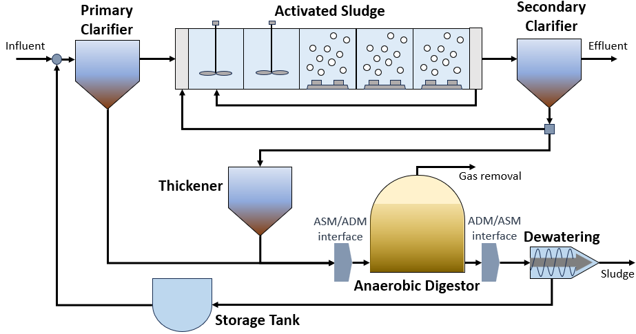

Benchmark Simulation Model No.2
===============================

Introduction
------------

The Benchmark Simulation Model No.2 (BSM2) is an industry benchmark for modeling a full biological wastewater
treatment plant that includes a primary clarifier, the activated sludge process, a thickener, an anaerobic digester,
and a dewatering unit. These unit processes are driven by biological reaction models that relate soluble and particulate wastewater
components to their respective process rate equations. While this BSM2 flowsheet can simply be used to
simulate and run techno-economic analyses on the operation of a conventional wastewater treatment plant,
an additional layer of utility can be derived from using BSM2 as a baseline for comparing alternative plant
configurations to a well-established standard and/or amongst the variations themselves by adding, removing,
or modifying unit processes using WaterTAP's flexible modeling capabilities.

Implementation
--------------

Figure 1 shows the process flow diagram for BSM2 where influent wastewater is fed
to a primary clarifier (primary treatment); the effluent is then passed to a series of activated sludge
reactors and a secondary clarifier (secondary treatment). CSTRs are used to model the two anoxic reactors in the activated
sludge process and CSTRs with injection (which accounts for aeration tanks) are used to model the three aerobic reactors.
Finally, the sludge is passed through a thickener and sent to the anaerobic digester. The anaerobic digester processes
the sludge to produce a biogas stream and residual sludge stream that passes through a dewatering unit which recycles
liquid to the headworks of the plant while sludge is released for disposal.
The flowsheet relies on the following key assumptions:

   * supports steady-state only
   * property and reaction package are provided for the activated sludge model (ASM)
   * property and reaction package are provided for the anaerobic digester model (ADM)
   * interfaces are provided to convert between the properties of ASM and ADM

    Figure 1. BSM2 flowsheet

Documentation for each of the unit models can be found below. All unit models were set up with their default configuration arguments.
    * `Thickener <https://watertap.readthedocs.io/en/latest/technical_reference/unit_models/thickener.html>`_
    * `Anaerobic digester <https://watertap.readthedocs.io/en/latest/technical_reference/unit_models/anaerobic_digester.html>`_
    * `Dewatering unit <https://watertap.readthedocs.io/en/latest/technical_reference/unit_models/dewatering_unit.html>`_
    * `CSTR <https://idaes-pse.readthedocs.io/en/latest/reference_guides/model_libraries/generic/unit_models/cstr.html>`_
    * `ADM1 to ASM1 Translator <https://watertap.readthedocs.io/en/latest/technical_reference/unit_models/translators/translator_adm1_asm1.html>`_
    * `ASM1 to ADM1 Translator <https://watertap.readthedocs.io/en/latest/technical_reference/unit_models/translators/translator_asm1_adm1.html>`_
    * `Aeration tank <https://watertap.readthedocs.io/en/latest/technical_reference/unit_models/aeration_tank.html>`_
    * `Primary clarifier <https://watertap.readthedocs.io/en/latest/technical_reference/unit_models/clarifier.html>`_
    * `Secondary clarifier <https://watertap.readthedocs.io/en/latest/technical_reference/unit_models/clarifier.html>`_

Documentation for each of the property models can be found below.
    * `ASM1 <https://watertap.readthedocs.io/en/latest/technical_reference/property_models/ASM1.html>`_
    * `ADM1 <https://watertap.readthedocs.io/en/latest/technical_reference/property_models/ADM1.html>`_

Documentation for the costing relationships can be found below.
    * `WaterTAP Costing Package <https://watertap.readthedocs.io/en/latest/technical_reference/costing/watertap_costing.html>`_

The objective function is to minimize the levelized cost of water, which can be represented by the following equation
where :math:`Q` represents volumetric flow, :math:`f_{crf}` represents capital recovery factor
:math:`C_{cap,tot}` represents total capital cost, :math:`C_{op,tot}` represents total operating cost, and
:math:`f_{util}` represents the utilization factor:

    .. math::

        LCOW_{Q} = \frac{f_{crf}   C_{cap,tot} + C_{op,tot}}{f_{util} Q}

Degrees of Freedom
------------------
The following variables are initially specified for simulating the BSM2 flowsheet (i.e., degrees of freedom = 0):
    * feed water conditions (flow, temperature, pressure, component concentrations, and alkalinity)
    * volume of activated sludge reactors
    * component injection rates for aerobic reactors
    * split fraction(s) for the recycle loop after the activated sludge reactors
    * secondary clarifier surface area and split fraction(s)
    * primary clarifier split fraction(s)
    * split fraction(s) for the separator following the secondary clarifier
    * pressure changer outlet pressure (feeds into the activated sludge process)
    * anaerobic digester liquid volume, vapor volume, and liquid outlet temperature
    * dewatering unit hydraulic retention time and specific energy consumption
    * thickener hydraulic retention time and diameter

Flowsheet Specifications
------------------------

.. csv-table::
   :header: "Description", "Value", "Units"

   "**Feed Water**:math:`^1`"
   "Volumetric flow","20648", ":math:`\text{m}^3\text{/day}`"
   "Temperature", "308.15", ":math:`\text{K}`"
   "Pressure", "1", ":math:`\text{atm}`"
   "Soluble inert organic matter (S_I) concentration", "27", ":math:`\text{g/}\text{m}^3`"
   "Readily biodegradable substrate (S_S) concentration", "58", ":math:`\text{g/}\text{m}^3`"
   "Particulate inert organic matter (X_I) concentration", "92", ":math:`\text{g/}\text{m}^3`"
   "Slowly biodegradable substrate (X_S) concentration", "363", ":math:`\text{g/}\text{m}^3`"
   "Active heterotrophic biomass (X_B,H) concentration", "50", ":math:`\text{g/}\text{m}^3`"
   "Active autotrophic biomass (X_B,A) concentration", "0", ":math:`\text{g/}\text{m}^3`"
   "Particulate products arising from biomass decay (X_P) concentration", "0", ":math:`\text{g/}\text{m}^3`"
   "Oxygen (S_O) concentration", "0", ":math:`\text{g/}\text{m}^3`"
   "Nitrate and nitrite nitrogen (S_NO) concentration", "0", ":math:`\text{g/}\text{m}^3`"
   "NH4 :math:`^{+}` + NH :math:`_{3}` Nitrogen (S_NH) concentration", "23", ":math:`\text{g/}\text{m}^3`"
   "Soluble biodegradable organic nitrogen (S_ND) concentration", "5", ":math:`\text{g/}\text{m}^3`"
   "Particulate biodegradable organic nitrogen (X_ND) concentration", "16", ":math:`\text{g/}\text{m}^3`"
   "Alkalinity (S_ALK)", "7", ":math:`\text{mol/}\text{m}^3`"

   "**Activated Sludge Process**"
   "Reactor 1 volume", "1000", ":math:`\text{m}^3`"
   "Reactor 2 volume", "1000", ":math:`\text{m}^3`"
   "Reactor 3 volume", "1333", ":math:`\text{m}^3`"
   "Reactor 4 volume", "1333", ":math:`\text{m}^3`"
   "Reactor 5 volume", "1333", ":math:`\text{m}^3`"
   "Reactor 3 injection rate for component j", "0", ":math:`\text{g/}\text{s}`"
   "Reactor 4 injection rate for component j", "0", ":math:`\text{g/}\text{s}`"
   "Reactor 5 injection rate for component j", "0", ":math:`\text{g/}\text{s}`"
   "Reactor 3 outlet oxygen (S_O) concentration", "0.00172", ":math:`\text{g/}\text{m}^3`"
   "Reactor 4 outlet oxygen (S_O) concentration", "0.00243", ":math:`\text{g/}\text{m}^3`"
   "Reactor 5 outlet oxygen (S_O) concentration", "0.00449", ":math:`\text{g/}\text{m}^3`"
   "Reactor 5 underflow split fraction", "0.6", ":math:`\text{dimensionless}`"
   "Reactor 3 oxygen mass transfer coefficient", "7.6", ":math:`\text{hr}^{-1}`"
   "Reactor 4 oxygen mass transfer coefficient", "5.7", ":math:`\text{hr}^{-1}`"
   "Secondary clarifier H2O split fraction", "0.48956", ":math:`\text{dimensionless}`"
   "Secondary clarifier S_I split fraction", "0.48956", ":math:`\text{dimensionless}`"
   "Secondary clarifier S_S split fraction", "0.48956", ":math:`\text{dimensionless}`"
   "Secondary clarifier X_I split fraction", "0.00187", ":math:`\text{dimensionless}`"
   "Secondary clarifier X_S split fraction", "0.00187", ":math:`\text{dimensionless}`"
   "Secondary clarifier X_BH split fraction", "0.00187", ":math:`\text{dimensionless}`"
   "Secondary clarifier X_BA split fraction", "0.00187", ":math:`\text{dimensionless}`"
   "Secondary clarifier X_P split fraction", "0.00187", ":math:`\text{dimensionless}`"
   "Secondary clarifier S_O split fraction", "0.48956", ":math:`\text{dimensionless}`"
   "Secondary clarifier S_NO split fraction", "0.48956", ":math:`\text{dimensionless}`"
   "Secondary clarifier S_NH split fraction", "0.48956", ":math:`\text{dimensionless}`"
   "Secondary clarifier S_ND split fraction", "0.48956", ":math:`\text{dimensionless}`"
   "Secondary clarifier X_ND split fraction", "0.00187", ":math:`\text{dimensionless}`"
   "Secondary clarifier S_ALK split fraction", "0.48956", ":math:`\text{dimensionless}`"
   "Secondary clarifier surface area", "1500", ":math:`\text{m}^2`"
   "Separator recycle split fraction", "0.985", ":math:`\text{dimensionless}`"
   "Recycle pump outlet pressure", "101325", ":math:`\text{Pa}`"

   "**Primary Clarifier**"
   "Primary clarifier H2O split fraction", "0.993", ":math:`\text{dimensionless}`"
   "Primary clarifier S_I split fraction", "0.993", ":math:`\text{dimensionless}`"
   "Primary clarifier S_S split fraction", "0.993", ":math:`\text{dimensionless}`"
   "Primary clarifier X_I split fraction", "0.5192", ":math:`\text{dimensionless}`"
   "Primary clarifier X_S split fraction", "0.5192", ":math:`\text{dimensionless}`"
   "Primary clarifier X_BH split fraction", "0.5192", ":math:`\text{dimensionless}`"
   "Primary clarifier X_BA split fraction", "0.5192", ":math:`\text{dimensionless}`"
   "Primary clarifier X_P split fraction", "0.5192", ":math:`\text{dimensionless}`"
   "Primary clarifier S_O split fraction", "0.993", ":math:`\text{dimensionless}`"
   "Primary clarifier S_NO split fraction", "0.993", ":math:`\text{dimensionless}`"
   "Primary clarifier S_NH split fraction", "0.993", ":math:`\text{dimensionless}`"
   "Primary clarifier S_ND split fraction", "0.993", ":math:`\text{dimensionless}`"
   "Primary clarifier X_ND split fraction", "0.5192", ":math:`\text{dimensionless}`"
   "Primary clarifier S_ALK split fraction", "0.993", ":math:`\text{dimensionless}`"

   "**Anaerobic Digester**"
   "Anaerobic digester liquid volume", "3400", ":math:`\text{m}^3`"
   "Anaerobic digester vapor volume", "300", ":math:`\text{m}^3`"
   "Anaerobic digester liquid outlet temperature", "308.15", ":math:`\text{m}^3`"

   "**Dewatering Unit**"
   "Dewatering unit hydraulic retention time", "1800", ":math:`\text{s}`"
   "Dewatering unit specific energy consumption", "0.069", ":math:`\text{kWh/}\text{m}^3`"

   "**Thickener**"
   "Thickener hydraulic retention time", "86400", ":math:`\text{s}`"
   "Thickener diameter", "10", ":math:`\text{kWh/}\text{m}`"

Additional Variables
--------------------

.. csv-table::
   :header: "Description", "Symbol", "Value", "Units"

   "Maximum total suspended solids concentration", ":math:`TSS_{max}`", "0.03", ":math:`\text{kg/}\text{m}^3`"
   "Maximum chemical oxygen demand", ":math:`COD_{max}`", "0.1", ":math:`\text{kg/}\text{m}^3`"
   "Maximum total nitrogen concentration", ":math:`N_{max}`", "0.018", ":math:`\text{kg/}\text{m}^3`"
   "Maximum 5-day biological oxygen demand", ":math:`BOD5_{max}`", "0.01", ":math:`\text{kg/}\text{m}^3`"

Additional Constraints
----------------------
The following constraints represent concentration limits on treated water (secondary effluent) discharged into the environment.
The subscript "out" represents the effluent from the secondary clarifier.

.. csv-table::
   :header: "Description", "Equation"

   "Total suspended solids concentration", ":math:`TSS_{out} <= TSS_{max}`"
   "Chemical oxygen demand", ":math:`COD_{out} <= COD_{max}`"
   "Total nitrogen concentration", ":math:`N_{out} <= N_{max}`"
   "5-day biological oxygen demand", ":math:`BOD5_{out} <= BOD5_{max}`"

Future Refinements
------------------

The following modifications to BSM2 are planned for development:
    * Improving costing relationships in terms of detail, completeness, and reasonable validity
    * Accounting for temperature-dependence in the oxygen mass transfer coefficient (KLa) and oxygen concentration at saturation
    * Adding thermal energy requirements to the anaerobic digester and refining energy consumption estimates for units collectively
    * Replacing the ideal-separator formulation in the secondary clarifier with the widely used double-exponential settling model (i.e., the Takacs model)

References
----------
[1] J. Alex, L. Benedetti, J. Copp, K.V. Gernaey, U. Jeppsson, I. Nopens, M.N. Pons,
C. Rosen, J.P. Steyer and P. Vanrolleghem, "Benchmark Simulation Model no. 2 (BSM2)", 2018
http://iwa-mia.org/wp-content/uploads/2018/01/BSM_TG_Tech_Report_no_3_BSM2_General_Description.pdf