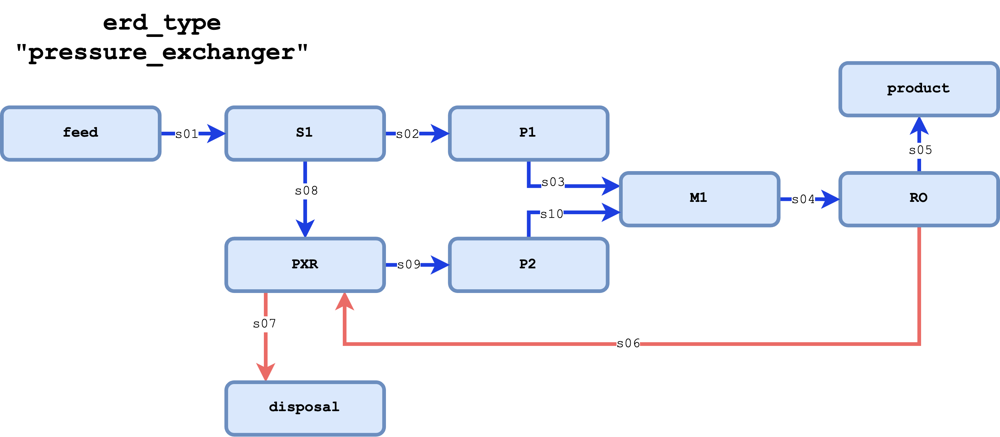
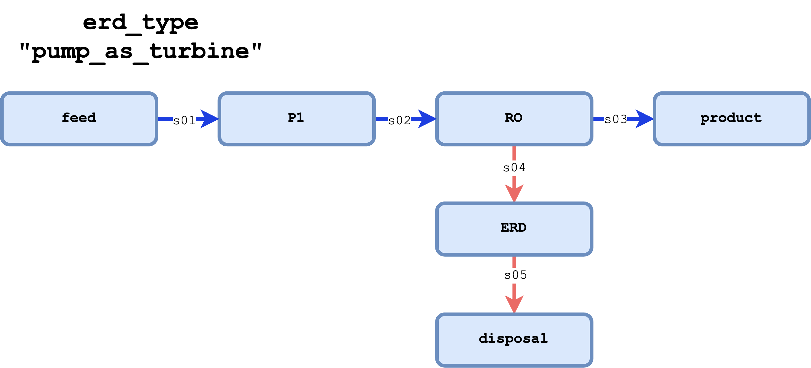
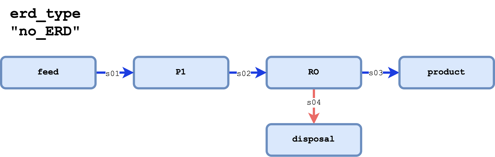

Reverse Osmosis with Energy Recovery
====================================

Introduction
------------

This flowsheet represents a reverse osmosis (RO) with energy recovery device (ERD). 
The flowsheet is similar to the desalination block of the full-scale seawater RO treatment facility flowsheet,
but includes an demonstration for optimization of the process. The user can select between pressure exchanger ERD, 
pump-as-turbine ERD, or no ERD.

Implementation
--------------

This flowsheet uses several different modeling features available in WaterTAP, including:

Costing packages:
    * :doc:`/technical_reference/costing/watertap_costing`
    * :doc:`/technical_reference/costing/detailed_unit_model_costing`
Property models:
    * :doc:`/technical_reference/property_models/NaCl`
Unit models:
    * :doc:`/technical_reference/unit_models/reverse_osmosis_0D`
    * :doc:`/technical_reference/unit_models/pressure_exchanger`
    * :doc:`idaes:reference_guides/model_libraries/generic/unit_models/product`
    * :doc:`idaes:reference_guides/model_libraries/generic/unit_models/separator`
    * :doc:`idaes:reference_guides/model_libraries/generic/unit_models/mixer`

The demonstration file itself contains several core functions that are used to build, specify, initialize, solve, and (optionally) optimize the model, 
as well as helper functions that group these core functions together for convenience or to display results.

* Creating and instantiating the model using ``build()``:
    
    This function will create the core components and structure of the flowsheet including unit, property, and costing models.
    Different components will be added depending on the type of ERD used (dictated by the ``erd_type`` argument).
    An ``Arc`` is used to connect the different component flows to one another and default scaling factors are set.

* Specify the operating conditions with ``set_operating_conditions()``:

    Influent component flows and RO pump operating pressures are set with this function.
    The user can set via keyword arguments the volumetric flow rate (``flow_vol``), mass fraction of NaCl (``salt_mass_conc``),
    a target fractional mass-based water recovery ``water_recovery``, and a fractional over pressure (``over_pressure``). 
    Over pressure is the fractional increase in pressure over of the brine osmotic pressure to use as the
    an initial guess for the RO operating pressure as determined by the helper function ``calculate_operating_pressure``.
    Initial values for relevant RO membrane parameters are provided in the Flowsheet Specifications section.
    After the RO unit is initialized, the area is unfixed and the mass-based recovery is fixed to the 
    user provided value.

* Calculating the RO operating pressure with ``calculate_operating_pressure()``:

    This helper functions takes in the RO feed state block and will calculate the needed operating pressure
    to achieve the desired mass-based water recovery.

* Initialize entire system with ``initialize_system()``:

    After the model is built and specified, this function will initialize the feed, RO, and costing blocks.
    Depending on the ``erd_type`` different helper functions are used to initialize the relevant 
    ERD-related unit models.    

* Optionally optimize the system with ``optimize_set_up()``:

    The model is fully defined and can be solved with the provided ``solve()`` function after the user passes 
    the model through ``initialize_system()``. This function is provided as a demonstration of how the system could be
    optimized the minimize the levelized cost of water (LCOW). The optimization routine proceeds as follows:

    #. An ``Objectve`` is placed on the flowsheet set to minimize the ``LCOW`` expression in the costing package.
    #. Operating pressure for the RO booster pump is unfixed and realistic bounds are placed on the pressure.
    #. Similarly, the RO membrane area is unfixed and bounds are placed on the membrane area.
    #. To ensure the product water is still of acceptable quality, a ``Constraint`` is placed on the effluent 
       concentration of the RO to be less than 500 mg/L.
    #. Additionally, there is a minimum water flux placed on the RO model to be over 2.8e-4 kg/m :math:`\text{}^2`/s.

There are other helper functions, like ``display_system()``, ``display_design()``, and ``display_state()``, that 
are used to print out the results of the model solve. The ``main()`` function is an example of building, specifying, 
initializing, and optimizing an RO-ERD system with WaterTAP.

Figure 1 presents the process flow diagram if ``erd_type == pressure_exchanger``.

    Figure 1: Process flow for RO with pressure exchanger ERD.

Figure 2 presents the process flow diagram if ``erd_type == pump_as_turbine``.

    Figure 2: Process flow for RO with pump-as-turbine ERD.

Figure 3 presents the process flow diagram with no ERD (i.e., ``erd_type == no_ERD``).

    Figure 3: Process flow for RO without ERD.

Degrees of Freedom 
------------------

The degrees of freedom (DOF) for the flowsheet can change depending on model configuration options.
For either ``pump_as_turbine`` or ``pressure_exchanger`` as ``erd_type``, there are 15 DOF. Running
the model with ``no_ERD`` results in 13 DOF.

* Influent conditions (component flows, temperature, pressure)
* RO membrane properties
* RO operating pressure
* Pump and ERD efficiencies

Passing any model build to the provided function ``set_operating_conditions()`` will result in a model with zero DOF.

Flowsheet Specifications
------------------------

The influent and operating conditions for the different flowsheet configurations are presented in the following table,
including the different build options for ``erd_type``:

.. csv-table::
   :header: "Description", "Default Value", "Units"

    **Influent Conditions**
   "Volumetric flow rate", "1e-3", ":math:`\text{m}^3/\text{s}`"
   "TDS mass fraction", "0.035", ":math:`\text{dimensionless}`"
   "Temperature", "298", ":math:`\text{K}`"
   "Pressure", "101325", ":math:`\text{Pa}`"
   
   **Desalination**
   "RO water permeability coefficient", "4.2e-12", ":math:`\text{m/Pa/s}`"
   "RO salt permeability coefficient", "3.5e-8", ":math:`\text{m/s}`"
   "RO spacer porosity", "0.85", ":math:`\text{dimensionless}`"
   "RO channel height", "1e-3", ":math:`\text{m}`"
   "RO membrane width per stage", "5", ":math:`\text{m}`"
   "RO total membrane area per stage", "50", ":math:`\text{m}^2`"
   "RO permeate side pressure", "101325", ":math:`\text{Pa}`"
   "Pump 1 efficiency", "0.8", ":math:`\text{dimensionless}`"
   "Pump 1 operating pressure", "70e5", ":math:`\text{Pa}`"
   
   *if* ``erd_type == "pressure_exchanger"``
   "Pressure exchanger efficiency", "0.95", ":math:`\text{dimensionless}`"
   "Pump 2 efficiency", "0.8", ":math:`\text{dimensionless}`"
   
   *if* ``erd_type == "pump_as_turbine"``
   "Energy recovery device pump efficiency", "0.95", ":math:`\text{dimensionless}`"
   "Energy recovery device permeate side pressure", "101325", ":math:`\text{Pa}`"
   

Code Documentation
------------------

* :mod:`watertap.examples.flowsheets.RO_with_energy_recovery`
