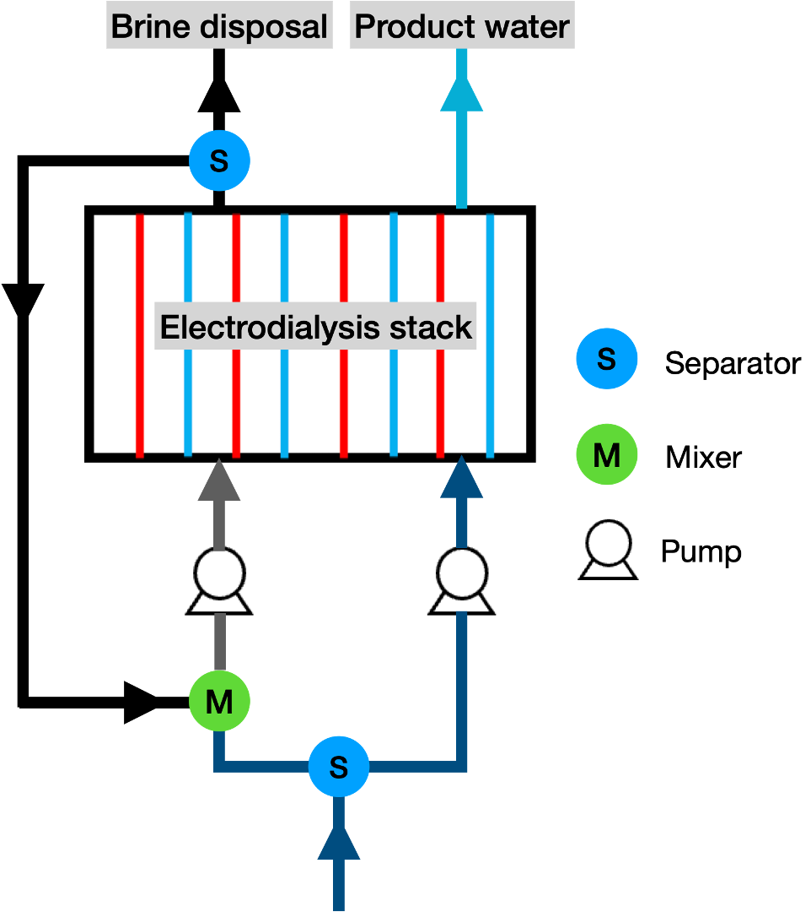

One-stack electrodialysis with concentrate stream recirculation (feed-and-bleed mode)
=====================================================================================

Introduction
------------
Electrodialysis (ED) is a promising technology for desalinating brackish waters and has been deployed at industrial scales [1]_. It utilizes electrical potential to drive ion diffusion through anion and cation exchange membranes, resulting in the dilution of the feed stream while producing a concentrated brine. A single ED stack is an assembly of multiple flow-by cells separated by alternating cation and anion exchange membranes positioned between a pair of electrodes. When a voltage is applied, ions in the cell pair are driven from one channel (forming the diluate channel) to the other (forming the concentrate channel), thereby desalinating water. A one-stack ED desalination system represents a basic ED operation, from which more complicated or larger-scale systems can be derived. Analyzing a one-stack ED system therefore provides valuable information on the technology's performance and cost-effectiveness for a given treatment task.

Equal flow conditions through the diluate and concentrate channels would result in a product water recovery of 50%. Larger water recoveries are commonly achieved by operating the system in a feed-and-bleed mode, where a portion of the concentrate outlet is recirculated back to its inlet, thus increasing the portion of product water from the diluate outlet. This flowsheet simulates a one-stack ED system operated in feed-and-bleed mode.

Implementation
--------------

The modeled one-stack ED system is illustrated by Figure 1. The feed solution is split into two fluids through a separator unit, entering the diluate and concentrate channels of the ED stack. Two pump units are place respectively on the two channels entering pipelines to counterbalance the pressure drops across ED stack channels.  On the outlet side of the ED stack, all diluate fluids are collected into the total product water, and the concentrate fluids into the total brine stream.  A second separator unit takes a portion of the brine back into the concentrate pump inlet, with the rest being sent to brine disposal. Water recovery in this model is volume-based, i.e., the ratio of product volume to total volume of feed solution. The model simulates the steady state of the ED system.

    Figure 1. Flowsheet diagram: one-stack ED operated in feed-and-bleed mode

Documentation for unit models from WaterTAP: 
    * `Electrodialysis_1D <https://watertap.readthedocs.io/en/latest/technical_reference/unit_models/electrodialysis_1D.html>`_
    * `Pressure exchanger <https://watertap.readthedocs.io/en/latest/technical_reference/unit_models/pressure_exchanger.html>`_
Documentation for unit models from IDAES: 
    * `Separator <https://idaes-pse.readthedocs.io/en/latest/reference_guides/model_libraries/generic/unit_models/separator.html>`_
    * `Mixer <https://idaes-pse.readthedocs.io/en/latest/reference_guides/model_libraries/generic/unit_models/mixer.html>`_
Documentation for the property model:
    * `Multi-Component Aqueous Solution (MCAS) Property Package <https://watertap.readthedocs.io/en/latest/technical_reference/property_models/mc_aq_sol.html>`_

Degrees of Freedom
------------------
The number of degree of freedom (DOF) is associated with the number of fixed variables (parameters) determined by the purpose of the modeling case. We implemented two modeling cases in the `main()` function: (1) the prediction of desalination outcome (salinity of the product water and saline disposal) and (2) the optimization of key decision variables in system design.  In the first case, DOF is set to zero by fixing all initial conditions of the feed solution fluid and definite ED stack parameters. All fixed values are presented in the section to follow.  In the second case, the values of those chosen to be the decision variables in the optimization are unfixed. The DOF number is therefore the number of decision variables. In this example, the decision variables are

    * stack voltage applied
    * ED cell pair number 
    * ED cell length

The optimization objective function is set to LCOW. 

Flowsheet Specifications
------------------------
.. csv-table:: Initial values of parameters in conditioned modeling
   :header: Name, Value, Unit, Reference
   :widths: 30, 20, 20, 10

   "Salinity (NaCl)", ":math:`2`", ":math:`g L^{-1}`", "--"
   "Volume flow rate", ":math:`5.2 \times 10^{-4}`", ":math:`m^3 s^{-1}`", [2]_ ,
   "Temperature", ":math:`298.15`", ":math:`K`", "--"
   "Pressure", ":math:`101325`", ":math:`Pa`", "--"
   "Na^+ diffusivity", ":math:`1.33 \times 10^{-9}`", ":math:`m^2 s^{-1}`",[3]_,
   "Cl^- diffusivity", ":math:`2.03 \times 10^{-9}`", ":math:`m^2 s^{-1}`",[3]_,
   "NaCl mass diffusivity", ":math:`1.60 \times 10^{-9}`", ":math:`m^2 s^{-1}`", [4]_,
   "Cell pair number", ":math:`100`", ":math:`1`", "--"
   "Cell length", ":math:`1.68`", ":math:`m`", [2]_,
   "Cell width", ":math:`0.1`", ":math:`m`",[5]_,
   "Channel height", ":math:`5 \times 10^{-4}`", ":math:`m`", "--"
   "Water recovery", ":math:`70%`", ":math:`1`", "--"
   "Stack voltage", ":math:`10`", ":math:`V`", "--"
   "Thickness, aem and cem", ":math:`1.3 \times 10^{-5}`", ":math:`m`",[5]_,
   "Areal resistance, aem", ":math:`1.77 \times 10^{-4}`", ":math:`\Omega m^2`", [5]_,
   "Areal resistance, cem", ":math:`1.89 \times 10^{-4}`", ":math:`\Omega m^2`",[5]_,
   "Water permeability, aem", ":math:`1.75 \times 10^{-14}`", ":math:`m s^{-1} Pa^{-1}`",[5]_,
   "Water permeability, cem", ":math:`2.16 \times 10^{-14}`", ":math:`m s^{-1} Pa^{-1}`", [5]_,
   "Water transport number, aem", ":math:`4.3`", ":math:`1`",[6]_,
   "Water transport number, cem", ":math:`5.8`", ":math:`1`", [7]_,
   "NaCl mass diffusivity, aem and cem", ":math:`3.28 \times 10^{-11}`", ":math:`m^2 s^{-1}`", [8]_,
   "Porosity", ":math:`0.83`", ":math:`1`", [2]_,
   "Specific surface area", ":math:`10400`", ":math:`m^{-1}`", [9]_,
   "Pump efficiency", ":math:`0.8`", ":math:`1`", "--"

References
----------
.. [1] Strathmann, H. (2010). Electrodialysis, a mature technology with a multitude of new applications. Desalination, 264(3), 268-288.
.. [2] Wright, N. C., Shah, S. R., & Amrose, S. E. (2018). A robust model of brackish water electrodialysis desalination with experimental comparison at different size scales. Desalination, 443, 27-43.
.. [3] Vanýsek, P. (1993). Ionic conductivity and diffusion at infinite dilution. CRC handbook of chemistry and physics, 94.
.. [4] Vitagliano, V., & Lyons, P. A. (1956). Diffusion coefficients for aqueous solutions of sodium chloride and barium chloride. Journal of the American Chemical Society, 78(8), 1549-1552.
.. [5] Campione, A., Cipollina, A., Bogle, I. D. L., Gurreri, L., Tamburini, A., Tedesco, M., & Micale, G. (2019). A hierarchical model for novel schemes of electrodialysis desalination. Desalination, 465, 79-93.
.. [6] Breslau, B. R., & Miller, I. F. (1971). A hydrodynamic model for electroosmosis. Industrial & Engineering Chemistry Fundamentals, 10(4), 554-565.
.. [7] Larchet, C., Dammak, L., Auclair, B., Parchikov, S., & Nikonenko, V. (2004). A simplified procedure for ion-exchange membrane characterisation. New Journal of Chemistry, 28(10), 1260-1267.
.. [8] Amang, D. N., Alexandrova, S., & Schaetzel, P. (2003). The determination of diffusion coefficients of counter ion in an ion exchange membrane using electrical conductivity measurement. Electrochimica acta, 48(18), 2563-2569.
.. [9] Schock, G., & Miquel, A. (1987). Mass transfer and pressure loss in spiral wound modules. Desalination, 64, 339-352.