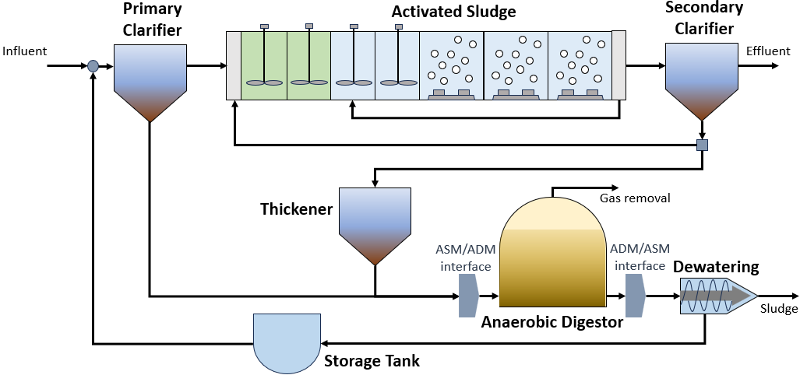

Extended Benchmark Simulation Model No.2
========================================

Introduction
------------

Like the conventional Benchmark Simulation Model No.2 `(BSM2) <https://watertap.readthedocs.io/en/latest/technical_reference/flowsheets/BSM2.html>`_,
extended BSM2 is an industry benchmark for modeling a full biological wastewater
treatment plant that includes a primary clarifier, the activated sludge process, and an anaerobic digester.
These unit processes are driven by biological reaction models that relate soluble and particulate wastewater
components to their respective process rate equations. The main difference between conventional and extended BSM2
is that the latter uses modified ADM1 and ASM2d property packages as opposed to conventional ADM1 and ASM1. These modifications allow
key components like phosphorus, magnesium and calcium to be tracked throughout the system, which are essential in order to
accurately modeling certain novel technologies that can incorporated into BSM2. Thus, while this flowsheet can simply be used to
simulate and run techno-economic analyses on the operation of a conventional wastewater treatment plant,
an additional layer of utility can be derived from using BSM2 as a baseline for comparing alternative plant
configurations to a well-established standard and/or amongst the variations themselves by adding, removing,
or modifying unit processes using WaterTAP's flexible modeling capabilities.

Implementation
--------------

Figure 1 shows the process flow diagram for BSM2 where influent wastewater is fed
to a primary clarifier (primary treatment); the effluent is then passed to a series of activated sludge
reactors and a secondary clarifier (secondary treatment). CSTRs are used to model the two anaerobic and two anoxic reactors, respectively, in the activated
sludge process and CSTRs with injection (which accounts for aeration tanks) are used to model the three aerobic reactors.
Finally, the sludge is passed through a thickener and sent to the anaerobic digester. The anaerobic digester processes
the sludge to produce a biogas stream and residual sludge stream that passes through a dewatering unit which recycles
liquid to the headworks of the plant while sludge is released for disposal.
The flowsheet relies on the following key assumptions:

   * supports steady-state only
   * property and reaction package are provided for the activated sludge model (ASM)
   * property and reaction package are provided for the anaerobic digester model (ADM)
   * interfaces are provided to convert between the properties of ASM and ADM

    Figure 1. BSM2 flowsheet

Documentation for each of the unit models can be found below. All unit models were set up with their default configuration arguments.
    * `Thickener <https://watertap.readthedocs.io/en/latest/technical_reference/unit_models/thickener.html>`_
    * `Anaerobic digester <https://watertap.readthedocs.io/en/latest/technical_reference/unit_models/anaerobic_digester.html>`_
    * `Dewatering unit <https://watertap.readthedocs.io/en/latest/technical_reference/unit_models/dewatering_unit.html>`_
    * `CSTR <https://idaes-pse.readthedocs.io/en/latest/reference_guides/model_libraries/generic/unit_models/cstr.html>`_
    * `ADM1 to ASM2d Translator <https://watertap.readthedocs.io/en/latest/technical_reference/unit_models/translators/translator_adm1_asm2d.html>`_
    * `ASM2d to ADM1 Translator <https://watertap.readthedocs.io/en/latest/technical_reference/unit_models/translators/translator_asm2d_adm1.html>`_
    * `Aeration tank <https://watertap.readthedocs.io/en/latest/technical_reference/unit_models/aeration_tank.html>`_
    * `Primary clarifier <https://watertap.readthedocs.io/en/latest/technical_reference/unit_models/clarifier.html>`_
    * `Secondary clarifier <https://watertap.readthedocs.io/en/latest/technical_reference/unit_models/clarifier.html>`_

Documentation for each of the property models can be found below.
    * `Modified ASM2d <https://watertap.readthedocs.io/en/latest/technical_reference/property_models/modified_ASM2D.html>`_
    * `Modified ADM1 <https://watertap.readthedocs.io/en/latest/technical_reference/property_models/modified_ADM1.html>`_

Documentation for the costing relationships can be found below.
    * `WaterTAP Costing Package <https://watertap.readthedocs.io/en/latest/technical_reference/costing/watertap_costing.html>`_

The objective function is to minimize the levelized cost of water, which can be represented by the following equation
where :math:`Q` represents volumetric flow, :math:`f_{crf}` represents capital recovery factor
:math:`C_{cap,tot}` represents total capital cost, :math:`C_{op,tot}` represents total operating cost, and
:math:`f_{util}` represents the utilization factor:

    .. math::

        LCOW_{Q} = \frac{f_{crf}   C_{cap,tot} + C_{op,tot}}{f_{util} Q}

Degrees of Freedom
------------------
The following variables are initially specified for simulating the Extended BSM2 flowsheet (i.e., degrees of freedom = 0):
    * feed water conditions (flow, temperature, pressure, component concentrations, and alkalinity)
    * volume of activated sludge reactors
    * component injection rates for aerobic reactors
    * split fraction(s) for the recycle loop after the activated sludge reactors
    * secondary clarifier surface area and split fraction(s)
    * primary clarifier split fraction(s)
    * split fraction(s) for the separator following the secondary clarifier
    * pressure changer outlet pressure (feeds into the activated sludge process)
    * anaerobic digester liquid volume, vapor volume, and liquid outlet temperature
    * dewatering unit hydraulic retention time and specific energy consumption
    * thickener hydraulic retention time and diameter

Flowsheet Specifications
------------------------

.. csv-table::
   :header: "Description", "Value", "Units"

   "**Feed Water**:math:`^1`"
   "Volumetric flow","20935.15", ":math:`\text{m}^3\text{/day}`"
   "Temperature", "308.15", ":math:`\text{K}`"
   "Pressure", "1", ":math:`\text{atm}`"
   "Dissolved oxygen (S_O2) concentration", "1e-6", ":math:`\text{g/}\text{m}^3`"
   "Fermentable, readily bio-degradable organic substrate (S_F) concentration", "1e-6", ":math:`\text{g/}\text{m}^3`"
   "Fermentation products, considered to be acetate (S_A) concentration", "70", ":math:`\text{g/}\text{m}^3`"
   "Ammonium plus ammonia nitrogen (S_NH4) concentration", "26.6", ":math:`\text{g/}\text{m}^3`"
   "Nitrate plus nitrite nitrogen (S_NO3) concentration", "1e-6", ":math:`\text{g/}\text{m}^3`"
   "Inorganic soluble phosphorus (S_PO4) concentration", "1e-6", ":math:`\text{g/}\text{m}^3`"
   "Inert soluble organic material (S_I) concentration", "57.45", ":math:`\text{g/}\text{m}^3`"
   "Dinitrogen concentration (S_N2)", "25.19", ":math:`\text{g/}\text{m}^3`"
   "Inert particulate organic material (X_I) concentration", "84", ":math:`\text{g/}\text{m}^3`"
   "Slowly biodegradable substrate (X_S) concentration", "94.1", ":math:`\text{g/}\text{m}^3`"
   "Heterotrophic organism (X_H) concentration", "370", ":math:`\text{g/}\text{m}^3`"
   "Phosphate-accumulating organism (X_PAO) concentration", "51.5262", ":math:`\text{g/}\text{m}^3`"
   "Poly-phosphate (X_PP) concentration", "1e-6", ":math:`\text{g/}\text{m}^3`"
   "Poly-hydroxy-alkanoates (X_PHA) concentration", "1e-6", ":math:`\text{g/}\text{m}^3`"
   "Autotrophic nitrifying organism (X_AUT) concentration", "1e-6", ":math:`\text{g/}\text{m}^3`"
   "Inorganic carbon (S_IC) concentration", "5.652", ":math:`\text{g/}\text{m}^3`"
   "Potassium (S_K) concentration", "374.6925", ":math:`\text{g/}\text{m}^3`"
   "Magnesium (S_Mg) concentration", "20", ":math:`\text{g/}\text{m}^3`"

   "**Activated Sludge Process**"
   "Reactor 1 volume", "1000", ":math:`\text{m}^3`"
   "Reactor 2 volume", "1000", ":math:`\text{m}^3`"
   "Reactor 3 volume", "1500", ":math:`\text{m}^3`"
   "Reactor 4 volume", "1500", ":math:`\text{m}^3`"
   "Reactor 5 volume", "3000", ":math:`\text{m}^3`"
   "Reactor 6 volume", "3000", ":math:`\text{m}^3`"
   "Reactor 7 volume", "3000", ":math:`\text{m}^3`"
   "Reactor 5 injection rate for component j", "0", ":math:`\text{g/}\text{s}`"
   "Reactor 6 injection rate for component j", "0", ":math:`\text{g/}\text{s}`"
   "Reactor 7 injection rate for component j", "0", ":math:`\text{g/}\text{s}`"
   "Reactor 5 outlet oxygen (S_O) concentration", "0.00191", ":math:`\text{g/}\text{m}^3`"
   "Reactor 6 outlet oxygen (S_O) concentration", "0.00260", ":math:`\text{g/}\text{m}^3`"
   "Reactor 7 outlet oxygen (S_O) concentration", "0.00320", ":math:`\text{g/}\text{m}^3`"
   "Reactor 5 underflow split fraction", "0.6", ":math:`\text{dimensionless}`"
   "Secondary clarifier H2O split fraction", "0.48956", ":math:`\text{dimensionless}`"
   "Secondary clarifier S_A split fraction", "0.48956", ":math:`\text{dimensionless}`"
   "Secondary clarifier S_F split fraction", "0.48956", ":math:`\text{dimensionless}`"
   "Secondary clarifier S_I split fraction", "0.48956", ":math:`\text{dimensionless}`"
   "Secondary clarifier S_N2 split fraction", "0.48956", ":math:`\text{dimensionless}`"
   "Secondary clarifier S_NH4 split fraction", "0.48956", ":math:`\text{dimensionless}`"
   "Secondary clarifier S_NO3 split fraction", "0.48956", ":math:`\text{dimensionless}`"
   "Secondary clarifier S_O2 split fraction", "0.48956", ":math:`\text{dimensionless}`"
   "Secondary clarifier S_PO4 split fraction", "0.48956", ":math:`\text{dimensionless}`"
   "Secondary clarifier S_IC split fraction", "0.48956", ":math:`\text{dimensionless}`"
   "Secondary clarifier S_K split fraction", "0.48956", ":math:`\text{dimensionless}`"
   "Secondary clarifier S_Mg split fraction", "0.48956", ":math:`\text{dimensionless}`"
   "Secondary clarifier X_AUT split fraction", "0.00187", ":math:`\text{dimensionless}`"
   "Secondary clarifier X_H split fraction", "0.00187", ":math:`\text{dimensionless}`"
   "Secondary clarifier X_I split fraction", "0.00187", ":math:`\text{dimensionless}`"
   "Secondary clarifier X_PAO split fraction", "0.00187", ":math:`\text{dimensionless}`"
   "Secondary clarifier X_PHA split fraction", "0.00187", ":math:`\text{dimensionless}`"
   "Secondary clarifier X_PP split fraction", "0.00187", ":math:`\text{dimensionless}`"
   "Secondary clarifier X_S split fraction", "0.00187", ":math:`\text{dimensionless}`"
   "Separator recycle split fraction", "0.985", ":math:`\text{dimensionless}`"
   "Recycle pump outlet pressure", "101325", ":math:`\text{Pa}`"

   "**Primary Clarifier**"
   "Primary clarifier H2O split fraction", "0.993", ":math:`\text{dimensionless}`"
   "Primary clarifier S_A split fraction", "0.993", ":math:`\text{dimensionless}`"
   "Primary clarifier S_F split fraction", "0.993", ":math:`\text{dimensionless}`"
   "Primary clarifier S_I split fraction", "0.993", ":math:`\text{dimensionless}`"
   "Primary clarifier S_N2 split fraction", "0.993", ":math:`\text{dimensionless}`"
   "Primary clarifier S_NH4 split fraction", "0.993", ":math:`\text{dimensionless}`"
   "Primary clarifier S_NO3 split fraction", "0.993", ":math:`\text{dimensionless}`"
   "Primary clarifier S_O2 split fraction", "0.993", ":math:`\text{dimensionless}`"
   "Primary clarifier S_PO4 split fraction", "0.993", ":math:`\text{dimensionless}`"
   "Primary clarifier S_IC split fraction", "0.993", ":math:`\text{dimensionless}`"
   "Primary clarifier S_K split fraction", "0.993", ":math:`\text{dimensionless}`"
   "Primary clarifier S_Mg split fraction", "0.993", ":math:`\text{dimensionless}`"
   "Primary clarifier X_AUT split fraction", "0.5192", ":math:`\text{dimensionless}`"
   "Primary clarifier X_H split fraction", "0.5192", ":math:`\text{dimensionless}`"
   "Primary clarifier X_I split fraction", "0.5192", ":math:`\text{dimensionless}`"
   "Primary clarifier X_PAO split fraction", "0.5192", ":math:`\text{dimensionless}`"
   "Primary clarifier X_PHA split fraction", "0.5192", ":math:`\text{dimensionless}`"
   "Primary clarifier X_PP split fraction", "0.5192", ":math:`\text{dimensionless}`"
   "Primary clarifier X_S split fraction", "0.5192", ":math:`\text{dimensionless}`"

   "**Anaerobic Digester**"
   "Anaerobic digester liquid volume", "3400", ":math:`\text{m}^3`"
   "Anaerobic digester vapor volume", "300", ":math:`\text{m}^3`"
   "Anaerobic digester liquid outlet temperature", "308.15", ":math:`\text{m}^3`"

   "**Dewatering Unit**"
   "Dewatering unit hydraulic retention time", "1800", ":math:`\text{s}`"

   "**Thickener**"
   "Thickener hydraulic retention time", "86400", ":math:`\text{s}`"
   "Thickener diameter", "10", ":math:`\text{kWh/}\text{m}`"

Additional Variables
--------------------

.. csv-table::
   :header: "Description", "Symbol", "Value", "Units"

   "Reactor 5 oxygen mass transfer coefficient",":math:`KLa_{R5}`", "240", ":math:`\text{hr}^{-1}`"
   "Reactor 6 oxygen mass transfer coefficient",":math:`KLa_{R6}`", "240", ":math:`\text{hr}^{-1}`"
   "Reactor 7 oxygen mass transfer coefficient",":math:`KLa_{R7}`", "240", ":math:`\text{hr}^{-1}`"
   "Dissolved oxygen concentration at equilibrium",":math:`S_{O, eq}`", "8e-3", ":math:`\text{hr}^{-1}`"

Additional Constraints
----------------------

.. csv-table::
   :header: "Description", "Equation"

   "Reactor 5 mass transfer", ":math:`injection_{R5, S_{O2}} = KLa_{R5} * V_{R5} * (S_{O, eq} - S_{O, out})`"
   "Reactor 6 mass transfer", ":math:`injection_{R6, S_{O2}} = KLa_{R6} * V_{R6} * (S_{O, eq} - S_{O, out})`"
   "Reactor 7 mass transfer", ":math:`injection_{R7, S_{O2}} = KLa_{R7} * V_{R7} * (S_{O, eq} - S_{O, out})`"

Future Refinements
------------------

The following modifications to extended BSM2 are planned for development:
    * Improving costing relationships in terms of detail, completeness, and reasonable validity
    * Accounting for temperature-dependence in the oxygen mass transfer coefficient (KLa) and oxygen concentration at saturation
    * Adding thermal energy requirements to the anaerobic digester and refining energy consumption estimates for units collectively
    * Accounting for mineral precipitation reactions
    * Accounting for ion speciation and activity
    * Accounting for sulfur components
    * Accounting for iron components
    * Replacing the ideal-separator formulation in the secondary clarifier with the widely used double-exponential settling model (i.e., the Takacs model)

References
----------
[1] X. Flores-Alsina, K. Solon, C.K. Mbamba, S. Tait, K.V. Gernaey, U. Jeppsson, D.J. Batstone,
Modelling phosphorus (P), sulfur (S) and iron (Fe) interactions for dynamic simulations of anaerobic digestion processes,
Water Research. 95 (2016) 370-382. https://www.sciencedirect.com/science/article/pii/S0043135416301397