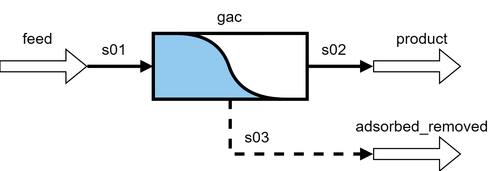

Granular Activated Carbon
=========================

Introduction
------------

The simple granular activated carbon (GAC) flowsheet can be simulated to predict the performance of a GAC system to treat residual organics. This flowsheet can
be useful to expedite the set-up, usage, and costing of a GAC system for conventional water treatment applications using the constant pattern homogeneous
surface diffusion model (CPHSDM) model.

Implementation
--------------

Only consisting of a single unit operation, the assumptions for the flowsheet are aligned with those detailed in the :doc:`GAC unit model documentation <../unit_models/gac>`.
The code-based naming of modeling objects for the inlets, outlets, units, and streams are shown in Figure 1.

    Figure 1. GAC flowsheet

Degrees of Freedom
------------------

The degrees of freedom for the flowsheet can change depending on the configuration options specified during the build. Excluding those variables which are
only necessary for specific configuration options, the following variables are initially fixed for simulating the GAC flowsheet (i.e., degrees of freedom = 0):
    * feed conditions (component flows, temperature, pressure)
    * Freundlich isotherm parameters :math:`k` and :math:`\frac{1}{n}`
    * liquid phase film transfer coefficient
    * surface diffusion coefficient
    * particle apparent density
    * particle diameter
    * empty bed contact time
    * bed voidage
    * bed length
    * effluent to inlet concentration ratio at operational time
    * CPHSDM empirical parameters

Flowsheet Specifications
------------------------

.. csv-table::
   :header: "Description", "Value", "Units"

   "feed molar flowrate of water", "2433.81215", ":math:`\text{mol}/\text{s}`"
   "feed molar flowrate of the solute", "0.05476625", ":math:`\text{mol}/\text{s}`"
   "feed temperature", "298.15", ":math:`\text{K}`"
   "feed pressure", "101325", ":math:`\text{Pa}`"
   "Freundlich isotherm k parameter", "10", ":math:`\left(\text{m}^3\text{/kg}\right)^\left( \frac{1}{n} \right)`"
   "Freundlich isotherm 1/n parameter", "0.9", ":math:`\text{dimensionless}`"
   "liquid phase film transfer coefficient", "5e-5", ":math:`\text{m/s}`"
   "surface diffusion coefficient", "2e-13", ":math:`\text{m}^2\text{/s}`"
   "gac apparent density", "750", ":math:`\text{kg/}\text{m}^3`"
   "gac particle diameter", "0.001", ":math:`\text{m}`"
   "empty bed contact time", "600", ":math:`\text{s}`"
   "bed void fraction", "0.4", ":math:`\text{dimensionless}`"
   "bed length", "6", ":math:`\text{m}`"
   "effluent to inlet concentration ratio at operational time", "0.50", ":math:`\text{dimensionless}`"
   "Stanton equation parameter 0", "3.68421", ":math:`\text{dimensionless}`"
   "Stanton equation parameter 1", "13.1579", ":math:`\text{dimensionless}`"
   "throughput equation parameter 0", "0.784576", ":math:`\text{dimensionless}`"
   "throughput equation parameter 1", "0.239663", ":math:`\text{dimensionless}`"
   "throughput equation parameter 2", "0.484422", ":math:`\text{dimensionless}`"
   "throughput equation parameter 3", "0.003206", ":math:`\text{dimensionless}`"
   "throughput equation parameter 4", "0.134987", ":math:`\text{dimensionless}`"

Future Refinements
------------------

The following modifications to the GAC flowsheet are planned for development:
    * Add surrogate models to lessen the need for numerous empirical parameters
    * Improve auto-scaling of model for ease of use

Code Documentation
------------------

* :mod:`watertap.examples.flowsheets.gac`

References
----------
Hand, D. W., Crittenden, J. C., & Thacker, W. E. (1984). Simplified models for design of fixed-bed adsorption systems.
Journal of Environmental Engineering, 110(2), 440-456.

Crittenden, J., Rhodes, R., Hand, D., Howe, K., & Tchobanoglous, G. (2012). MWHs Water Treatment. Principles and Design.
John Wiley & Sons.

United States Environmental Protection Agency. (2021). Work Breakdown Structure-Based Cost Model for Granular Activated
Carbon Drinking Water Treatment.