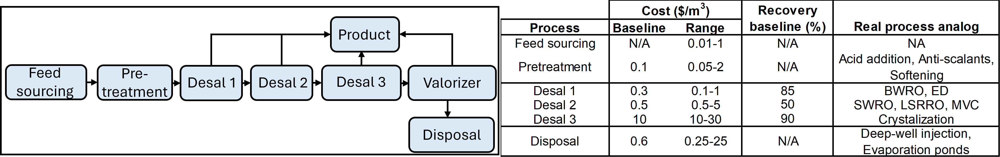

Generic desalination treatment train 
====================================

Introduction
------------
This flowsheet builds a treatment train with generic units that operate with assumed performance and use simple costs specified by the user for each unit operation. 
The flowsheet uses its own simple costing package and uses generic desalter and generic separation units to estimate overall treatment costs. 
The flowsheet relies on `MCAS <https://watertap.readthedocs.io/en/latest/technical_reference/property_models/mc_aq_sol.html>`_ properties package to track different species through the train. 

Implementation
--------------

The default flowsheet builds a typical zero liquid discharge processes shown in Figure 1 using generic desalter and separator units. 

The Documentation for desalter and separator units: 
    * `Generic desalter <https://watertap.readthedocs.io/en/latest/technical_reference/unit_models/generic_desalter.html>`_
    * `Generic separator <https://watertap.readthedocs.io/en/latest/technical_reference/unit_models/generic_separator.html>`_

Degrees of Freedom
------------------
For a zero degrees of freedom optimization the user is expected to provide unit level costing and operation for each step:
    * Feed sourcing cost (m.fs.feed.costing.base_cost in $/m^3)
    * Product distribution cost (m.fs.product.costing.base_cost in $/m^3)
    * Disposal cost (m.fs.disposal.costing.base_cost in $/m^3)
    * Pretreatment unit cost:
        * Base cost (m.fs.Pretreatment.costing.base_cost in $/m^3 of feed) 
        * (Optional) Pretreatment target component removal cost (m.fs.Pretreatment.separator.separation_cost[{component}] in % (Default: 0 for all components))
        * (Optional) Chemical cost (m.fs.Pretreatment.separator.additive_cost in $/kg (Default: 0)
    * Pretreatment unit operation:
        * (Optional) Pretreatment target component removal amount (m.fs.Pretreatment.separator.component_removal_percent[{component] in % (Default: 0 for all components))
        * (Optional) Pretreatment chemical addition amount (m.fs.Pretreatment.separator.chemical_dose in PPM if any (Default: 0) 
    * Desalination unit cost
        * Using base treatment cost:
            * m.fs.{unit_name}.desalter.base_cost (in $/m^3 of product)
        * Defining cost as a linear function of cost per water recovery and offset which will compute the base case as base_cost=recovery_cost*water_recovery+offset
            * m.fs.{unit_name}.desalter.brine_solids_concentration (kg/m^3) 
            * m.fs.{unit_name}.desalter.brine_water_mass_percent (%) 
    * Desalination unit operation (Fix only one)
        * Water recovery (m.fs.{unit_name}.desalter.water_recovery (in %))
        * (or) Brine solids concentration (m.fs.{unit_name}.desalter.water_recovery (in %))
        * (or) Brine water content (m.fs.{unit_name}.desalter.water_recovery (in %))
    * Valorization unit costs: 
        * Base cost (m.fs.Pretreatment.costing.base_cost in $/m^3 of feed) 
        * (Optional) Target product removal value (m.fs.Valorizer.separator.product_value[{component}] in % (Default: 0 for all components))
        * (Optional) Chemical cost (m.fs.Valorizer.separator.chemical_cost in $/kg (Default: 0)
    * Valorization unit operation: 
        * (Optional) Target product removal amount (m.fs.Valorizer.separator.component_removal_percent[{component] in % (Default: 0 for all components))
        * (Optional) Chemical addition amount (m.fs.Valorizer.separator.additive_cost in PPM if any (Default: 0) 

The flowsheet is populated with baseline costs for the unit operations based on general literature values, as presented in Figure 1. 

Flowsheet Specifications
------------------------

These are the default values configured in flowsheet main function: 

.. csv-table::
   :header: "Description", "Value", "Units"

   "**Feed Water**"
   "Water mass flow", "1", ":math:`\text{kg/s}`"
   "TDS concentration", "3.5", ":math:`\text{g/L}`"
   "Ion X", "0.3", ":math:`\text{g/L}`"
   "Temperature", "298.15", ":math:`\text{K}`"
   "Pressure", "101325", ":math:`\text{Pa}`"

   "**Stream costing**"
   "Product distribution", "0", ":math:`\text{$/}\text{m}^3`"
   "Feed sourcing, "0", ":math:`\text{$/}\text{m}^3`"
   "Waste disposal, "1", ":math:`\text{$/}\text{m}^3`"
   "Additive cost", "0", ":math:`\text{$/kg}`"
   "Additive dose", "1", ":math:`\text{PPM}`"
   "Component removal percent [X]", "50", ":math:`\text`"

   "**Desal 2**"
   "Base cost", "0.5", ":math:`\text{$/}\text{m}^3`"
   "Recovery cost", "0.01", ":math:`\text{$/}\text{m}^3`"
   "Recovery cost offset", "35", ":math:`\text`"

   "**Desal 3**"
   "Base cost", "10", ":math:`\text{$/}\text{m}^3`"
   "Brine water mass percent", "80", ":math:`\text`"
   "Product value [X]", "1", ":math:`\text{$/kg}`"

Code Documentation
------------------

* :mod:`watertap.flowsheets.generic_desalination_train`
