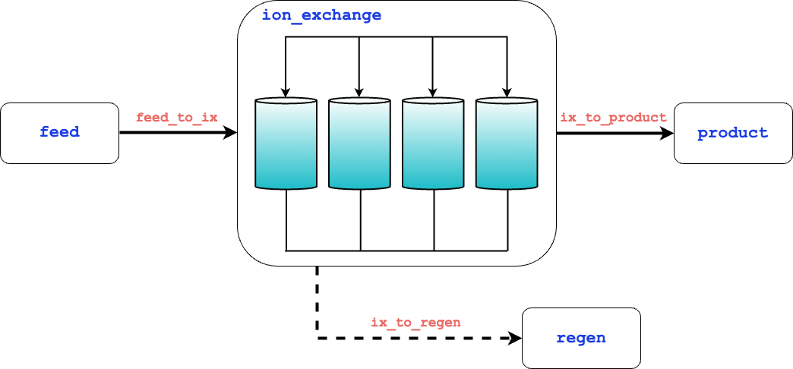

Ion Exchange
============

Introduction
------------

The simple ion exchange (IX) flowsheet can be simulated to predict the performance of an IX system to remove targeted ions and components. This flowsheet can
be useful to expedite the setup, usage, and costing of an IX system for conventional water treatment applications using the Langmuir isotherm and
the constant pattern assumption.

Implementation
--------------

Consisting of only a single unit operation, the assumptions for the flowsheet are the same as those outlined in the :doc:`IX unit model documentation </technical_reference/unit_models/ion_exchange_0D>`:

1) Model dimensionality is limited to a 0D control volume
2) Single liquid phase only
3) Steady state only
4) Single solute and single solvent (water) only
5) Plug flow conditions
6) Isothermal conditions
7) Favorable Langmuir isotherm

Figure 1 presents the process flow diagram for the IX model. Blue text represents all of the unit blocks on the flowsheets, and red text
represents process streams (or more specifically, an ``Arc`` that is connected to a ``Port`` on each unit block).

    Figure 1. IX demonstration flowsheet.

The following modeling components are used within the flowsheet:

    Documentation for property models:
        * :doc:`/technical_reference/property_models/mc_aq_sol`
    Documentation for unit models:
        * :doc:`/technical_reference/unit_models/ion_exchange_0D`
    Documentation for unit models from IDAES:
        * :doc:`idaes:reference_guides/model_libraries/generic/unit_models/feed`
        * :doc:`idaes:reference_guides/model_libraries/generic/unit_models/product`
    Documentation for costing models:
        * :doc:`/technical_reference/costing/watertap_costing`
        * :doc:`/technical_reference/costing/ion_exchange`

The ion exchange flowsheet demonstration proceeds through five steps:

1. Building the model with ``ix_build``: 
    This function builds the flowsheet with a list of ions as the input.
    If the keyword argument ``target_ion`` is not used, the first ion in the list of ions provided is used as the ``target_ion`` configuration argument for the ``IonExchange0D`` model.
    The ion used in the demonstration is calcium (``Ca_2+``), but the local function ``get_ion_config`` can be used to get diffusivity, molecular weight,
    and charge data for sodium (``Na_+``), chloride (``Cl_-``), magnesium (``Mg_2+``), and sulfate (``SO4_2-``). This function will also add the flowsheet 
    level and unit model costing packages, set default scaling for molar flow rates of water and the target ion, create ``Arcs`` to connect
    the feed, product, and regen blocks to the IX unit model, and calculate scaling factors for the entire flowsheet. The model is returned from this function.

2. Defining the operating conditions with ``set_operating_conditions``: 
    This function is used to set the flow rate and concentration for the flowsheet via the ``flow_in`` and ``conc_mass_in``
    keywords, respectively. It will also set the operating conditions for the IX unit process simulation. Specific variables fixed are in the sections below.

3. Connecting and initializing individual unit models with ``initialize_system``: 
    Calling this function will initialize all unit models on the flowsheet (``feed``, ``ion_exchange``, ``product``, and ``regen``), initialize 
    the ``costing`` block, and propagate the arcs.

4. Solving the model with ``solver``:
    The solver object is returned by calling the WaterTAP function ``get_solver()``. After the model is built, specified, and initialized, 
    the model has zero degrees of freedom and is solved with ``solver.solve(m)``. The termination condition of the solve is checked and, assuming the solve is optimal, 
    continues with the optimization demonstration.
    
5. Optimizing IX design with ``optimize_system``: 
    Though not required, this function provides an example of optimizing the design of the IX system for a targeted effluent concentration
    of 25 mg/L. The initial model demonstration resulted in an effluent concentration of 0.21 mg/L, so this optimization results in longer breakthrough time
    and therefore, a less frequent regeneration schedule and lower operating costs. The optimization proceeds in four steps:
        
    * First, the function will set an ``Objective`` on the flowsheet to minimize the levelized cost of water (LCOW).
    
    .. math::
        
        LCOW_{Q} = \frac{f_{crf}   C_{cap,tot} + C_{op,tot}}{f_{util} Q}
    
    where :math:`Q` represents volumetric flow, :math:`f_{crf}` represents capital recovery factor :math:`C_{cap,tot}` represents total capital cost, :math:`C_{op,tot}` represents total operating cost, and :math:`f_{util}` represents the utilization factor

    * Then, the model fixes the effluent concentration of the IX model to 25 mg/L, propagates that concentration to the product block, and re-initializes the product block with the new targeted concentration.
    * Next, three variables are unfixed on the ion exchange model to allow for the model to solve for the new conditions (``dimensionless_time``, ``number_columns``, and the ``bed_depth``).
    * Finally, the model is solved for these new conditions.
    
    Note that stopping at this point will likely result in a non-integer value for ``number_columns``. This value also corresponds to an optimal value for both ``bed_depth`` and 
    ``dimensionless_time``. The user can optionally ensure the ``number_columns`` is an integer by rounding the ``number_columns`` to an integer value after 
    the initial optimization solve, fixing ``number_columns`` to that value, and then re-solving the model to obtain the final values for ``bed_depth`` and ``dimensionless_time``.
    This is the approach taken in the demonstration file.
        
Degrees of Freedom
------------------

The degrees of freedom for the flowsheet can change depending on the configuration options specified during the build. 
Specifics for other configurations options are available in the IX model documentation.
In this demonstration, the following variables are initially fixed for simulating the IX flowsheet (i.e., degrees of freedom = 0):

    * Feed conditions (component flows, temperature, pressure)
    * Langmuir equilibrium coefficient for target ion
    * Resin capacity, diameter, porosity, and density
    * Number of columns for the system
    * Service flow rate (loading rate)
    * The dimensionless time for the constant-pattern solution

Flowsheet Specifications
------------------------

.. csv-table::
   :header: "Description", "Value", "Units"

   "Feed molar flowrate of water", "2777.5", ":math:`\text{mol}/\text{s}`"
   "Feed molar flowrate of target ion", "0.125", ":math:`\text{mol}/\text{s}`"
   "Feed temperature", "298.15", ":math:`\text{K}`"
   "Feed pressure", "101325", ":math:`\text{Pa}`"
   "Langmuir equilibrium coefficient", "0.7", ":math:`\text{dimensionless}`"
   "Resin capacity", "3.0", ":math:`\text{mol/kg}`"
   "Resin bulk density", "0.7", ":math:`\text{kg/L}`"
   "Constant pattern dimensionless time", "1", ":math:`\text{dimensionless}`"
   "Number columns", "4", ":math:`\text{dimensionless}`"
   "Bed void fraction", "0.5", ":math:`\text{dimensionless}`"
   "Bed depth", "1.7", ":math:`\text{m}`"
   "Service flow rate (in bed volumes)", "15", ":math:`\text{1/hr}`"

Future Refinements
------------------

The following modifications to the IX flowsheet are planned for development:

    * Add examples of the Freundlich (Clark) ion exchange model.
    * Improve auto-scaling of model for ease of use

Code Documentation
------------------

* :mod:`watertap.examples.flowsheets.ion_exchange`

References
----------

| LeVan, M. D., Carta, G., & Yon, C. M. (2019).
| Section 16: Adsorption and Ion Exchange.
| Perry's Chemical Engineers' Handbook, 9th Edition.

| Inamuddin, & Luqman, M. (2012).
| Ion Exchange Technology I: Theory and Materials.

| United States Environmental Protection Agency. (2021). Work Breakdown Structure-Based Cost Models
| https://www.epa.gov/sdwa/drinking-water-treatment-technology-unit-cost-models
