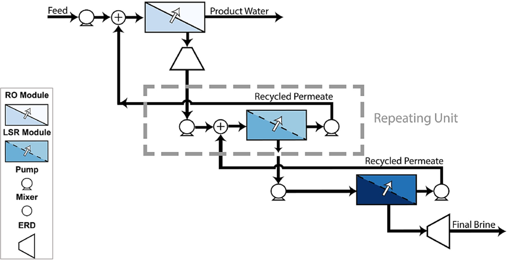

Low-Salt-Rejection Reverse Osmosis (LSRRO)
==========================================

.. note::
   When utilizing this model in research or publications, please cite the following reference:

   Atia, A. A., Allen, J., Young, E., Knueven, B., & Bartholomew, T. V. (2023). Cost optimization of low-salt-rejection reverse osmosis. Desalination, 551, 116407.

Introduction
---------------

Low-Salt-Rejection Reverse Osmosis (LSRRO) is an innovative membrane-based desalination technology designed to concentrate high-salinity brines with potentially lower energy consumption and cost compared to traditional thermal processes. 
LSRRO addresses the limitations of conventional reverse osmosis by utilizing low-salt-rejection (LSR) membranes. These membranes allow the passage of water molecules while permitting a controlled amount of salt permeation, which reduces the transmembrane osmotic pressure.
Moreover, LSRRO can be constructed using commercially available nanofiltration modules with low monovalent ion rejection or oxidant-treated reverse osmosis modules, making it more readily deployable.

Implementation
--------------

Figure 1 illustrates the LSRRO flowsheet. The LSRRO system comprises a conventional RO stage followed by low-salt-rejection (LSR) stages, where the saline permeate of each LSR stage is recycled to the inlet of the previous stage. Brine is concentrated further as it passes through each subsequent LSR stage.
The first stage RO permeate is collected as purified water (Product Water) and the last LSR stage produces the final concentrated brine. 
Primary pumps are located upstream of each RO or LSR stage. These pumps pressurize the feed to the RO stage and the concentrated brine from the previous stage to the LSR stages.
Booster pumps are used to pressurize the permeate recycled from the subsequent LSR stages. 
Mixers combine the pressurized streams from the primary pumps and booster pumps. The resulting mixed stream is then fed into the next LSR stage.
Energy recovery devices (ERDs) are employed to optimize energy use. These devices recover energy from the retentate stream of the first RO stage and the final brine from the last LSR stage.

    Figure 1. LSRRO flow diagram

The flowsheet relies on the following key assumptions:

   * supports steady-state only
   * supports optimization and minimizes levelized cost of water (LCOW) with constraints
   * `NaCl Property Package <https://watertap.readthedocs.io/en/latest/technical_reference/property_models/NaCl.html>`_ is utilized
   * number of stages and system recovery should be specified for optimization

Documentation for each of the unit models can be found here:
   * `RO and LSR <https://watertap.readthedocs.io/en/latest/technical_reference/unit_models/reverse_osmosis_0D.html>`_
   * `Mixer <https://idaes-pse.readthedocs.io/en/stable/reference_guides/model_libraries/generic/unit_models/mixer.html>`_

Documentation for the property model can be found here:
    * `NaCl Property Package <https://watertap.readthedocs.io/en/latest/technical_reference/property_models/NaCl.html>`_

Documentation for the costing relationships can be found here:
    * `WaterTAP Costing Package <https://watertap.readthedocs.io/en/latest/technical_reference/costing/watertap_costing.html>`_

This flowsheet aims to solve an optimization problem that minimizes the levelized cost of water (LCOW) with a specified number of stages and system mass recovery. LCOW can be represented by the following equation where :math:`Q` represents product volumetric flow, :math:`f_{crf}` represents the capital recovery factor, :math:`C_{cap,tot}` represents the total capital cost, :math:`C_{op,tot}` represents the total operating cost, and :math:`f_{util}` represents the utilization factor:

    .. math::

        LCOW_{Q} = \frac{f_{crf} \cdot C_{cap,tot} + C_{op,tot}}{f_{util} \cdot Q}
   

Additional variables, parameters, and constraints
--------------------------------------------------

The LSRRO flowsheet can be customized using a range of configuration options and input settings. Depending on the selected options, specific variables, parameters, and constraints will be applied to tailor the flowsheet to meet specific requirements of the model.

Variables
---------

If ``A_case`` is set to ``single_optimum``:

.. csv-table::
   :header: "Description", "Symbol", "Variable Name", "Index", "Units"

   "Water permeability coefficient constant in all LSR stages", ":math:`A_{\text{comp}_{\text{system}}}`", "``A_comp_system``", "[t, j]", ":math:`\text{m/Pa/s}`"

If ``B_case`` is set to ``single_optimum``:

.. csv-table::
   :header: "Description", "Symbol", "Variable Name", "Index", "Units"

   "Salt permeability coefficient constant in all LSR stages", ":math:`B_{\text{comp}_{\text{system}}}`", "``B_comp_system``", "[t, j]", ":math:`\text{m/s}`"

Parameters
----------

If ``AB_tradeoff`` is set to ``equality_constraint`` or ``inequality_constraint``:

.. csv-table::
   :header: "Description", "Symbol", "Parameter Name", "Units"

   "Water and salt permeatbility coefficient trade-off", ":math:`AB_{\text{trade-off}}`", "``AB_tradeoff_coeff``", ":math:`\text{m/s}`"

If ``B_max`` is set:

.. csv-table::
   :header: "Description", "Symbol", "Parameter Name", "Units"

   "Maximum allowable B value", ":math:`B_{\text{max}}`", "``B_max``", ":math:`\text{m/s}`"

Constraints
-----------

If ``A_case`` is set to ``ACase.single_optimum``:

.. csv-table::
   :header: "Description", "Equation"

   "Equality constraint across all A (water permeability coefficient) values of LSR stages", ":math:`A_{\text{comp}}[0, \text{H2O}] = A_{\text{comp}_{\text{system}}}`"

If ``B_case`` is set to ``BCase.single_optimum``:

.. csv-table::
   :header: "Description", "Equation"

   "Equality constraint across all B (salt permeability coefficient) values of LSR stages", ":math:`B_{\text{comp}}[0, \text{NaCl}] = B_{\text{comp}_{\text{system}}}`"

If ``AB_tradeoff`` is set to ``equality_constraint``:

.. csv-table::
   :header: "Description", "Equation"

   "Equality constraint between A and B", ":math:`B_{\text{comp}} = AB_{\text{trade-off}} \cdot (A_{\text{comp}})^{3}`"

If ``AB_tradeoff`` is set to ``inequality_constraint``:

.. csv-table::
   :header: "Description", "Equation"

   "Inequality constraint between A and B", ":math:`B_{\text{comp}} \geq AB_{\text{trade-off}} \cdot (A_{\text{comp}})^{3}`"

If ``has_NaCl_solubility_limit`` is set to ``True``:

.. csv-table::
   :header: "Description", "Equation"

   "NaCl solubility limit", ":math:`X_{\text{Liq, NaCl}} \leq 0.2614`"

If ``permeate_quality_limit`` is not None:

.. csv-table::
   :header: "Description", "Equation"

   "Permeate quality limit", ":math:`X_{\text{Liq, NaCl}_{\text{permeate}}} \leq \text{permeate quality limit}`"

Degrees of Freedom
------------------

In addition to the number of stages and water mass recovery of the system, the following variables need to be specified based on the default settings:

   * feed water conditions (flow, temperature, pressure, component concentrations)
   * pump efficiency of primary pumps and recycle pumps
   * ERD pump efficiency and outlet pressure
   * RO membrane solvent and solute permeability coefficients, feed-side channel height and spacer porosity, and permeate pressure
   * LSR modules feed-side channel height and spacer porosity, and permeate pressure

If configuring LSR stages to utilize fixed values of solvent and solute permeability coefficients:

    * LSR membranes' solvent and solute permeability coefficients

Flowsheet Specifications
--------------------------

.. csv-table::
   :header: "Description", "Value", "Units"

   "**Primary and booster pumps**", "", ""
   "Pump efficiency", "0.75", "dimensionless"
   "**ERDs**", "", ""
   "efficiency", "0.8", "dimensionless"
   "Outlet pressure", "101325", "Pa"
   "**RO Stage**", "", ""
   "Water permeability coefficient", "4.2E-12", "m/s-Pa"
   "Salt permeability coefficient", "3.5E-8", "m/s"
   "Feed-channel height", "1E-3", "m"
   "Feed-side spacer porosity", "0.85", "dimensionless"
   "Permeate pressure", "101325", "Pa"
   "Minimum RO pressure", "10E5", "Pa"
   "Maximum RO pressure", "85E5", "Pa"
   "**LSRRO stages**", "", ""
   "Water permeability coefficient", "2.78E-12 to 4.2E-11", "m/s-Pa"
   "Salt permeability coefficient", "3.5E-8 to B_max", "m/s"
   "Feed-channel height", "1E-3", "m"
   "Feed-side spacer porosity", "0.85", "dimensionless"
   "Minimum LSRRO pressure", "10E5", "Pa"
   "Maximum LSRRO pressure", "65E5", "Pa"
   "**Additional Specifications**", "", ""
   "Permeate quality limit", "500E-6", "ppm"

