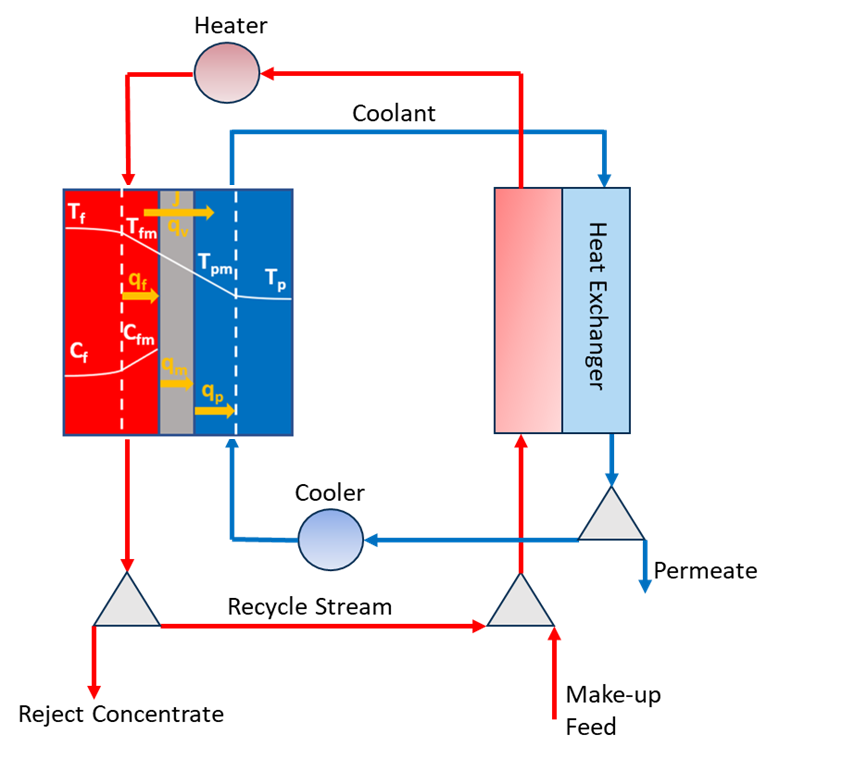

Membrane Distillation
======================

Introduction
------------

Membrane Distillation (MD) is an emerging technology that combines membrane and evaporative processes to treat highly saline brine. By leveraging a temperature gradient across a hydrophobic membrane, MD induces vapor pressure differences that cause permeate to pass through the membrane pores, facilitating the separation of pure water from a saline solution.
The condensation site of the permeated vapor depends on the MD configuration. In Direct Contact Membrane Distillation (DCMD), the permeated vapor condenses on the coolant surface in the cold side, which is in direct contact with the membrane. The process operates at lower temperatures compared to traditional thermal desalination methods, making it well-suited for utilization of waste heat sources.

Implementation
--------------

Figure 1 shows the flowsheet diagram for a DCMD model operating in continuous recirculation mode, where a large portion of the concentrated brine is recirculated and mixed with the makeup feed to achieve high recoveries. This approach helps overcome the low single-pass recovery limitation of MD technologies, which is typically a maximum of 10%.
The simulation includes an integrated external heat exchanger for heat recovery, optimizing energy use. The flowsheet encompasses:

- An MD module for the distillation process.
- A heater to preheat the recycle stream and makeup feed.
- A chiller to cool the cold loop stream entering the cold side of the membrane, ensuring efficient separation driving force and vapor condensation.
- An external heat exchanger to recover heat from the heated pure water in the cold loop and preheat the recycle stream and makeup feed mixture to the hot channel before it enters the heater.
- Pumps, separators, and mixers to support the process flow and integration.

Costing relationships for each of the unit models are described in the
`WaterTAP Costing Package <https://watertap.readthedocs.io/en/latest/technical_reference/costing/watertap_costing.html>`_.

The flowsheet relies on the following key assumptions:

   * Supports steady-state only
   * Supports optimization and minimizes the levelized cost of water (LCOW) with constraints
   * Uses the `Seawater Property Package <https://watertap.readthedocs.io/en/latest/technical_reference/property_models/seawater.html>`_ and  `Water Property Package <https://watertap.readthedocs.io/en/latest/technical_reference/property_models/water.html>`_
   * Number of stages and system recovery should be specified for optimization

    Figure 1. MD flow diagram

Documentation for each of the unit models can be found here:
   * `MD <https://watertap.readthedocs.io/en/latest/technical_reference/unit_models/membrane_distillation_0D.html>`_
   * `Heat Exchanger <https://idaes-pse.readthedocs.io/en/stable/reference_guides/model_libraries/generic/unit_models/heat_exchanger.html>`_
   * `Heater and chiller <https://idaes-pse.readthedocs.io/en/stable/reference_guides/model_libraries/generic/unit_models/heater.html>`_
   * `Mixer <https://idaes-pse.readthedocs.io/en/stable/reference_guides/model_libraries/generic/unit_models/mixer.html>`_
   * `Separator <https://idaes-pse.readthedocs.io/en/stable/reference_guides/model_libraries/generic/unit_models/separator.html>`_

Documentation for the property model can be found here:
   * `Seawater Property Package <https://watertap.readthedocs.io/en/latest/technical_reference/property_models/seawater.html>`_
   * `Water Property Package <https://watertap.readthedocs.io/en/latest/technical_reference/property_models/water.html>`_

This flowsheet aims to solve an optimization problem that minimizes the LCOW with a specified overall water recovery.
LCOW can be represented by the following equation where :math:`Q` represents product volumetric flow, :math:`f_{crf}` represents the capital recovery factor, :math:`C_{cap,tot}` represents total capital cost, :math:`C_{op,tot}` represents total operating cost, and :math:`f_{util}` represents the utilization factor:

    .. math::

        LCOW_{Q} = \frac{f_{crf} \cdot C_{cap,tot} + C_{op,tot}}{f_{util} \cdot Q}

Degrees of Freedom
------------------

In addition to the overall water recovery, the following variables need to be specified based on the default settings:
   * Feed water conditions (flow, temperature, pressure, component concentrations)
   * Pump efficiency
   * Membrane permeability coefficient, thickness, and thermal conductivity
   * MD hot and cold channel spacer porosity and height
   * Heat exchanger overall heat transfer coefficient

Flowsheet Specifications
------------------------

.. csv-table::
   :header: "Description", "value", "Units"

   "**MD Module**"
   "Membrane permeability coefficient", "1e-10", "m/Pa/s"
   "Membrane thickness", "1e-4", "m"
   "Membrane thermal conductivity", "0.2", "W/m/K"
   "MD hot and cold channels height", "0.0019", "m"
   "MD hot and cold channels spacer porosity", "0.77", "dimensionless"
   "**Heat Exchanger**"
   "Overall heat transfer coefficient", "2000", "W/m²K"
   "**Pumps**"
   "Efficiency", "0.8", "dimensionless"
   "**Heater**"
   "Maximum outlet temperature", "90", "°C"
   "**Cooler**"
   "Minimum outlet temperature", "10", "°C"

Additional Variables
--------------------

.. csv-table::
   :header: "Description", "Variable Name", "Units"

   "Recycle ratio (Ratio of recycle stream to the make up feed)", ``recycle_ratio``, ":math:`\text{dimensionless}`"

Additional Constraints
----------------------

There is an extra inequality constraint to ensure the hydraulic pressure inside the MD module is lower than the Liquid Entry Pressure (LEP) to prevent membrane wetting:

.. csv-table::
   :header: "Description", "Equation"

   "Liquid Entry Pressure", ":math:`P_{hot\_channel\_inlet} \le 10^5`"
