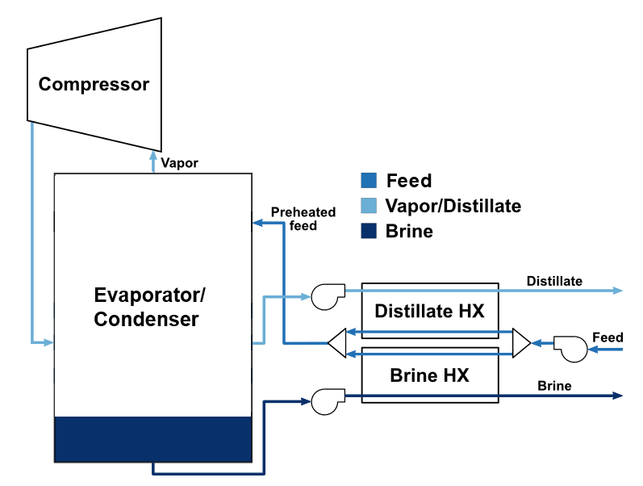

Mechanical Vapor Compression
============================

Introduction
------------

Mechanical vapor compression (MVC) is a energy recovery system that recycles waste heat from working fluids (usually steam),
reducing a facility's energy consumption and operational costs. The process works by increasing the
temperature and pressure of waste heat with a compressor and then transferring the excess heat via heat exchangers (HEX), ultimately
generating a concentrated brine stream and a distillate stream.

Implementation
--------------

Figure 1 shows the process flow diagram for MVC where the (by default) half of the influent water is pumped into the cold inlet
a distillate HEX, and the other half is pumped into the cold inlet of a brine HEX. After being transferred
heat, the cold side outlets are mixed and sent to the evaporator, which produces steam and brine streams.
The brine is sent to the hot side inlet of the brine HEX, transferring some of its heat to the influent before leaving the system.
Meanwhile, the steam generated by the evaporator is sent to a compressor, increasing the temperature and pressure
of the steam. The amount of energy needed to compress the vapor is relatively small compared to the energy saved by
the recovered waste heat, making this process highly energy efficient. The compressed vapor is recycled back to the
evaporator which helps to produce even more steam. Finally, the distillate is sent to the hot side inlet of the distillate
HEX, transferring some of its heat to the influent before leaving the system. The flowsheet relies
on the following key assumptions:

   * supports steady-state only
   * property package(s) supporting liquid and vapors is provided

    Figure 1. MVC flowsheet

Documentation for each of the WaterTAP unit models can be found below. All unit models were set up with their default configuration arguments.
    * `Pressure Changer <https://watertap.readthedocs.io/en/latest/technical_reference/unit_models/pressure_changer.html>`_
    * `Evaporator <https://watertap.readthedocs.io/en/latest/technical_reference/unit_models/evaporator.html>`_
    * `Compressor <https://watertap.readthedocs.io/en/latest/technical_reference/unit_models/compressor.html>`_
    * `Condenser <https://watertap.readthedocs.io/en/latest/technical_reference/unit_models/condenser.html>`_

Documentation for each of the IDAES unit models can be found below. All unit models were set up with their default configuration arguments.
    * `Feed <https://idaes-pse.readthedocs.io/en/latest/reference_guides/model_libraries/generic/unit_models/feed.html>`_
    * `Heat Exchanger <https://idaes-pse.readthedocs.io/en/latest/reference_guides/model_libraries/generic/unit_models/heat_exchanger.html>`_
    * `Separator <https://idaes-pse.readthedocs.io/en/latest/reference_guides/model_libraries/generic/unit_models/separator.html>`_
    * `Product <https://idaes-pse.readthedocs.io/en/latest/reference_guides/model_libraries/generic/unit_models/product.html>`_
    * `Mixer <https://idaes-pse.readthedocs.io/en/latest/reference_guides/model_libraries/generic/unit_models/mixer.html>`_
    * `Translator <https://idaes-pse.readthedocs.io/en/latest/reference_guides/model_libraries/generic/unit_models/translator.html>`_

Documentation for each of the property models can be found below.
    * `Water <https://watertap.readthedocs.io/en/latest/technical_reference/property_models/water.html>`_
    * `Seawater <https://watertap.readthedocs.io/en/latest/technical_reference/property_models/seawater.html>`_

Documentation for the costing relationships can be found below.
    * `WaterTAP Costing Package <https://watertap.readthedocs.io/en/latest/technical_reference/costing/watertap_costing.html>`_

The objective function is to minimize the levelized cost of water, which can be represented by the following equation
where :math:`Q` represents volumetric flow, :math:`f_{crf}` represents capital recovery factor
:math:`C_{cap,tot}` represents total capital cost, :math:`C_{op,tot}` represents total operating cost, and
:math:`f_{util}` represents the utilization factor:

    .. math::

        LCOW_{Q} = \frac{f_{crf}   C_{cap,tot} + C_{op,tot}}{f_{util} Q}

Degrees of Freedom
------------------
The following variables are initially specified for simulating the MVC flowsheet (i.e., degrees of freedom = 0):
    * feed water conditions (mass flow, mass fractions, temperature, and pressure)
    * feed pump efficiency and pressure change (ΔP)
    * separator split fraction
    * distillate HEX heat transfer coefficient, area, cold-side ΔP, and hot-side ΔP
    * brine HEX heat transfer coefficient, area, cold-side ΔP, and hot-side ΔP
    * evaporator outlet brine temperature and internal energy
    * compressor efficiency and pressure ratio
    * brine pump efficiency and ΔP
    * distillate pump efficiency and ΔP
    * translator block outlet TDS concentration

Flowsheet Specifications
------------------------

.. csv-table::
   :header: "Description", "Value", "Units"

   "**Feed Water**:math:`^1`"
   "Volumetric flow","20648", ":math:`\text{m}^3\text{/day}`"
   "Temperature", "308.15", ":math:`\text{K}`"
   "Pressure", "1", ":math:`\text{atm}`"
   "Soluble inert organic matter (S_I) concentration", "27", ":math:`\text{g/}\text{m}^3`"
   "Readily biodegradable substrate (S_S) concentration", "58", ":math:`\text{g/}\text{m}^3`"
   "Particulate inert organic matter (X_I) concentration", "92", ":math:`\text{g/}\text{m}^3`"
   "Slowly biodegradable substrate (X_S) concentration", "363", ":math:`\text{g/}\text{m}^3`"
   "Active heterotrophic biomass (X_B,H) concentration", "50", ":math:`\text{g/}\text{m}^3`"
   "Active autotrophic biomass (X_B,A) concentration", "0", ":math:`\text{g/}\text{m}^3`"
   "Particulate products arising from biomass decay (X_P) concentration", "0", ":math:`\text{g/}\text{m}^3`"
   "Oxygen (S_O) concentration", "0", ":math:`\text{g/}\text{m}^3`"
   "Nitrate and nitrite nitrogen (S_NO) concentration", "0", ":math:`\text{g/}\text{m}^3`"
   "NH4 :math:`^{+}` + NH :math:`_{3}` Nitrogen (S_NH) concentration", "23", ":math:`\text{g/}\text{m}^3`"
   "Soluble biodegradable organic nitrogen (S_ND) concentration", "5", ":math:`\text{g/}\text{m}^3`"
   "Particulate biodegradable organic nitrogen (X_ND) concentration", "16", ":math:`\text{g/}\text{m}^3`"
   "Alkalinity (S_ALK)", "7", ":math:`\text{mol/}\text{m}^3`"

   "**Activated Sludge Process**"
   "Reactor 1 volume", "1000", ":math:`\text{m}^3`"
   "Reactor 2 volume", "1000", ":math:`\text{m}^3`"
   "Reactor 3 volume", "1333", ":math:`\text{m}^3`"
   "Reactor 4 volume", "1333", ":math:`\text{m}^3`"
   "Reactor 5 volume", "1333", ":math:`\text{m}^3`"
   "Reactor 3 injection rate for component j", "0", ":math:`\text{g/}\text{s}`"
   "Reactor 4 injection rate for component j", "0", ":math:`\text{g/}\text{s}`"
   "Reactor 5 injection rate for component j", "0", ":math:`\text{g/}\text{s}`"
   "Reactor 3 outlet oxygen (S_O) concentration", "0.00172", ":math:`\text{g/}\text{m}^3`"
   "Reactor 4 outlet oxygen (S_O) concentration", "0.00243", ":math:`\text{g/}\text{m}^3`"
   "Reactor 5 outlet oxygen (S_O) concentration", "0.00449", ":math:`\text{g/}\text{m}^3`"
   "Reactor 5 underflow split fraction", "0.6", ":math:`\text{dimensionless}`"
   "Reactor 3 oxygen mass transfer coefficient", "7.6", ":math:`\text{hr}^{-1}`"
   "Reactor 4 oxygen mass transfer coefficient", "5.7", ":math:`\text{hr}^{-1}`"
   "Secondary clarifier H2O split fraction", "0.48956", ":math:`\text{dimensionless}`"
   "Secondary clarifier S_I split fraction", "0.48956", ":math:`\text{dimensionless}`"
   "Secondary clarifier S_S split fraction", "0.48956", ":math:`\text{dimensionless}`"
   "Secondary clarifier X_I split fraction", "0.00187", ":math:`\text{dimensionless}`"
   "Secondary clarifier X_S split fraction", "0.00187", ":math:`\text{dimensionless}`"
   "Secondary clarifier X_BH split fraction", "0.00187", ":math:`\text{dimensionless}`"
   "Secondary clarifier X_BA split fraction", "0.00187", ":math:`\text{dimensionless}`"
   "Secondary clarifier X_P split fraction", "0.00187", ":math:`\text{dimensionless}`"
   "Secondary clarifier S_O split fraction", "0.48956", ":math:`\text{dimensionless}`"
   "Secondary clarifier S_NO split fraction", "0.48956", ":math:`\text{dimensionless}`"
   "Secondary clarifier S_NH split fraction", "0.48956", ":math:`\text{dimensionless}`"
   "Secondary clarifier S_ND split fraction", "0.48956", ":math:`\text{dimensionless}`"
   "Secondary clarifier X_ND split fraction", "0.00187", ":math:`\text{dimensionless}`"
   "Secondary clarifier S_ALK split fraction", "0.48956", ":math:`\text{dimensionless}`"
   "Secondary clarifier surface area", "1500", ":math:`\text{m}^2`"
   "Separator recycle split fraction", "0.985", ":math:`\text{dimensionless}`"
   "Recycle pump outlet pressure", "101325", ":math:`\text{Pa}`"

   "**Primary Clarifier**"
   "Primary clarifier H2O split fraction", "0.993", ":math:`\text{dimensionless}`"
   "Primary clarifier S_I split fraction", "0.993", ":math:`\text{dimensionless}`"
   "Primary clarifier S_S split fraction", "0.993", ":math:`\text{dimensionless}`"
   "Primary clarifier X_I split fraction", "0.5192", ":math:`\text{dimensionless}`"
   "Primary clarifier X_S split fraction", "0.5192", ":math:`\text{dimensionless}`"
   "Primary clarifier X_BH split fraction", "0.5192", ":math:`\text{dimensionless}`"
   "Primary clarifier X_BA split fraction", "0.5192", ":math:`\text{dimensionless}`"
   "Primary clarifier X_P split fraction", "0.5192", ":math:`\text{dimensionless}`"
   "Primary clarifier S_O split fraction", "0.993", ":math:`\text{dimensionless}`"
   "Primary clarifier S_NO split fraction", "0.993", ":math:`\text{dimensionless}`"
   "Primary clarifier S_NH split fraction", "0.993", ":math:`\text{dimensionless}`"
   "Primary clarifier S_ND split fraction", "0.993", ":math:`\text{dimensionless}`"
   "Primary clarifier X_ND split fraction", "0.5192", ":math:`\text{dimensionless}`"
   "Primary clarifier S_ALK split fraction", "0.993", ":math:`\text{dimensionless}`"

   "**Anaerobic Digester**"
   "Anaerobic digester liquid volume", "3400", ":math:`\text{m}^3`"
   "Anaerobic digester vapor volume", "300", ":math:`\text{m}^3`"
   "Anaerobic digester liquid outlet temperature", "308.15", ":math:`\text{m}^3`"

   "**Dewatering Unit**"
   "Dewatering unit hydraulic retention time", "1800", ":math:`\text{s}`"
   "Dewatering unit specific energy consumption", "0.069", ":math:`\text{kWh/}\text{m}^3`"

   "**Thickener**"
   "Thickener hydraulic retention time", "86400", ":math:`\text{s}`"
   "Thickener diameter", "10", ":math:`\text{kWh/}\text{m}`"

