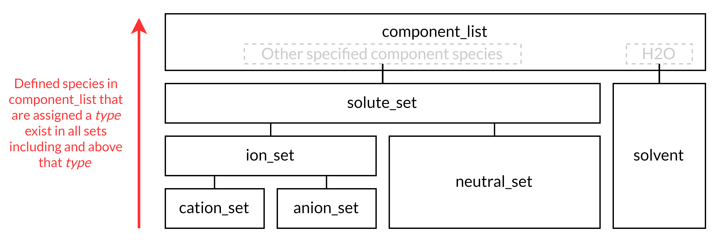

.. _mcas_tech_ref:

Multi-Component Aqueous Solution (MCAS) Property Package
========================================================

This property package implements property relationships for an aqueous solution that may contain multiple neutral and/or ionic solutes.

The MCAS property package
   * sets H2O as the solvent;
   * supports multiple solute components including ions and neutral molecules;
   * supports only liquid phase;
   * uses temperature, pressure, and either molar flowrate (mol/s) or mass flowrate (kg/s) as state variables;
   * does not support dynamics.

For usage examples, please refer to the associated :ref:`"how-to" documentation for MCAS<mcas_how_to>`. 

Sets
----
.. csv-table::
   :header: "Description", "Symbol", "Indices"

   "Components", ":math:`j`", "component_list=['H2O', solute_list :sup:`1`]"
   "Phases", ":math:`p`", "['Liq']"
   "solute_set", ":math:`j`", "[all components in component_list except H2O]"
   "cation_set", ":math:`j`", "[cationic components in component_list]"
   "anion_set", ":math:`j`", "[anionic components in component_list]"
   "neutral_set", ":math:`j`", "[neutral components in component_list]"
   "ion_set", ":math:`j`", "[cationic and anionic components in component_list]"

.. note::
   
   :sup:`1`  solute_list must be provided by the user via the necessary configuration option, ``solute_list``.

    Figure 1. Hierarchy of the Pyomo sets constructed in the MCAS property package. Here, types are declared for the
    species in component list, or sometimes auto-assigned considering other input such as charge; e.g., the chloride anion
    would be contained in anion_set, ion_set, solute_set, and component_list.

State variables
---------------
.. csv-table::
   :header: "Description", "Symbol", "Variable", "Index", "Units"

   "Temperature", ":math:`T`", "temperature", "None", ":math:`\text{K}`"
   "Pressure", ":math:`P`", "pressure", "None", ":math:`\text{Pa}`"

The ``material_flow_basis`` configuration option can be used to select the desired state variable for flow basis.

If ``material_flow_basis`` is set to ``MaterialFlowBasis.molar`` (the default setting), component molar flowrates will be used:

.. csv-table::
   :header: "Description", "Symbol", "Variable", "Index", "Units"

   "Component molar flowrate", ":math:`N`", "flow_mol_phase_comp", "[p, j]", ":math:`\text{mol s}^{-1}`"

If ``material_flow_basis`` is set to ``MaterialFlowBasis.mass``, component mass flowrates will be used:

.. csv-table::
   :header: "Description", "Symbol", "Variable", "Index", "Units"

   "Component mass flowrate", ":math:`M`", "flow_mass_phase_comp", "[p, j]", ":math:`\text{kg s}^{-1}`"

Parameters
----------
.. csv-table::
 :header: "Description", "Symbol", "Parameter", "Index", "Units"

 "Component molecular weight :sup:`1`", ":math:`m_N`", "mw_comp", "[j]", ":math:`\text{kg mol}^{-1}`"
 "Stokes radius of solute", ":math:`r_h`", "radius_stokes_comp", "[j]", ":math:`\text{m}`"
 "Molar volume of solute", ":math:`V`", "molar_volume_phase_comp", "[p, j]", ":math:`\text{m}^3 \text{ mol}^{-1}`"
 "Dynamic viscosity", ":math:`\mu`", "visc_d_phase", "[p]", ":math:`\text{Pa s}`"
 "Bulk diffusivity of solute", ":math:`D`", "diffus_phase_comp", "[p, j]", ":math:`\text{m}^2 \text{ s}^{-1}`"
 "Ion charge", ":math:`z`", "charge_comp", "[j]", ":math:`\text{dimensionless}`"
 "Dielectric constant of water", ":math:`\epsilon`", "dielectric_constant", "None", ":math:`\text{dimensionless}`"
 "Debye Huckel constant b", ":math:`b`", "debye_huckel_b", "None", ":math:`\text{kg mol}^{-1}`"
 "Hayduk Laudie correlation constant", ":math:`\chi_{1}`", "hl_diffus_cont", "None", ":math:`\text{dimensionless}`"
 "Hayduk Laudie viscosity coefficient", ":math:`\chi_{2}`", "hl_visc_coeff", "None", ":math:`\text{dimensionless}`"
 "Hayduk Laudie molar volume coefficient", ":math:`\chi_{3}`", "hl_molar_volume_coeff", "None", ":math:`\text{dimensionless}`"

.. note::
   :sup:`1` *Component molecular weight* data is now set as a requirement when instantiating the MCAS property model. Hence, the user must provide these data in the ``mw_data`` configuration option.
   Additionally, a warning will be displayed if *charge* data are not provided via the ``charge`` configuration option, in case the user intended to include ions in the ``solute_list`` but forgot to provide charge. However, this warning can be ignored if neutral molecules were the only solutes intended for inclusion in ``solute_list``.

Properties
----------
.. csv-table::
   :header: "Description", "Symbol", "Variable", "Index", "Units"

   "Component charge-equivalent molar flowrate", ":math:`\tilde{N}`", "flow_equiv_phase_comp", "[p, j]", ":math:`\text{mol s}^{-1}`"
   "Component charge-equivalent molar concentration", ":math:`\tilde{n}`", "conc_equiv_phase_comp", "[p, j]", ":math:`\text{mol m}^{-3}`"
   "Component mass fraction", ":math:`x`", "mass_frac_phase_comp", "[p, j]", ":math:`\text{dimensionless}`"
   "Mass density of aqueous phase", ":math:`\rho`", "dens_mass_phase", "[p]", ":math:`\text{kg m}^{-3}`"
   "Mass density of solvent water", ":math:`\rho_w`", "dens_mass_solvent", "[p]", ":math:`\text{kg m}^{-3}`"
   "Phase volumetric flowrate", ":math:`Q`", "flow_vol_phase", "[p]", ":math:`\text{m}^3\text{ } \text{s}^{-1}`"
   "Total volumetric flowrate", ":math:`Q_{tot}`", "flow_vol", "None", ":math:`\text{m}^3\text{ } \text{s}^{-1}`"
   "Component molar concentration", ":math:`n`", "conc_mol_phase_comp", "[p, j]", ":math:`\text{mol m}^{-3}`"
   "Component mass concentration", ":math:`m`", "conc_mass_phase_comp", "[p, j]", ":math:`\text{kg m}^{-3}`"
   "Component molar fraction", ":math:`y`", "mole_frac_phase_comp", "[p, j]", ":math:`\text{dimensionless}`"
   "Component molality", ":math:`b`", "molality_phase_comp", "[p, j]", ":math:`\text{mol kg}^{-1}`"
   "Kinematic viscosity", ":math:`\nu`", "visc_k_phase", "[p]", ":math:`\text{m}^2 \text{ s}^{-1}`"
   "Phase osmotic pressure", ":math:`\Pi`", "pressure_osm_phase", "[p]", ":math:`\text{Pa}`"
   "Ion component electrical mobility", ":math:`\mu_e`", "elec_mobility_phase_comp", "[p,j]", ":math:`\text{m}^2\text{ }\text{V}^{-1}\text{ }\text{s}^{-1}`"
   "Ion component transport number", ":math:`t`", "trans_num_phase_comp", "[p, j]", ":math:`\text{dimensionless}`"
   "Phase equivalent conductivity", ":math:`\Lambda`", "equiv_conductivity_phase", "[p]", ":math:`\text{m}^2 \text{ } \Omega^{-1} \text{ mol}^{-1}`"
   "Phase electrical conductivity", ":math:`\lambda`", "elec_cond_phase", "[p]", ":math:`\Omega^{-1} \text{ m}^{-1}`"
   "Component activity coefficient", ":math:`\gamma`", "act_coeff_phase_comp", "[j]", ":math:`\text{dimensionless}`"
   "Debye-Huckel constant A", ":math:`A`", "deby_huckel_constant", "none", ":math:`\text{dimensionless}`"
   "Ionic Strength", ":math:`I`", "ionic_strength_molal", "none", ":math:`\text{mol kg}^{-1}`"
   "Mass diffusivity of solute", ":math:`D`", "diffus_phase_comp", "[p, j]", ":math:`\text{m}^2 \text{ s}^{-1}`"

Relationships
-------------
.. csv-table::
   :header: "Description", "Equation"

   "Component charge-equivalent molar flowrate", ":math:`\tilde{N}=N\left|z\right|`"
   "Component charge-equivalent molar concentration", ":math:`\tilde{n}=n\left|z\right|`"
   "Component mass fraction", ":math:`x_j=\frac{M_j}{\sum_j{M_j}}`"
   "Mass density of aqueous phase", ":math:`\rho=1000 \text{ kg m}^{-3}` or :math:`\rho=\rho_w + \textbf{f} \left(\sum_{j\in solute}{x_j}, T\right)` :sup:`1`"
   "Mass density of solvent water", ":math:`\rho_w=\textbf{f}\left(T\right)` :sup:`1`"
   "Phase volumetric flowrate", ":math:`Q=\frac{\sum_j{N_j m_{Nj}}}{\rho}`"
   "Total volumetric flowrate", ":math:`Q_{tot}=\sum_p{Q_p}`"
   "Component molar fraction", ":math:`y_j=\frac{N_j}{\sum_j{N_j}}`"
   "Component molality", ":math:`b=\frac{N}{N_{H_2O} m_{N\text{H_2O}}}`"
   "Kinematic viscosity", ":math:`\nu=\mu\rho^{-1}`"
   "Phase osmotic pressure", ":math:`\Pi=RT\sum_{j\in solute}{n_j}`"
   "Ion component electrical mobility :sup:`2`", ":math:`\mu_e=\frac{D\left|z\right|F}{RT}`"
   "Ion component transport number :sup:`3`", ":math:`t_j=\frac{\left|z_j\right|\mu_{ej} n_j}{\sum_{j\in ion}{\left|z_j\right|\mu_{ej} n_j}}`"
   "Phase equivalent conductivity :sup:`4`", ":math:`\Lambda=\frac{\sum_{j\in ion}{F\left|z_j\right|\mu_{ej} n_j}}{\sum_{j\in cation}{\left|z_j\right|n_j}}`"
   "Phase electrical conductivity", ":math:`\lambda=\Lambda\sum_{j\in cation}{\left|z_j\right|n_j}`"
   "Debye-Huckel constant", ":math:`A=\frac{\left(2 \pi N_A\right)^{0.5}}{log(10)} \left(\frac{\textbf{e}^2}{4 \pi \epsilon \epsilon_0 kT}\right)^{\frac{3}{2}}`"
   "Ionic strength", ":math:`I=0.5\sum_{j\in ion}{z_j^2b_j}`"
   "Component mass diffusivity :sup:`5`", ":math:`D\text{ specified in data argument}` or :math:`D \text{ }[\text{m}^2 \text{ s}^{-1}]=\frac{\chi_{1}}{(\mu \text{ }[\text{cP}])^{\chi_{2}}(V \text{ }[\text{cm}^3 \text{ mol}^{-1}])^{\chi_{3}}}`"

.. note::

   :sup:`1`  :math:`\textbf{f}(\cdot)` refers to empirical correlations of phase or solvent mass density to seawater salinity and temperature following the study of Sharqawy et al. (2010).
   
   :sup:`2`  Electrical mobility can either be (1) specified when the user provides data via the ``elec_mobility_data`` configuration option or (2) calculated by setting the ``elec_mobility_calculation`` configuration option to ``ElectricalMobilityCalculation.EinsteinRelation``.

   :sup:`3`  Transport number can either be (1) specified when the user provides data via the ``trans_num_data`` configuration option or (2) calculated by setting the ``trans_num_calculation`` configuration option to ``TransportNumberCalculation.ElectricalMobility``.
 
   :sup:`4`  Phase equivalent conductivity can either be (1) specified when the user provides data via the ``equiv_conductivity_phase_data`` configuration option or (2) calculated by setting the ``equiv_conductivity_calculation`` configuration option to ``EquivalentConductivityCalculation.ElectricalMobility``.
 
   :sup:`5`  Diffusivity can either be (1) specified when the user provides data via the ``diffusivity_data`` configuration option or (2) calculated by the correlation defined in Hayduk, W., & Laudie, H. (1974). For the latter, the ``diffus_calculation`` configuration option must be set to ``DiffusivityCalculation.HaydukLaudie``.

Physical/chemical constants
---------------------------
.. csv-table::
   :header: "Description", "Symbol", "Value", "Unit"
   
   "Idea gas constant", ":math:`R`", "8.3145", ":math:`\text{J mol}^{-1} \text{K}^{-1}`"
   "Faraday constant", ":math:`F`", "96485.33", ":math:`\text{C mol}^{-1}`"
   "Avogadro constant", ":math:`N_A`", "6.022e23", ":math:`\text{dimensionless}`"
   "Boltzmann constant", ":math:`k`", "1.381e-23", ":math:`\text{J K}^{-1}`"
   "Vacuum permittivity", ":math:`\epsilon_0`", "8.854e-12", ":math:`\text{F m}^{-1}`"
   "Elementary charge", ":math:`\textbf{e}`", "1.602e-19", ":math:`\text{C}`"

Scaling
-------
A comprehensive scaling factor calculation method is coded in this property package.  Among the state variables (:math:`N, T, \text{and }  p`), default scaling factors for :math:`T` and :math:`p` were set and do not need users' input, while, for :math:`N`, usually require a user input via an interface. The coding interface to set defalut scaling factor for :math:`N` and call the scaling calculation for other variables is the following. 

.. code-block::

   m.fs.properties.set_default_scaling('flow_mol_phase_comp', 1e2, index=('Liq','{component name}')) 
   # m is the model name, and fs is the instanced flowsheet block of m. 
   calculate_scaling_factors(m)

Users also have the authority to set a scaling factor for non-state variables via the following codes: 

.. code-block::

   import idaes.core.util.scaling as iscale #import the needed utility package
   ...
   iscale.set_scaling_factor(m.fs.properties.{property_name}, 100) 

Proper scaling of variables is, in many cases, crucial to solver's performance in finding an optimal solution of a problem. While designing scaling can have a mathematical sophistication, a general rule is to scale all variables as close to 1 as possible, e.g., in the range of 1e-2 to 1e2. 

Classes
-------
.. currentmodule:: watertap.property_models.multicomp_aq_sol_prop_pack

.. autoclass:: MCASParameterBlock
    :members:
    :noindex:

.. autoclass:: MCASParameterData
    :members:
    :noindex:

.. autoclass:: _MCASStateBlock
    :members:
    :noindex:

.. autoclass:: MCASStateBlockData
    :members:
    :noindex:
   
Reference
---------

M.H. Sharqawy, J.H.L. V, S.M. Zubair, Thermophysical properties of seawater: a review of existing correlations and data, Desalination and Water Treatment. 16 (2010) 354–380. https://doi.org/10.5004/dwt.2010.1079. (2017 corrections provided at http://web.mit.edu/seawater )

Bard, A. J., Faulkner, L. R., & White, H. S. (2022). Electrochemical methods: fundamentals and applications. John Wiley & Sons.

Hayduk, W., & Laudie, H. (1974). Prediction of diffusion coefficients for nonelectrolytes in dilute aqueous solutions. AIChE Journal, 20(3), 611–615. https://doi.org/10.1002/aic.690200329
