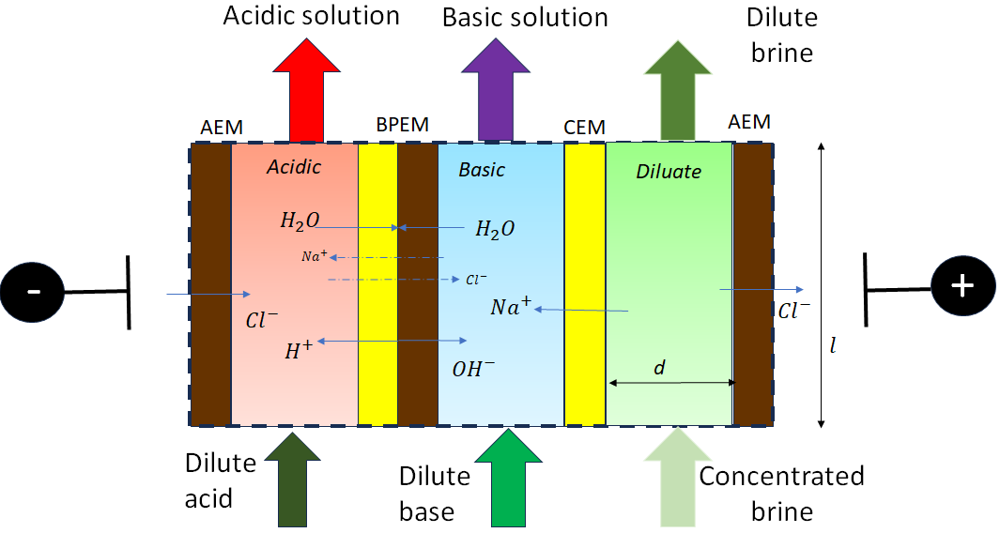

Bipolar Electrodialysis (0D)
============================

Introduction
------------

Bipolar electrodialysis, an electrochemical separation technology, has primarily been used to generate acids and bases
from waste salts produced in water purification. By providing in-situ access to valuable raw materials bipolar membranes can
significantly reduce the total cost of the operation.  This cell stack is shown in Figure 1 with **basic** and **acidic** channels, that produce base and acid
respectively. More overview of the bipolar
electrodialysis technology can be found in the *References*.

    Figure 1. Schematic representation of a bipolar electrodialysis unit

One bipolar membrane along with the **acidic** and **basic** channels can thus be treated as a modelling unit that can
multiply to larger-scale systems. The presented bipolar electrodialysis model establishes mathematical descriptions of
ion and water transport across the membrane along with water splitting. Modelled transfer mechanisms include
electrical migration, diffusion of ions, osmosis, electroosmosis, and water splitting. The following are the key
assumptions made:

* The **acidic** and **basic** side channels have identical geometry.
* For each channel, component fluxes are uniform in the bulk solutions (the 0-dimensional assumption)  and are set as the average of inlet and outlet of each channel.
* Steady state: all variables are independent on time.
* Co-current flow operation. 
* Ideality assumptions: activity, osmotic, and van't Hoff coefficients are set at one.
* All ion-exchange membrane properties (ion and water transport number, resistance, permeability) are constant.
* Detailed concentration gradient effect at membrane-water interfaces is neglected. 
* Constant pressure and temperature through each channel. 

Control Volumes
---------------

This model has two control volumes for the acidic and basic channels.

* **acidic** channel
* **basic** side channel

Ports
-----

On the two control volumes, this model provides four ports (Pyomo notation in parenthesis):

* inlet_acidic (inlet)
* outlet_acidic (outlet)
* inlet_basic (inlet)
* outlet_basic (outlet)

Sets
----
This model can simulate the water splitting and the transport of multiple species. All solution components
( H\ :sub:`2`\ O, neutral solutes, and ions, including Proton and Hydroxide ion) form a Pyomo set in the model.
For a clear model demonstration, this document uses a NaCl water solution along with the products of water splitting, H\ :sup:`+` and OH\ :sup:`-`, hereafter.

This model can mathematically take a multi-component (i.e., one salt molecule to be treated) as an input; nevertheless
a multi-component solution creates unknown or difficult-to-specify parameters, e.g., the electrical transport numbers through membranes,
the multi-ion diffusivity, etc., and physical relationships, which may result in ill-posed or ill-conditioned problems challenging the models'
numerical solutions.  While we continuously work on advancing our models to absorb new principles revealed by progressing
research, we advise the users be very **cautious** with simulating multi-component systems by this programmed model for aspects stated above.

.. csv-table:: **Table 1.** List of Set
   :header: "Description", "Symbol", "Indices"

   "Time", ":math:`t`", "[t] ([0])\ :sup:`1`"
   "Phase", ":math:`p`", "['Liq']"
   "Component", ":math:`j`", "['H\ :sub:`2` \O', 'Na\ :sup:`+`', 'Cl\ :sup:`-`', 'H\ :sup:`+`', 'OH\ :sup:`-`']"
   "Ion", ":math:`j`", "['Na\ :sup:`+`', 'Cl\ :sup:`-`', 'H\ :sup:`+`', 'OH\ :sup:`-`'] \  :sup:`2`"
   "Membrane", "n/a", "['bpem']"

**Notes**
 :sup:`1` The time set index is set as [0] in this steady-state model and is reserved majorly for the future extension
 to a dynamic model.

 :sup:`2` "Ion" is a subset of "Component" and uses the same symbol j.

Degrees of Freedom
------------------
The bipolar membrane model has multiple degrees of freedom, among which temperature, pressure, and component molar flow
rate are state variables that are fixed as initial conditions. The rest are parameters that should be provided in order
to fully solve the model. The exact degrees of freedom depend on the mode of operation. For the simplest case where no water
splitting occurs and the bipolar membrane acts like a simple electrodialysis memrbane these are:

.. csv-table:: **Table 2.** List of Degree of Freedom (DOF)
   :header: "Description", "Symbol", "Variable Name", "Index", "Units", "DOF Number \ :sup:`1`"

   "Temperature, inlet_acidic", ":math:`T^acidic`", "temperature", "None", ":math:`K`", 1
   "Temperature, inlet_basic", ":math:`T^basic`", "temperature", "None", ":math:`K`", 1
   "Pressure, inlet_acidic",":math:`p^acidic`", "temperature", "None", ":math:`Pa`", 1
   "Pressure, inlet_basic",":math:`p^basic`", "temperature", "None", ":math:`Pa`", 1
   "Component molar flow rate, inlet_acidic", ":math:`N_{j,in}^{acidic}`", "flow_mol_phase_comp", "[t], ['Liq'], ['H\ :sub:`2`\O', 'Na\ :sup:`+`', '\Cl\ :sup:`-`', 'H\ :sup:`+`', 'OH\ :sup:`-`']", ":math:`mol \, s^{-1}`", 5
   "Component molar flow rate, inlet_basic", ":math:`N_{j, in}^{basic}`", "flow_mol_phase_comp", "[t], ['Liq'], ['H\ :sub:`2`\O', 'Na\ :sup:`+`', '\Cl\ :sup:`-`', 'H\ :sup:`+`', 'OH\ :sup:`-`']", ":math:`mol \, s^{-1}`", 5
   "Water transport number", ":math:`t_w`", "water_trans_number_membrane", "['bpem']", "dimensionless", 1
   "Water permeability", ":math:`L`", "water_permeability_membrane", "['bpem']", ":math:`m^{-1}s^{-1}Pa^{-1}`", 1
   "Voltage or Current \ :sup:`2`", ":math:`U` or :math:`I`", "voltage or current", "[t]", ":math:`\text{V}` or :math:`A`", 1
   "Electrode areal resistance", ":math:`r_{el}`", "electrodes_resistance", "[t]", ":math:`\Omega m^2`", 1
   "Cell number", ":math:`n`", "cell_num", "None", "dimensionless", 1
   "Current utilization coefficient", ":math:`\xi`", "current_utilization", "None", "dimensionless", 1
   "Shadow factor", ":math:`\xi`", "shadow_factor", "None", "dimensionless", 1
   "Spacer thickness", ":math:`s`", "spacer_thickness", "none", ":math:`m` ", 1
   "Membrane areal resistance", ":math:`r`", "membrane_surface_resistance", "['acidic', 'basic']", ":math:`\Omega m^2`", 2
   "Cell width", ":math:`b`", "cell_width", "None", ":math:`\text{m}`", 1
   "Cell length", ":math:`l`", "cell_length", "None", ":math:`\text{m}`", 1
   "Thickness of ion exchange membranes", ":math:`\delta`", "membrane_thickness", "['bpem']", ":math:`m`", 1
     "transport number of ions in the membrane phase", ":math:`t_j`", "ion_trans_number_membrane", "['bpem'], ['Na\ :sup:`+`', '\Cl\ :sup:`-`', 'H\ :sup:`+`', 'OH\ :sup:`-`']", "dimensionless", 4

**Note**
 :sup:`1` DOF number takes account of the indices of the corresponding parameter.

 :sup:`2` A user should provide either current or voltage as the electrical input, in correspondence to the "Constant_Current" or "Constant_Voltage" treatment mode

Solution component information
------------------------------
To fully construct solution properties, users need to provide basic component information of the feed solution to use this model. Below is a sample:

.. code-block::

   ion_dict = {
        "solute_list": ["Na_+", "Cl_-", "H_+", "OH_-"],
        "mw_data": {
            "H2O": 18e-3,
            "Na_+": 23e-3,
            "Cl_-": 35.5e-3,
            "H_+": 1e-3,
            "OH_-": 17.0e-3,
        },
        "elec_mobility_data": {
            ("Liq", "Na_+"): 5.19e-8,
            ("Liq", "Cl_-"): 7.92e-8,
            ("Liq", "H_+"): 36.23e-8,
            ("Liq", "OH_-"): 20.64e-8,
        },
        "charge": {"Na_+": 1, "Cl_-": -1, "H_+": 1, "OH_-": -1},
        "diffusivity_data": {
            ("Liq", "Na_+"): 1.33e-9,
            ("Liq", "Cl_-"): 2.03e-9,
            ("Liq", "H_+"): 9.31e-9,
            ("Liq", "OH_-"): 5.27e-9,
        },
    }

This model, by default, uses H\ :sub:`2`\ O  as the solvent of the feed solution.

Information regarding the property package this unit model relies on can be found here: 

:py:mod:`watertap.property_models.ion_DSPMDE_prop_pack`

Operation without catalyst
--------------------------
The Mass balance equations are summarized in **Table3**. Further details on these can be found in the *References*.

.. csv-table:: **Table 3** Mass Balance Equations
   :header: "Description", "Equation", "Index set"

   "Component mass balance", ":math:`N_{j, in}^{acidic \: or\:  basic}-N_{j, out}^{acidic\: or\:  basic}+J_j^{acidic\: or\:  basic} bl=0`", ":math:`j \in \left['H_2 O', '{Na^+} ', '{Cl^-} '\right]`"
   "mass transfer flux, basic, solute", ":math:`J_j^{C} = -t_j^{bpem}\frac{\xi i_{lim}}{ z_j F}`", ":math:`j \in \left['{Na_+} ', '{Cl^-} '\right]`"
   "mass transfer flux, acidic, Water ions", ":math:`J_j^{C} = \frac{i - i_{lim}}{ z_j F}`", ":math:`j \in \left['{H^+} '\right]`"
   "mass transfer flux, acidic, Water ions", ":math:`J_j^{C} = 0`", ":math:`j \in \left['{OH^-} '\right]`"
   "mass transfer flux, basic, Water ions", ":math:`J_j^{C} = 0`", ":math:`j \in \left['{H^+} '\right]`"
   "mass transfer flux, basic, Water ions", ":math:`J_j^{C} = -\frac{i - i_{lim}}{ z_j F}`", ":math:`j \in \left['{OH^-} '\right]`"
   "mass transfer flux, acidic H\ :sub:`2`\ O", ":math:`J_j^{C} = t_w^{bpem} \left(\frac{i}{F}\right)+\left(L^{bpem} \right)\left(p_{osm}^CEM-p_{osm}^AEM \right)\left(\frac{\rho_w}{M_w}\right)`", ":math:`j \in \left['H_2 O'\right]`"
   "mass transfer flux, basic, H\ :sub:`2`\ O", ":math:`J_j^{C} = -t_w^{bpem} \left(\frac{i}{F}\right)-\left(L^{bpem} \right)\left(p_{osm}^CEM-p_{osm}^AEM \right)\left(\frac{\rho_w}{M_w}\right)`", ":math:`j \in \left['H_2 O'\right]`"

Overcoming the limiting current corresponds to a potential barrier (:math:`U_{diss}`) gives the relationship :math:`U =  i r_{tot}+ U_{diss}`.

Both the current durrent density and potential barrier must be specified, via
``limiting_current_density_method_bpem =LimitingCurrentDensityMethod`` and ``limiting_potential_method_bpem =LimitingpotentialMethod``
respectively, in the water splitting mode of operation. They can either be user inputs ``InitialValue``, with ``limiting_current_density_data``
in :math:`A/m^2` and ``limiting_potential_data`` in volts. There is also an option to have these critical quantities computed. For this ``Empirical`` is chosen.

The limiting current is computed as :math:`i_{lim} = D F (C_{acidic}+C_{basic})^2 / (\sigma \delta)`. The potential barrier
calculation involves kinetics of water splitting. The rate of proton/hydroxide ion formation per unit volume is given as
:math:`R_{H^+/OH^-} = [k_2(0)f(E)C_{H_2O}-k_r C_{H^+}C_{OH^-} ]`. A majority of the production occurs within the small
depletion region :math:`\lambda`, thus the flux is :math:`R_{H^+/OH^-} /\lambda`. When this flux is :math:`0.1 i_{lim}`
the barrier is assumed to be crossed, and the corresponding :math:`E=E_{crit}=U_{diss} \lambda` determines the potential barrier.

The quantities :math:`C_{H_2 O}, C_{H^+}, C_{OH^-}` are the water proton and hydroxyl concentration in
:math:`mol\, m^{-3}` and are taken to be constants. :math:`f(E)` is the second Wien effect driven enhanacidicent of the
dissociation rate under applied electric field. It requires as input temperature and relative permittivity (:math:`\epsilon_r`).
To close the model :math:`\lambda = E_{crit} \epsilon_0 \epsilon_r / (F \sigma)`

.. csv-table:: **Table 4.** DOF for water splitting without catalyst
   :header: "Description", "Symbol", "Variable Name", "Index", "Units"

   "Diffusivity", ":math:`D`", "diffus_mass", "[bpem]", ":math:`m^2 s^{-1}`"
   "Salt concentration, basic side ", ":math:`C_{basic}`", "salt_conc_basic", "[bpem]",":math:`mol m^{-3}`"
   "Salt concentration, acidic side ", ":math:`C_{acidic}`", "salt_conc_acidic", "[bpem]",":math:`mol m^{-3}`"
   "Membrane Fixed charge ", ":math:`\sigma`", "membrane_fixed_charge", "[bpem]",":math:`mol m^{-3}`"
   "Dissociation rate constant, zero electric field ", ":math:`k_2(0)`", "kd_zero", "[bpem]",":math:`s^{-1}`"
   "Recombination rate constant ", ":math:`k_r`", "k_r", "[bpem]",":math:`L^1 mol^{-1} s^{-1}`"
   "Relative permittivity ", ":math:`\epsilon_r`", "relative_permittivity", "[bpem]","Non-dimensional"

.. csv-table:: **Table 5** Electrical and Performance Equations
   :header: "Description", "Equation"

   "Current density", ":math:`i =  \frac{I}{bl}`"
   "Ohm's Law", ":math:`U =  i r_{tot}`"
   "Resistance calculation", ":math:`r_{tot}=n\left(r^{acidic}+r^{basic}\right)+r_{el}`"
   "Electrical power consumption", ":math:`P=UI`"
   "Water-production-specific power consumption", ":math:`P_Q=\frac{UI}{3.6\times 10^6 nQ_{out}^D}`"
   "Overall current efficiency", ":math:`I\eta=\sum_{j \in[cation]}{\left[\left(N_{j,in}^basic-N_{j,out}^basic\right)z_j F\right]}`"

All equations are coded as "constraints" (Pyomo). Isothermal and isobaric conditions apply.

The model has been validated using the bipolar membrane information available online: Fumatech, Technical Data Sheet for
Fumasep FBM, 2020.  Additional inputs were obtained from from  Ionescu, Viorel (2023)

Operation with catalyst
--------------------------

With catalyst present the water production term is modified as :math:`R_{H^+/OH^-} = \frac{Q_m}{K_{a/b}}[k_2(0)f(E)C_{H_2O}-k_r C_{H^+}C_{OH^-} ]`. Here :math:`Q_m` is the concentration of the catalyst and :math:`K_{a/b}` are the equilibrium constants for proton/hydroxide. The flux out of either side of the membrane is :math:`J_{diss} =R_{H^+} /\lambda + R_{OH^-} /\lambda`, with :math:`R_{H^+}` dominating the cation exchange side while the anion exchange side almost exclusively produces :math:`R_{OH^-}`.

Thus the fluxes become,

.. csv-table:: **Table 6** Mass Balance Equations
   :header: "Description", "Equation", "Index set"

   "mass transfer flux, acidic/basic, Water ions", ":math:`J_j^{C} = J_{diss}`", ":math:`j \in \left['{H^+, OH^-} '\right]`"
   "mass transfer flux, acidic H\ :sub:`2`\ O", ":math:`J_j^{C} = t_w^{bpem} \left(\frac{i}{F}\right)+\left(L^{bpem} \right)\left(p_{osm}^CEM-p_{osm}^AEM \right)\left(\frac{\rho_w}{M_w}\right) -  J_{diss}`", ":math:`j \in \left['H_2 O'\right]`"
   "mass transfer flux, basic, H\ :sub:`2`\ O", ":math:`J_j^{C} = -t_w^{bpem} \left(\frac{i}{F}\right)-\left(L^{bpem} \right)\left(p_{osm}^CEM-p_{osm}^AEM \right)\left(\frac{\rho_w}{M_w}\right) -  J_{diss}`", ":math:`j \in \left['H_2 O'\right]`"

.. csv-table:: **Table 7.** DOF for water splitting with catalyst
   :header: "Description", "Symbol", "Variable Name", "Index", "Units"

   "Catalyst concentration on the cation exchange side", ":math:`Q_m`", "membrane_fixed_catalyst_cem", "[bpem]", ":math:`mol \, m^{-3}`"
   "Catalyst concentration on the anion exchange side", ":math:`Q_m`", "membrane_fixed_catalyst_aem", "[bpem]", ":math:`mol \, m^{-3}`"
   "Equilibrium constant of proton disassociation", ":math:`K_A`", "k_a", "none",":math:`mol \, m^{-3}`"
   "Equilibrium constant of hydroxide disassociation", ":math:`K_B`", "k_b", "none",":math:`mol \, m^{-3}`"

The model has been validated using the experimental data on bipolar membrane information available in Wilhelm et al. (2002) with additional inputs from Mareev et al. (2020).

Frictional pressure drop
^^^^^^^^^^^^^^^^^^^^^^^^
This model can optionally calculate pressured drops along the flow path in the diluate and concentrate channels through
config ``has_pressure_change`` and ``pressure_drop_method``.  Under the assumption of identical diluate and concentrate
channels and starting flow rates, the flow velocities in the two channels are approximated equal and invariant over the
channel length when calculating the frictional pressure drops. This approximation is based on the evaluation that the
actual velocity variation over the channel length caused by water mass transfer across the consecutive channels leads to
negligible errors as compared to the uncertainties carried by the frictional pressure method itself. **Table 8** gives
essential equations to simulate the pressure drop. Among extensive literatures using these equations, a good reference
paper is by Wright et. al., 2018 (*References*).

.. csv-table:: **Table 8** Essential equations supporting the pressure drop calculation
   :header: "Description", "Equation", "Condition"

   "Frictional pressure drop, Darcy_Weisbach", ":math:`p_L=f\frac{\rho v^2}{2d_H}` \ :sup:`1`", "`has_pressure_change == True` and `pressure_drop_method == PressureDropMethod.Darcy_Weisbach`"
   " ", ":math:`p_L=` user-input constant", "`has_pressure_change == True` and `pressure_drop_method == PressureDropMethod.Experimental`"
   "Hydraulic diameter", ":math:`d_H=\frac{2db(1-\epsilon)}{d+b}`", "`hydraulic_diameter_method == HydraulicDiameterMethod.conventional`"
   " ", ":math:`d_H=\frac{4\epsilon}{\frac{2}{h}+(1-\epsilon)S_{v,sp}}`", "`hydraulic_diameter_method == HydraulicDiameterMethod.spacer_specific_area_known`"
   "Reynold number", ":math:`Re=\frac{\rho v d_H}{\mu}`", "`has_pressure_change == True` or `limiting_current_density_method == LimitingCurrentDensityMethod.Theoretical`"
   "Schmidt number", ":math:`Sc=\frac{\mu}{\rho D_b}`", "`has_pressure_change == True` or `limiting_current_density_method == LimitingCurrentDensityMethod.Theoretical`"
   "Sherwood number", ":math:`Sh=0.29Re^{0.5}Sc^{0.33}`", "`has_pressure_change == True` or `limiting_current_density_method == LimitingCurrentDensityMethod.Theoretical`"
   "Darcy's frictional factor", ":math:`f=4\times 50.6\epsilon^{-7.06}Re^{-1}`", "`friction_factor_method == FrictionFactorMethod.Gurreri`"
   " ", ":math:`f=4\times 9.6 \epsilon^{-1} Re^{-0.5}`", "`friction_factor_method == FrictionFactorMethod.Kuroda`"
   "Pressure balance", ":math:`p_{in}-p_L l =p_{out}`", "`has_pressure_change == True`"

**Note**

 :sup:`1` We assumed a constant linear velocity (in the cell length direction), :math:`v`, in both channels and along the flow path. This :math:`v` is calculated based on the average of inlet and outlet volumetric flow rate.

Nomenclature
------------
.. csv-table:: **Table 9.** Nomenclature
   :header: "Symbol", "Description", "Unit"
   :widths: 10, 20, 10

   "**Parameters**"
   ":math:`\rho_w`", "Mass density of water", ":math:`kg\  m^{-3}`"
   ":math:`M_w`", "Molecular weight of water", ":math:`kg\  mol^{-1}`"
   "**Variables and Parameters**"
   ":math:`N`", "Molar flow rate of a component", ":math:`mol\  s^{-1}`"
   ":math:`J`", "Molar flux of a component", ":math:`mol\  m^{-2}s^{-1}`"
   ":math:`b`", "Cell/membrane width", ":math:`m`"
   ":math:`l`", "Cell/membrane length", ":math:`m`"
   ":math:`t`", "Ion transport number", "dimensionless"
   ":math:`I`", "Current", ":math:`A`"
   ":math:`i`", "Current density", ":math:`A m^{-2}`"
   ":math:`U`", "Voltage over a stack", ":math:`V`"
   ":math:`n`", "Cell number", "dimensionless"
   ":math:`\xi`", "Current utilization coefficient (including ion diffusion and water electroosmosis)", "dimensionless"
   ":math:`z`", "Ion charge", "dimensionless"
   ":math:`F`", "Faraday constant", ":math:`C\ mol^{-1}`"
   ":math:`\epsilon_0`", "permittivity of free space", ":math:`C\ mol^{-1}`"
   ":math:`D`", "Ion Diffusivity", ":math:`F m^-1`"
   ":math:`\delta`", "Membrane thickness", ":math:`m`"
   ":math:`c`", "Solute concentration", ":math:`mol\ m^{-3}`"
   ":math:`t_w`", "Water electroosmotic transport number", "dimensionless"
   ":math:`L`", "Water permeability (osmosis)", ":math:`ms^{-1}Pa^{-1}`"
   ":math:`p_{osm}`", "Osmotic pressure", ":math:`Pa`"
   ":math:`r_{tot}`", "Total areal resistance", ":math:`\Omega m^2`"
   ":math:`r`", "Membrane areal resistance", ":math:`\Omega m^2`"
   ":math:`r_{el}`", "Electrode areal resistance", ":math:`\Omega m^2`"
   ":math:`d`", "Spacer thickness", ":math:`m`"
   ":math:`\eta`", "Current efficiency for desalination", "dimensionless"
   ":math:`P`", "Power consumption", ":math:`W`"
   ":math:`P_Q`", "Specific power consumption", ":math:`kW\ h\  m^{-3}`"
   ":math:`Q`", "Volume flow rate", ":math:`m^3s^{-1}`"
   ":math:`\phi_d^{ohm}`", "Ohmic potential across a Nernst diffusion layer", ":math:`V`"
   "**Subscripts and superscripts**"
   ":math:`j`", "Component index",
   ":math:`in`", "Inlet",
   ":math:`out`", "Outlet",
   ":math:`acidic`", "Cation exchange side of bipolar membrane",
   ":math:`basic`", "Anion exchange side of bipolar membrane",

Class Documentation
-------------------

* :mod:`watertap.unit_models.Bipolar_Electrodialysis_0D`

References
----------
Strathmann, H. (2010). Electrodialysis, a mature technology with a multitude of new applications.
Desalination, 264(3), 268-288.

Strathmann, H. (2004). Ion-exchange membrane separation processes. Elsevier. Ch. 4.

Campione, A., Cipollina, A., Bogle, I. D. L., Gurreri, L., Tamburini, A., Tedesco, M., & Micale, G. (2019).
A hierarchical model for novel schemes of electrodialysis desalination. Desalination, 465, 79-93.

Campione, A., Gurreri, L., Ciofalo, M., Micale, G., Tamburini, A., & Cipollina, A. (2018). 
Electrodialysis for water desalination: A critical assessment of recent developments on process 
fundamentals, models and applications. Desalination, 434, 121-160.

Spiegler, K. S. (1971). Polarization at ion exchange membrane-solution interfaces. Desalination, 9(4), 367-385.

Wright, N. C., Shah, S. R., & Amrose, S. E. (2018).
A robust model of brackish water electrodialysis desalination with experimental comparison at different size scales.
Desalination, 443, 27-43.