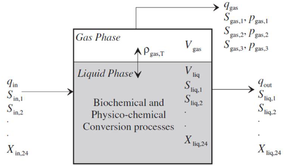

.. _anaerobic_digester:

Anaerobic Digester
==================

.. code-block:: python

   from watertap.unit_models.anaerobic_digester import AD

Introduction
------------

Anaerobic biological processes have been used in food and beverage production for centuries.
However, modern advances pertaining to anaerobic conversions have introduced various forms of
high-rate treatment processes that have proven to be particularly useful in wastewater treatment plants.
High organic loading rates and low sludge production gives anaerobic processes a significant advantage over other
biological unit operations, and, more importantly, the positive net energy production from the produced biogas
can help replace fossil fuel sources, lowering greenhouse gas emissions. While a wide variety of anaerobic
digestion models have been developed over the years, their widespread use has been made impossible by the
models' very specific natures. This generic anaerobic digestion model seeks to overcome this restriction by
limiting itself to only the major biological processes and excluding many of the more niche relationships in this
version of the model. Likewise, while this implementation may not be as accurate as models tailored to their
specific applications, its simplicity makes it applicable for a wide variety of anaerobic processes, providing a
common basis by which future model development and validation studies can be compared.

In this implementation of the model, the user MUST provide two property packages - one for the liquid phase and
another for the vapor phase. The reaction parameter block should utilize the property package specified for the liquid phase.
This anaerobic digester model is based on the standard IDAES CSTR with the addition of mass transfer
terms and an extra port for the vapor outlet. The model relies on the following key assumptions:

   * supports steady-state only
   * liquid phase property package has a single phase named Liq
   * vapor phase property package has a single phase named Vap
   * liquid and vapor phase properties need not have the same component lists

    Figure 1. Schematic representation of an anaerobic digester

.. index::
   pair: watertap.unit_models.anaerobic_digester;anaerobic_digester

.. currentmodule:: watertap.unit_models.anaerobic_digester

Degrees of Freedom
------------------
Aside from the inlet feed state variables (i.e. temperature, pressure, component flowrates), the ADM1 model has
at least 5 degrees of freedom that should be fixed for the unit to be fully specified.

Typically, the following variables are fixed, in addition to state variables at the inlet:
    * cation concentration
    * anion concentration
    * liquid volume
    * vapor volume
    * liquid outlet temperature

Control Volumes
---------------

This model has two separate 0D control volumes for the liquid and vapor phases.

* Liquid
* Vapor

Ports
-----

This model provides three ports:

* inlet
* liquid_outlet
* vapor_outlet

Sets
----
.. csv-table::
   :header: "Description", "Symbol", "Indices"

   "Time", ":math:`t`", "[0]"
   "Inlet/outlet", ":math:`x`", "['in', 'out']"
   "Phases", ":math:`p`", "['Liq', 'Vap']"
   "Components", ":math:`j`", "['H2O', 'S_su', 'S_aa', 'S_fa', 'S_va', 'S_bu', 'S_pro', 'S_ac', 'S_h2', 'S_ch4', 'S_IC', 'S_IN', 'S_I', 'X_c', 'X_ch', 'X_pr', 'X_li', 'X_su', 'X_aa', 'X_fa', 'X_c4', 'X_pro', 'X_ac', 'X_h2', 'X_I', 'S_cat', 'S_an', 'S_co2']"
   "Ion", ":math:`j`", "['S_cat', 'S_an'] \  :sup:`*`"

**Notes**
 :sup:`*` Ion" is a subset of "Component" and uses the same symbol j.

.. _AD_variables:

Variables
----------

.. csv-table::
   :header: "Description", "Symbol", "Variable Name", "Index", "Units"

   "Liquid phase mass transfer term", ":math:`J`", "liquid_phase.mass_transfer_term_j", "[t]", ":math:`\text{kg/s}`"
   "Liquid volume", ":math:`V_{ad, liq}`", "volume_liquid", "[t]", ":math:`\text{m}^3`"
   "Vapor volume", ":math:`V_{ad, vap}`", "volume_vapor", "[t]", ":math:`\text{m}^3`"
   "Total volume", ":math:`V_{ad}`", "volume_AD", "[t]", ":math:`\text{m}^3`"
   "CO2 Henry's law coefficient", ":math:`K_{H, CO_{2}}`", "KH_co2", "None", ":math:`\text{kmol}\text{m}^{-3}\text{bar}^{-1}`"
   "CH4 Henry's law coefficient", ":math:`K_{H, CH_{4}}`", "KH_ch4", "None", ":math:`\text{kmol}\text{m}^{-3}\text{bar}^{-1}`"
   "H2 Henry's law coefficient", ":math:`K_{H, H_{2}}`", "KH_h2", "None", ":math:`\text{kmol}\text{m}^{-3}\text{bar}^{-1}`"
   "Gas-liquid transfer coefficient", ":math:`K_{L}a`", "K_La", "None", ":math:`\text{day}^{-1}`"
   "Friction parameter", ":math:`k_{p}`", "k_p", "None", ":math:`\text{m}^{3}\text{bar}^{-1}\text{day}^{-1}`"

.. _AD_equations:

Equations and Relationships
---------------------------

.. csv-table::
   :header: "Description", "Equation"

   "Outlet vapor phase pressure", ":math:`P_{vap, out} = P_{wat, sat} + Σ_{j} P_{j, sat}`"
   "Mass transfer rate of H2 gas", ":math:`\rho_{T, H_{2}} = k_{L}a (S_{liq, H_{2}} - 16K_{H, H_{2}}) P_{vap, S_{H_{2}}} V_{ad, liq}`"
   "Mass transfer rate of CH4 gas", ":math:`\rho_{T, CH_{4}} = k_{L}a (S_{liq, CH_{4}} - 64K_{H, CH_{4}}) P_{vap, S_{CH_{4}}} V_{ad, liq}`"
   "Mass transfer rate of CO2 gas", ":math:`\rho_{T, IC} = k_{L}a (S_{liq, CO_{2}} - K_{H, CO_{2}}) P_{vap, S_{CO_{2}}} V_{ad, liq}`"
   "Vapor Flow", ":math:`Q_{vap, out} = k_{p} (P_{vap} - 101325) (\frac{P_{vap}}{101325})`"
   "Total Volume", ":math:`V_{ad} = V_{ad, liq} + V_{ad, vap}`"
   "Performance equation", ":math:`ξ_{t, r} = V_{ad, liq}R`"

Classes
-------
.. currentmodule:: watertap.unit_models.anaerobic_digester

.. autoclass:: AD
    :members:
    :noindex:

.. autoclass:: ADData
    :members:
    :noindex:

References
----------
[1] Batstone, D.J., Keller, J., Angelidaki, I., Kalyuzhnyi, S.V., Pavlostathis, S.G., Rozzi, A., Sanders, W.T.M., Siegrist, H.A. and Vavilin, V.A., 2002.
The IWA anaerobic digestion model no 1 (ADM1).
Water Science and Technology, 45(10), pp.65-73.
https://iwaponline.com/wst/article-abstract/45/10/65/6034

[2] Rosen, C. and Jeppsson, U., 2006.
Aspects on ADM1 Implementation within the BSM2 Framework.
Department of Industrial Electrical Engineering and Automation, Lund University, Lund, Sweden, pp.1-35.
https://www.iea.lth.se/WWTmodels_download/TR_ADM1.pdf

