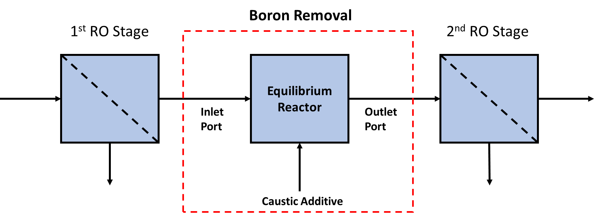

.. _boron_removal:

Boron Removal
=============

.. code-block:: python

   from watertap.unit_models.boron_removal import BoronRemoval

Introduction
------------

Boron removal is generally applied as a post-treatment process after the first

Reverse Osmosis (RO) stage to shift the equilibrium of Boron (B[OH]\ :sub:`3`\) to Borate (B[OH]\ :sub:`4`\ :sup:`-`)
so that a second RO stage can remove Borate ions from solution such that the total boron
concentration can go below ~1 mg/L per the World Health Organization standards. This
is accomplished by adding caustic chemicals (such as sodium hydroxide (NaOH) or lime
(Ca[OH]\ :sub:`2`\)) to the stream just before the 2nd RO stage. The goal is to shift
the pH of the stream above around 9.5 so that the majority of total boron is in the
ionic state of Borate. Those Borate ions would then be rejected in the 2nd RO stage.

In this implementation of the model, the user MUST provide a state variable for the
molar flow of Boron and Borate (at a minimum). Optionally, users may also have molar
flows for protons, hydroxide anions, and the cation species associated with the caustic
additive used in the unit. This will help track added salts and changes in pH when
the caustic chemical is added. The unit will always provide an approximation to the
mixture pH whether or not the user has state variables for protons in their property
package. Users must also specify a dosage of the caustic chemical added to the reactor
as well as the molecular weight of the chemical additive (see Chemical Dosing Parameters
section below for more detailed information).

The main assumptions of the implemented model are as follows:

1) Model dimensionality is limited to a 0D control volume
2) Single liquid phase only
3) Isothermal operation
4) Only major reactions occurring within this process are Boron/Borate dissociation and water dissociation
5) No other residual ion species change significantly when the caustic chemical is added

    Figure 1. Schematic representation of a Boron removal unit modeled in WaterTAP

Ports
-----

The model provides two ports (Pyomo notation in parenthesis):

* Inlet port (inlet)
* Outlet port (outlet)

Sets
----
.. csv-table::
   :header: "Description", "Symbol", "Indices"

   "Time", ":math:`t`", "[0]"
   "Phases", ":math:`p`", "['Liq']"
   "Components", ":math:`j`", "['H2O', 'Boron', 'Borate', 'Protons', 'Hydroxide', 'Caustic_Cation', ...]"

**Users can name the 'Components' however they want, but they must also provide the unit model with a mapping of component names to an associated state variable name used in the property package**

**State variables must have 'H2O', 'Boron', 'Borate', and 'Caustic_Cation'. All other components are optional**

Degrees of Freedom and Variables
--------------------------------
Aside from the inlet feed state variables (i.e., temperature, pressure, component molar flowrates),
the boron removal model has 2 additional degree of freedoms that
the user must specify.

.. csv-table::
   :header: "Description", "Symbol", "Variable Name", "Index", "Units"

   "Fluid temperature", ":math:`T`", "temperature", "[t]", ":math:`\text{K}`"
   "Fluid pressure", ":math:`P`", "pressure", "[t]", ":math:`\text{Pa}`"
   "Molar flowrate of components", ":math:`M_j`", "flow_mol_phase_comp", "[t, 'Liq', j]", ":math:`\text{mol/s}`"
   "Caustic Chemical Dose Rate", ":math:`S_{caustic}`", "caustic_dose_rate", "[t]", ":math:`\text{kg/s}`"
   "Reactor Volume", ":math:`V`", "reactor_volume", "None", ":math:`\text{m}^{3}`"

**Users must provide values for and 'fix' these variables to solve the model with DOF=0. However, users may also leave variables unfixed for optimization purposes.**

**NOTE: Variables for 'temperature', 'pressure', and 'flow_mol_phase_comp' come from the associated property package as state variables and are accessed via {port_name}.{state_var_name}**

Chemical Dosing Parameters
--------------------------
In addition to providing and fixing values for the caustic additive, the users will
need to provide a dictionary that maps specific species names from a property package
to Boron, Borate, protons (optional), hydroxides (optional), and the cation from the
caustic additive (required). These are needed to establish the appropriate changes in
the molar flow rate of each of these components and which variable they would apply to
from the property package. Users may also optionally provide a specific name to the
caustic chemical being added and are required to provide the molecular weight of the
caustic additive, as well as the moles of cations produced when the additive will
dissociate

Example
^^^^^^^
If the additive is NaOH, then the moles of
Na\ :sup:`+`\ produced from dissociation is 1. Thus, the
'moles_cation_per_additive' would be 1.

i.e., 1 NaOH --> 1 Na\ :sup:`+`\ + 1 OH\ :sup:`-`

To provide this information to the unit model, users must add a 'chemical_mapping_data'
dictionary to the initialization of the unit model. That dictionary must have the
following format.

.. code-block::

   chem_dict = {
                  'boron_name': 'name_of_species_representing_boron', #[is required]
                  'borate_name': 'name_of_species_representing_borate', #[is required]
                  'proton_name': 'name_of_species_representing_protons',  #[is optional]
                  'hydroxide_name': 'name_of_species_representing_hydroxides', #[is optional]

                  'caustic_additive':
                  {
                    'additive_name': 'name_of_the_actual_chemical', #[is optional]
                    'cation_name': 'name_of_cation_species_in_additive', #[is required]
                    'mw_additive': (value, units), #[is required]
                    'moles_cation_per_additive': value, #[is required]
                  }
               }

For example, this 'chem_dict' would be passed into the model on construction as
one of the configuration options as shown below.

.. code-block::

    model.fs.unit = BoronRemoval(
        property_package=model.fs.properties,
        chemical_mapping_data=chem_dict,
    )

**NOTE: The above example assumes you have already constructed a pyomo model named 'model' and attached an IDAES flowsheet named 'fs' to it, as well as a properties block named 'properties'**

Equations and Relationships
---------------------------
Reaction constants :math:`K_{w}` and :math:`K_{a}` are taken from the Benjamin (2010) chemistry
textbook (see References below).

.. csv-table::
   :header: "Description", "Equation"

   "Electroneutrality Constraint", ":math:`C_{out,H} = C_{out,OH} + C_{out,A} + Res_{ions}`"
   "Residual Ions Expression", ":math:`Res_{ions} = -{\sum_{i} n_i \cdotp C_{out,i} }`"
   "Total Boron Balance Constraint", ":math:`C_{in,HA} + C_{in,A} = C_{out,HA} + C_{out,A}`"
   "Water Dissociation Constraint", ":math:`K_{w} = C_{out,H} \cdotp C_{out,OH}`"
   "Boron Dissociation Constraint", ":math:`K_{a} \cdotp C_{out,HA} = C_{out,H} \cdotp C_{out,A}`"
   "Component (for Boron, Borate, Protons, and Hydroxide) mass balance", ":math:`0 = - M_{out,i} + C_{out,i} \cdotp Q`"
   "Caustic cation mass balance", ":math:`0 = M_{caustic,in} - M_{caustic,out} + \frac{S_{caustic} \cdotp m}{MW}`"
   "Reactor Volume", ":math:`V = Q \cdotp \theta`"

**NOTE:** :math:`Q` **is defined as the total volumetric flow rate and** :math:`S_{j}` **is the source/sink term for component** :math:`j`

**NOTE:** :math:`C_{p,H}` **is the proton concentration,** :math:`C_{p,OH}` **is the hydroxide concentration,** :math:`C_{p,A}` **is the Borate concentration, and** :math:`C_{p,HA}` **is the Boron concentration.** :math:`p` **represents either in or out**

**NOTE:** :math:`n_{i}` **is ion charge of component** :math:`i`

**NOTE:** :math:`C_{in,i}` **is the concentration from the inlet stream and** :math:`C_{out,i}` **is the resulting concentration in the outlet stream**

**NOTE:** :math:`Res_{ions}` **is the sum over all ions that are not hydroxide or borate ions (which are already included in the electroneutrality balance) that are needed to enforce electroneutrality**

**NOTE:** :math:`\theta` **is the hydraulic retention time for the reactor**

**NOTE:** :math:`m` **is the molar ratio of cations formed per mole of caustic added and** :math:`MW` **is the molecular weight of the caustic additive**

References
----------
M.M. Benjamin, `Water Chemistry <https://www.biblio.com/9781577666677>`_, Waveland Press,
Inc.: Illinois, 2010, Ch. 1, 18-51.

Lenntech, `Desalination Post-treatment: Boron Removal Process <https://www.lenntech.com/processes/desalination/post-treatment/post-treatments/boron-removal.htm>`_,
Accessed May 16, 2022.
