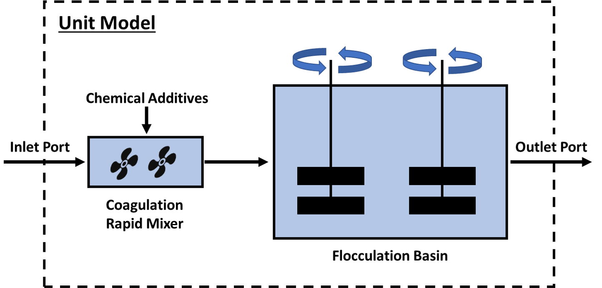

Coagulation-Flocculation
========================

Introduction
------------

Coagulation-Flocculation is a water treatment process  designed to remove total suspended
solids (TSS, primarily as natural organic matter) from solution by converting those small,
suspended particles into larger 'floccs' that can then be separated by sedimentation
and/or filtration (or other separation processes) later in the treatment train. This
is accomplished in a 2-stage process:

a) Stage 1: Coagulation (where chemical coagulants and other aids are mixing into solution)
b) Stage 2: Flocculation (where the 'floccs' are formed through slow, gentle mixing/agitation)

In this implementation of the model, the user MUST provide a measured final Turbidity (in NTU) made
during a Jar Test for the given water source. This measurement is then used to estimate how much
TSS would be removed during the Coagulation-Flocculation process. User's may also
provide the specific chemical composition of additives used to achieve this final Turbidity, and
can provide information on the level of salts in those additives. This information can be used
to estimate an increase in total dissolved salts (TDS) that may occur due to the addition of
those chemicals.

This model also includes relationships for power usage in the rapid mixing and flocculation
basins. User's will need to provide information for power usage such as retention times of
each basin, mixing paddle sizes, number of mixers, etc.

The main assumptions of the implemented model are as follows:

1) Coagulation-Flocculation can be modeled together in a single combined unit (Figure 1)
2) Model dimensionality is limited to 0D
3) Predicted levels of suspended solid removal can be determined solely by Jar Test measurements
4) Single liquid phase only
5) Isothermal operation

    Figure 1. Schematic representation of a coagulation-flocculation unit modeled in WaterTAP

Ports
-----

The model provides two ports (Pyomo notation in parenthesis):

* Inlet port (inlet)
* Outlet port (outlet)

Sets
----
.. csv-table::
   :header: "Description", "Symbol", "Indices"

   "Time", ":math:`t`", "[0]"
   "Phases", ":math:`p`", "['Liq']"
   "Components", ":math:`j`", "['H2O', 'TDS', 'TSS', 'Sludge', ...]"
   "Chemical Additives", ":math:`i`", "['chem_A', 'chem_B', ...]"

**User's are responsible for naming any chemical additives and defining all parameters associated with them**

Degrees of Freedom and Variables
--------------------------------
Aside from the inlet feed state variables (i.e. temperature, pressure, component mass flowrates),
the Coagulation-Flocculation model has an at least an additional 13 degrees of freedom that
the user must specify. The table below gives an outline of these.

.. csv-table::
   :header: "Description", "Symbol", "Variable Name", "Index", "Units"

   "Fluid temperature", ":math:`T`", "inlet.temperature", "[t]", ":math:`\text{K}`"
   "Fluid pressure", ":math:`P`", "inlet.pressure", "[t]", ":math:`\text{Pa}`"
   "Mass flowrate of components", ":math:`M_j`", "inlet.flow_mass_phase_comp", "[t, 'Liq', j]", ":math:`\text{kg/s}`"
   "Slope relationship between measured Turbidity and TSS", ":math:`a`", "slope", "[t]", ":math:`\text{mg/L/NTU}`"
   "Intercept relationship between measured Turbidity and TSS", ":math:`b`", "intercept", "[t]", ":math:`\text{mg/L}`"
   "Turbidity measured before Jar Test", ":math:`Turb_o`", "initial_turbidity_ntu", "[t]", ":math:`\text{NTU}`"
   "Turbidity measured after Jar Test", ":math:`Turb_f`", "final_turbidity_ntu", "[t]", ":math:`\text{NTU}`"
   "Chemical Doses added during Jar Test", ":math:`D_i`", "chemical_doses", "[t, i]", ":math:`\text{mg/L}`"
   "Retention time for each rapid mixer", ":math:`\tau_r`", "rapid_mixing_retention_time", "[t]", ":math:`\text{s}`"
   "Number of rapid mixers in series", ":math:`n_r`", "num_rapid_mixing_basins", "None", "None"
   "Rapid mixer velocity gradient", ":math:`G_r`", "rapid_mixing_vel_grad", "[t]", ":math:`\text{s^-1}`"
   "Retention time of flocculation basin", ":math:`\tau_f`", "floc_retention_time", "[t]", ":math:`\text{s}`"
