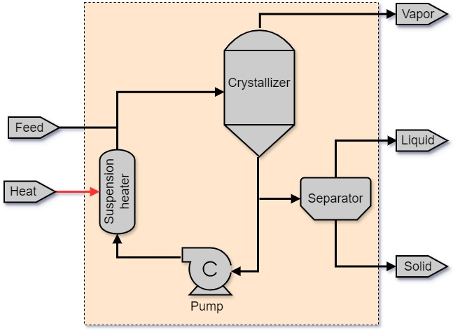

.. _crystallizer_0D:

Crystallizer (0D)
=================

.. code-block:: python

   from watertap.unit_models.crystallizer import Crystallization

Introduction
-------------
Crystallization from solution is a separation technique where a solid phase is separated from a mother
liquor (Kramer et al. [1]).

The model implemented here is for a continuous evaporative crystallization. The main features of the implemented model are as follows:

1) Evaporative crystallization is modeled as shown in Figure 1.
2) Model dimensionality is limited to 0D.
3) Model dynamics are restricted to steady-state only.
4) The unit supports solid-liquid-vapour mixtures.
5) The model has only been demonstrated for single solutes only.
6) The temperature in the crystallizer is fixed.
7) The exit liquid is assumed to lose its supersaturation.

    
    Figure 1. Schematic representation of the evaporative crystallization configuration system modeled in IDAES, comprising of a crystallization unit, a heater, a pump, and a separator. The broken lines show the system boundary. 

Ports
---------

The model provides four ports (Pyomo notation in parenthesis):

* Inlet port (inlet)
* Liquid outlet port (outlet)
* Solid crystals port (solids)
* Vapor outlet port (vapor)

Degrees of Freedom
-------------------
Aside from the inlet feed state variables (i.e. temperature, pressure, component flowrates), the crystallizer model has
at least 5 degrees of freedom that should be fixed for the unit to be fully specified.

Typically, the following four variables are fixed, in addition to state variables at the inlet (Pyomo notation in parenthesis):

    * Crystal growth rate, :math:`G` (crystal_growth_rate)
    * Desired median length of solid crystals, :math:`L_D` (crystal_median_length)
    * Parameter for Sounders-Brown relation, :math:`C_v` (souders_brown_constant)
    * Crystallization temperature (temperature_operating)

In addition to those four variables, the user may specify any of the following variables to fully specify the unit (Pyomo notation in parenthesis):

    * Crystallization yield (crystallization_yield['NaCl'])
    * Solids volumetric fraction of product slurry, :math:`1-{\varepsilon}` (product_volumetric_solids_fraction)
    * Magma density, :math:`{M}_{T}` (dens_mass_magma)
    * Solid outlet mass flow
    * Vapour outlet mass flow

Variables
---------

.. csv-table::
   :header: "Description", "Symbol", "Variable Name", "Index", "Units"

   "Crystal growth rate", ":math:`G`", "crystal_growth_rate", "None", ":math:`\text{m/s}`"
   "Souders-Brown constant", ":math:`C_v`", "souders_brown_constant", "None", ":math:`\text{dimensionless}`"
   "Crystal median length", ":math:`L_D`", "crystal_median_length", "None", ":math:`\text{m}`"
   "Crystallization yield", ":math:`Y`", "crystallization_yield", "[j]", ":math:`\text{dimensionless}`"
   "Solids volumetric fraction of product slurry", ":math:`1-{\varepsilon}`", "product_volumetric_solids_fraction", "None", ":math:`\text{dimensionless}`"
   "Crystallization temperature", ":math:`T`", "temperature_operating", "None", ":math:`\text{K}`"
   "Crystallizer pressure", ":math:`P`", "pressure_operating", "None", ":math:`\text{Pa}`"
   "Magma density", ":math:`M_{T}`", "dens_mass_magma", "None", ":math:`\text{kg/}\text{m}^3`"
   "Suspension density", ":math:`\rho_{slurry}`", "dens_mass_slurry", "None", ":math:`\text{kg/}\text{m}^3`"
   "Crystallizer heat requirement", ":math:`Q`", "work_mechanical", "None", ":math:`\text{kW}`"
   "Crystallizer vessel diameter", ":math:`D`", "diameter_crystallizer", "None", ":math:`\text{m}`"
   "Crystallizer vessel height", ":math:`H`", "height_crystallizer", "None", ":math:`\text{m}`"
   "Solution relative supersaturation", ":math:`\sigma`", "relative_supersaturation", "[j]", ":math:`\text{dimensionless}`"
   "Residence time", ":math:`\tau`", "t_res", "None", :math:`\text{h}`"
   "Crystallizer minmum active volume", ":math:`V_{susp}`", "volume_suspension", "None", ":math:`\text{m}^3`"

Model Equations
---------------

The crystallization unit model is based on predominantly on the works by Kramer et al. [1], Lewis et al. [2], and Tavares [3]. The following equations govern the performance of the crystallizer unit:

.. csv-table::
   :header: "Description", "Equation", "Reference(s)"

   "Crystallizer heat requirement", ":math:`Q = H_{liq,in} - H_{liq,out} - H_{crystal,out} - H_{vapor,out} + m_{crystal} \cdot ΔH_{crystallization}`", "Kramer et al. [1], Lewis et al. [2]"
   "Magma density", ":math:`M_T = \rho_{crystal}(1-\varepsilon)`", Lewis et al. [2]
   "Suspension density", ":math:`\rho_{susp} = \rho_{crystal}(1-\varepsilon) + \varepsilon \rho_{liq,out}`", Lewis et al. [2]
   "Crystallization yield", ":math:`Y_{j} = \frac{M_{in,j} - M_{out,j}}{M_{in,j}}`", Dutta [4]
   "Residence time", ":math:`\tau = \frac{L_D}{3.67G}`", "Dutta[4]"
   "Suspension volume (i.e. minimum active volume)", ":math:`V_{susp} = (\phi_{liq,out} + \phi_{vapor, out}) \cdot \tau`", "Lewis et al. [2], Kramer et al. [1]" 
   "Maximum linear velocity of vapor flow",":math:`v_{max} = C_{v}\left(\frac{\rho_{liq,out}}{\rho_{vap,out}}\right)^{0.5}`", "Dutta[4], Bennett [5]"
   "Crystallizer diameter",":math:`D = \sqrt{\frac{4\phi_{vapor, out}}{\pi v_{max}}}`", "Tavare [3], Lewis et al [2]"
   "Slurry height",":math:`h_{slurry} = \frac{4V_{susp}}{\pi D^{2}}`", "Lewis et al. [2]"
   "Crystallizer height",":math:`H = \max(1.5D, h_{slurry} + 0.75D)`"
   "Magma circulation vol. flow rate",":math:`\frac{Q}{\Delta T_{approach}\left[(1-\varepsilon)\rho_{crystal}C_{p,crystal}+\rho_{liq,out}C_{p,liq}\right]}`", "Lewis et al [2], Tavare [3]"

Code Documentation
------------------

* :mod:`watertap.unit_models.crystallizer`

References
----------

[1] Kramer, H. & van Rosmalen, G. Crystallization. Encyclopedia of Separation Science, Elsevier, 2000, 64-84.
https://www.sciencedirect.com/science/article/pii/B0122267702000314

[2] Lewis, A.; Seckler, M. & Kramer, H. Industrial Crystallization: Fundamentals and Applications. Cambridge, 2015.

[3] Tavare, N. S. Industrial Crystallization, Springer US, 2013.   
https://link.springer.com/book/10.1007/978-1-4899-0233-7  

[4] Dutta, B. Principles of mass transfer and separation processes. PHI Learning, 2007.

[5] Bennett, R. C. Crystallizer selection and design. Handbook of Industrial Crystallization, Elsevier, 2002, 115-140
