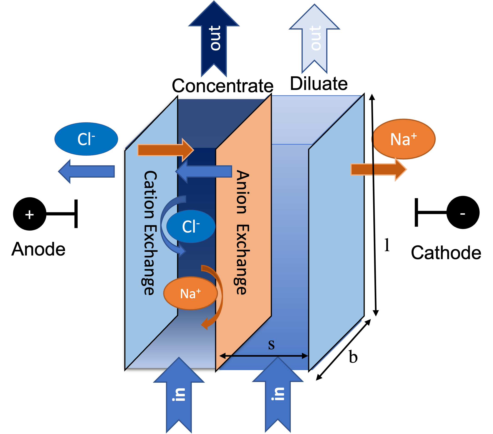
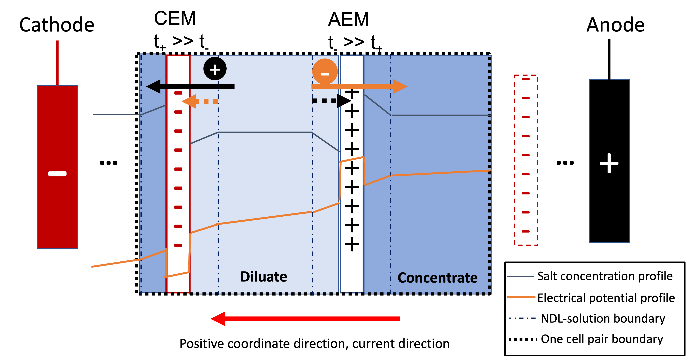

Electrodialysis (1D)
====================

Introduction
------------

Electrodialysis, an electrochemical separation technology, has been utilized to desalinate water for decades.
Compared with other technologies, such as reverse osmosis (RO),
electrodialysis shows advantages in desalinating brackish waters with
moderate salinity by its less intense energy consumption, higher water recovery, and robust
tolerance for adverse non-ionic components (e.g., silica and biological substances) in water.
Between the electrodes of an electrodialysis stack (a reactor module), multiple anion- and
cation-exchange membranes are alternately positioned and separated by spacers to form individual
cells. When operated, electrodialysis converts electrical current to ion flux and, assisted by
the opposite ion selectivity of cation- and anion-exchange membranes (cem and aem), moves ions from
one cell to its adjacent cell in a cell-pair treatment unit (Figure 1). The ion-departing cell is called a **diluate
channel** and the ion-entering cell a **concentrate channel**. Recovered (desalinated) water is
collected from diluate channels of all cell pairs while the concentrate product can be disposed of as brine
or retreated. More overview of the electrodialysis technology can be found in [1]_, [2]_, and [3]_.

    Figure 1. Schematic representation of an electrodialysis cell pair

One cell pair in an electrodialysis stack can thus be treated as a modeling unit that can multiply to
larger-scale systems.  The presented electrodialysis 1D model establishes mathematical descriptions of
ion and water transport in a cell pair and expands to simulate a stack with a specified cell-pair number.
Modeled mass transfer mechanisms include electrical migration and diffusion of ions and osmosis and electroosmosis
of water. By its name, "1D" suggests the variation of mass transfer and solution properties over length (l in Figure 1)
is mathematically described.  The model relies on the following key assumptions:

* The concentrate and diluate channels have identical geometry.
* For each channel, component fluxes in the bulk solution are uniform in b and s directions in Figure 1
  but dependent on the l directions (the 1-dimensional assumption).
* Steady state: all variables are independent of time.
* Co-current flow operation. 
* Electrical current is operated below the limiting current. 
* Ideality assumptions: activity, osmotic, and van't Hoff coefficients are set at one.
* All ion-exchange membrane properties (ion and water transport number, resistance, permeability) are
  constant.
* Detailed concentration gradient effect at membrane-water interfaces is neglected. 
* Constant pressure and temperature through each channel. 

Control Volumes
---------------

This model has two 1D control volumes for the concentrate and diluate channels.

* Diluate
* Concentrate

Ports
-----

On the two control volumes, this model provides four ports (Pyomo notation in parenthesis):

* inlet_diluate (inlet)
* outlet_diluate (outlet)
* inlet_concentrate (inlet)
* outlet_concentrate (outlet)

Sets
----
This model can simulate electrodialysis for desalination of a water solution containing multiple species
(neutral or ionic). All solution components ( H\ :sub:`2`\ O, neutral solutes, and ions) form a Pyomo set in the model.
For a clear model demonstration, **this document uses an NaCl water solution as an instance hereafter.**  The user can
nevertheless expand the component set as needed to represent other feed water conditions.

This model can mathematically take a multi-component (i.e., > one salt molecule to be treated) as an input; nevertheless a multi-component
solution creates unknown or difficult-to-specify parameters, e.g., the electrical transport numbers through membranes, 
the multi-ion diffusivity, etc., and physical relationships, which may result in ill-posed or ill-conditioned problems challenging 
the models' numerical solutions.  While we continuously work on advancing our models to absorb new principles revealed by 
progressing research, we advise the users be very **cautious** with simulating multi-component systems by this programmed model 
for aspects stated above. 

.. csv-table:: **Table 1.** List of Set
   :header: "Description", "Symbol", "Indices"

   "Time", ":math:`t`", "[t] ([0])\ :sup:`1`"
   "Length_domain", ":math:`x`", ":math:`l \times(0, 1)` \ :sup:`2`"
   "Phase", ":math:`p`", "['Liq']"
   "Component", ":math:`j`", "['H2O', 'Na_+', '\Cl_-']"
   "Ion", ":math:`j`", "['Na_+', '\Cl_-'] \  :sup:`3`"
   "Membrane", "n/a", "['cem', 'aem']"

**Notes**
 :sup:`1` The time set index is set as [0] in this steady-state model and is reserved for the future extension
 to a dynamic model.

 :sup:`2` By the IDAES convention, the index of length_domain is normalized to a continuous set of (0, 1), which is discretized 
 when differential equations in the model are solved by numerical methods such as "finite difference" discretization. In this
 documentation, :math:`x` refers to the length dimension before normalization and carries a unit of [m].

 :sup:`3` "Ion" is a subset of "Component" and uses the same symbol j.

Degrees of Freedom
------------------
Applying this model to an NaCl solution yields 33 degrees of freedom (**Table 2**), among which
temperature, pressure, and component molar flow rate are state variables that are fixed as initial conditions. The rest
are parameters that should be provided in order to fully solve the model.

.. csv-table:: **Table 2.** List of Degree of Freedom (DOF)
   :header: "Description", "Symbol", "Variable Name", "Index", "Units", "DOF Number \ :sup:`1`"

   "Temperature, inlet_diluate", ":math:`T^D`", "temperature", "None", ":math:`K`", 1
   "Temperature, inlet_concentrate", ":math:`T^C`", "temperature", "None", ":math:`K`", 1
   "Pressure, inlet_diluate",":math:`p^D`", "temperature", "None", ":math:`Pa`", 1
   "Pressure, inlet_concentrate",":math:`p^C`", "temperature", "None", ":math:`Pa`", 1
   "Component molar flow rate, inlet_diluate", ":math:`N_{j, in}^D`", "flow_mol_phase_comp", "[t], ['Liq'], ['H2O', 'Na_+', '\Cl_-']", ":math:`mol s^{-1}`", 3
   "Component molar flow rate, inlet_concentrate", ":math:`N_{j, in}^C`", "flow_mol_phase_comp", "[t], ['Liq'], ['H2O', 'Na_+', '\Cl_-']", ":math:`mol s^{-1}`", 3
   "Water transport number", ":math:`t_w`", "water_trans_number_membrane", "['cem', 'aem']", "dimensionless", 2
   "Water permeability", ":math:`L`", "water_permeability_membrane", "['cem', 'aem']", ":math:`m^{-1}s^{-1}Pa^{-1}`", 2
   "Voltage or Current \ :sup:`2`", ":math:`U` or :math:`I`", "voltage_applied or current_applied", "[t]", ":math:`\text{V}` or :math:`A`", 1
   "Electrode areal resistance", ":math:`r_{el}`", "electrodes_resistance", "[t]", ":math:`\Omega m^2`", 1
   "Cell pair number", ":math:`n`", "cell_pair_num", "None", "dimensionless", 1
   "Current utilization coefficient", ":math:`\xi`", "current_utilization", "None", "dimensionless", 1
   "Channel height", ":math:`d`", "channel_height", "none", ":math:`m` ", 1
   "Membrane areal resistance at infinitive ion concentration", ":math:`r_{const}`", "membrane_areal_resistance", "['cem', 'aem']", ":math:`\Omega m^2`", 2
   "Membrane areal resistance coefficient to the reciprocal of the ion concentration", ":math:`r_{coef}`", "membrane_areal_resistance_coef", "['cem', 'aem']", ":math:`\Omega mol m^{-1}`", 2
   "Spacer conductivity coefficient", ":math:`\sigma`", "spacer_conductivity_coefficient", "None", "dimensionless", 1
   "Cell width", ":math:`b`", "cell_width", "None", ":math:`\text{m}`", 1
   "Cell length", ":math:`l`", "cell_length", "None", ":math:`\text{m}`", 1
   "Thickness of ion exchange membranes", ":math:`\delta`", "membrane_thickness", "['cem', 'aem']", ":math:`m`", 2
   "diffusivity of solute in the membrane phase", ":math:`D`", "solute_diffusivity_membrane", "['cem', 'aem'], ['Na_+', '\Cl_-']", ":math:`m^2 s^{-1}`", 4
   "transport number of ions in the membrane phase", ":math:`t_j`", "ion_trans_number_membrane", "['cem', 'aem'], ['Na_+', '\Cl_-']", "dimensionless", 4

**Note**
 :sup:`1` DOF number accounts for indices of corresponding variables.

 :sup:`2` A user should provide either current or voltage as the electrical input, in correspondence to the "Constant_Current"
 or "Constant_Voltage" treatment mode (configured in this model). The user also should provide an electrical magnitude
 that ensures an operational current *below the limiting current* of the feed solution.

Solution component information
------------------------------
To fully construct solution properties, users need to provide basic component information of the feed solution to use
this model, including identity of all solute species (i.e., Na :sup:`+`, and \Cl :sup:`-` for a
NaCl solution), molecular weight of all component species (i.e., H\ :sub:`2`\ O, Na :sup:`+`, and \Cl :sup:`-`), and charge
and electrical mobility of all ionic species (i.e., Na :sup:`+`, and \Cl :sup:`-`). This can be provided as a solution
dictionary in the following format (instantiated by a NaCl solution).

.. code-block::

   ion_dict = {
            "solute_list": ["Na_+", "Cl_-"],
            "mw_data": {"H2O": 18e-3, "Na_+": 23e-3, "Cl_-": 35.5e-3},
            "electrical_mobility_data": {"Na_+": 5.19e-8, "Cl_-": 7.92e-8},
            "charge": {"Na_+": 1, "Cl_-": -1},
        }

This model, by default, uses H\ :sub:`2`\ O  as the solvent of the feed solution.

Information regarding the property package this unit model relies on can be found here: 

:py:mod:`watertap.property_models.ion_DSPMDE_prop_pack`

Equations
---------

This model solves mass balances of all solution components (H\ :sub:`2`\ O, Na :sup:`+`, and \Cl :sup:`-` for an NaCl
solution) on two control volumes (concentrate and diluate channels). Under the 1D treatment, balance equations are expressed 
as differential algebraic equations (DAE) when concerned variables are functions of length (x). The DAEs are solved in a 
discretization manner using the "finite difference" or "collocation" method implemented in **Pyomo.DAE**. 

Mass balance equations are summarized in **Table 3**. Mass transfer mechanisms account for solute electrical migration, diffusion,
water osmosis, and electroosmosis. Theoretical principles, e.g., continuity equation, Fick's law, and Ohm's law,
to simulate these processes are well developed and some good summaries for the electrodialysis scenario can be found in [1]_.

.. csv-table:: **Table 3** Mass Balance Equations
   :header: "Description", "Equation", "Index set"

   "Component mass balance", ":math:`\left(\frac{\partial N_j (x)}{\partial x}\right)^{C\: or\:  D}+J_j(x)^{C\: or\:  D} b=0`", ":math:`j \in \left['H_2 O', '{Na^{+}} ', '{Cl^{-}} '\right]`"
   "mass transfer flux, concentrate, solute", ":math:`J_j^{C} = \left(t_j^{cem}-t_j^{aem} \right)\frac{\xi i(x)}{ z_j F}-\left(\frac{D_j^{cem}}{\delta ^{cem}} +\frac{D_j^{aem}}{\delta ^{aem}}\right)\left(c_j^C(x)-c_j^D(x) \right)`", ":math:`j \in \left['{Na^{+}} ', '{Cl^{-}} '\right]`"
   "mass transfer flux, diluate, solute", ":math:`J_j^{D} = -\left(t_j^{cem}-t_j^{aem} \right)\frac{\xi i(x)}{ z_j F}+\left(\frac{D_j^{cem}}{\delta ^{cem}} +\frac{D_j^{aem}}{\delta ^{aem}}\right)\left(c_j^C(x)-c_j^D(x) \right)`", ":math:`j \in \left['{Na^{+}} ', '{Cl^{-}} '\right]`"
   "mass transfer flux, concentrate, H\ :sub:`2`\ O", ":math:`J_j^{C} = \left(t_w^{cem}+t_w^{aem} \right)\frac{i(x)}{F}+\left(L^{cem}+L^{aem} \right)\left(p_{osm}^C(x)-p_{osm}^D(x) \right)\frac{\rho_w}{M_w}`", ":math:`j \in \left['H_2 O'\right]`"
   "mass transfer flux, diluate, H\ :sub:`2`\ O", ":math:`J_j^{D} = -\left(t_w^{cem}+t_w^{aem} \right)\frac{i(x)}{F}-\left(L^{cem}+L^{aem} \right)\left(p_{osm}^C(x)-p_{osm}^D(x) \right)\frac{\rho_w}{M_w}`", ":math:`j \in \left['H_2 O'\right]`"

Additionally, several other equations are built to describe the electrochemical principles and electrodialysis performance.

.. csv-table:: **Table 4** Electrical and Performance Equations
   :header: "Description", "Equation"

   "Electrical input condition", ":math:`i(x) = \frac{I}{bl}`, for 'Constant_Current';  :math:`u(x) =U` for 'Constant_Voltage'"
   "Ohm's law", ":math:`u(x) =  i(x) r_{tot}(x)`"
   "mebrane resistance calculation \ :sup:`1`", ":math:`r^{iem}(x)=r^{iem}_{const}+\frac{r^{iem}_{coef}}{c_b^D}` [7]_"
   "Total resistance calculation", ":math:`r_{tot}(x)=n\left(r^{cem}(x)+r^{aem}(x)+\frac{d}{\sigma \kappa^C(x)}+\frac{d}{\sigma \kappa^D(x)}\right)+r_{el}` \ :sup:`2`"
   "Electrical power consumption", ":math:`P(x)=b\int _0 ^l u(x)i(x) dx`"
   "Water-production-specific power consumption", ":math:`P_Q=\frac{P(x=l)}{3.6\times 10^6 nQ_{out}^D}`"
   "Current efficiency for desalination", ":math:`bi(x)\eta(x)=-\sum_{j \in[cation]}{\left[\left(\frac{\partial N_j ^D(x)}{\partial x}\right) z_j F\right]}`"

**Note**

 :sup:`1` We now consider the experimentally observed dependence of membrane resistance on electrolyte concentration using an empirical relationship reported by [7]_. 
 :sup:`2`  We used a coefficient multiplied by the solution conductance, denoted by :math:`\sigma`, to account for the spacer's conductance shadowing effect. 

All equations are coded as "constraints" (Pyomo). Isothermal and isobaric conditions apply.

Extended simulation 
-------------------
Membrane and interfacial potentials
^^^^^^^^^^^^^^^^^^^^^^^^^^^^^^^^^^^
This model supports extensive simulations of (1) the nonohmic potential across ion exchange membranes and (2) the Nernst diffusion layer. 
Users can customize these extenions via two configurations: `has_nonohmic_potential_membrane` that triggers the calculation of nonohmic
potentials across ion exchange membranes and `has_Nernst_diffusion_layer` that triggers the simulation of a concentration-polarized Nernst 
diffusion layer including its ohmic and nonohmic potential changes. Based on a electrochemical cell setup in Figure 2 and established theoretical
descriptions ([4]_, [5]_), our model accounts for the cross-membrane diffusion and Donnan potentials (nonohmic), ion concentration polarization
in assumed Nernst diffusion layers (NDL), and the ohmic and nonohmic (i.e., diffusion) potentials across NDLs. These extensions make the model 
closer to the non-ideal physical conditions that can be encountered in real desalination practices.

    Figure 2. Electrochemical cell setup for simulating Nernst diffusion layer and cross-membrane potential and concentration variations.

**Table 5** presents the equations underlying the two extensions assuming a 1:1 symmetric electrolyte such as NaCl. 

.. csv-table:: **Table 5** Essential equations supporting model extensions 
   :header: "Description", "Equation", "Condition"

   "Limiting current density", ":math:`i_{lim}(x) = i_{lim,0}\frac{c_b^D(x)}{c_b^D(0)}`", "`has_Nernst_diffusion_layer==True` and `limiting_current_density_method == LimitingCurrentDensityMethod.InitialValue`"
   " ", ":math:`i_{lim}(x) = A v^B c_b^D (x)`", "`has_Nernst_diffusion_layer==True` and `limiting_current_density_method == LimitingCurrentDensityMethod.Empirical`"
   " ", ":math:`i_{lim}(x) = \frac{Sh F D_b c_b^D(x)}{d_H \left(t_+^{cem}-t_+ \right)}`", "`has_Nernst_diffusion_layer==True` and `limiting_current_density_method == LimitingCurrentDensityMethod.Theoretical`"
   "Nonohmic potential, membrane", ":math:`\phi_m(x)=\frac{RT}{F} \left( t_+^{iem} - t_-^{iem} \right) \ln \left( \frac{c_s^R(x)}{c_s^L(x)} \right)`", "`has_nonohmic_potential_membrane == True`"
   "Ohmic potential, NDL", ":math:`\phi_d^{ohm}(x)=\frac{FD_b}{\left(t_+^{iem}-t_+\right)\lambda}\ln\left(\frac{c_s^L(x)c_b^R(x)}{c_s^R(x)c_b^L(x)}\right)`", "`has_Nernst_diffusion_layer==True`"
   "Nonohmic potential, NDL", ":math:`\phi_d^{nonohm}(x)=\frac{RT}{F}\left(t_+-t_-\right) \ln\left(\frac{c_s^L(x)c_b^R(x)}{c_s^R(x)c_b^L(x)}\right)`", "`has_Nernst_diffusion_layer==True`"
   "NDL thickness, cem", ":math:`\Delta^{L/R}(x) = \frac{F D_b c_b^{L/R}(x)}{\left(t_+^{iem}-t_+ \right) i_{lim}(x)}`", "`has_Nernst_diffusion_layer==True`"
   "NDL thickness, aem", ":math:`\Delta^{L/R}(x) = - \frac{F D_b c_b^{L/R}(x)}{\left(t_+^{iem}-t_+\right) i_{lim}(x)}`", "`has_Nernst_diffusion_layer==True`"
   "Concentration polarization ratio, cem", ":math:`\frac{c_s^L(x)}{c_b^L(x)} = 1+\frac{i(x)}{i_{lim}(x)},\qquad \frac{c_s^R(x)}{c_b^R(x)} = 1-\frac{i(x)}{i_{lim}(x)}`", "`has_Nernst_diffusion_layer==True` \ :sup:`1`"
   "Concentration polarization ratio, aem", ":math:`\frac{c_s^L(x)}{c_b^L(x)} = 1-\frac{i(x)}{i_{lim}(x)},\qquad \frac{c_s^R(x)}{c_b^R(x)} = 1+\frac{i(x)}{i_{lim}(x)}`", "`has_Nernst_diffusion_layer==True`"
   

**Note**

 :sup:`1` When this configuration is turned off, :math:`i_{lim}` is considered as :math:`\infty` and the ratio becomes 1.

Some other modifications to previously defined equations are made to accommodate the two extensions.  These are shown in **Table 6**.

.. csv-table:: **Table 6** Other equation modifications under extensions
   :header: "Original equation description", "Equation replacement", "Condition"

   "Ohm's law", ":math:`u(x) =  i(x) r_{tot}(x) + \phi_m(x) + \phi_d^{ohm}(x) + \phi_d^{nonohm}(x)` \ :sup:`1`", "`has_nonohmic_potential_membrane == True` and/or \ `has_Nernst_diffusion_layer==True`"
   "mebrane resistance calculation", ":math:`r^{iem}(x)=r^{iem}_{const}+\frac{r^{iem}_{coef}}{c_b^D}`"
   "total resistance calculation", ":math:`r_{tot}(x)=n\left(r^{cem}(x)+r^{aem}(x)+\frac{d- \Delta_{cem}^L(x) - \Delta_{aem}^R(x)}{\sigma \kappa^C(x)}+\frac{d- \Delta_{cem}^R(x) - \Delta_{aem}^L(x)}{\sigma \kappa^D(x)}\right)+r_{el}`", "`has_Nernst_diffusion_layer==True`"
   "mass transfer flux, concentrate, solute", ":math:`J_j^{C} = \left(t_j^{cem}-t_j^{aem} \right)\frac{\xi i(x)}{ z_j F}-\left(\frac{D_j^{cem}}{\delta ^{cem}}\left(c_{s,j}^{L,cem}(x)-c_{s,j}^{R,cem}(x) \right) +\frac{D_j^{aem}}{\delta ^{aem}} \left(c_{s,j}^{R,aem}(x)-c_{s,j}^{L,aem}(x) \right)\right)`", "`has_nonohmic_potential_membrane == True` and/or \ `has_Nernst_diffusion_layer==True`"
   "mass transfer flux, diluate, solute", ":math:`J_j^{D} = -\left(t_j^{cem}-t_j^{aem} \right)\frac{\xi i(x)}{ z_j F}+\left(\frac{D_j^{cem}}{\delta ^{cem}}\left(c_{s,j}^{L,cem}(x)-c_{s,j}^{R,cem}(x) \right) +\frac{D_j^{aem}}{\delta ^{aem}} \left(c_{s,j}^{R,aem}(x)-c_{s,j}^{L,aem}(x) \right)\right)`", "`has_nonohmic_potential_membrane == True` and/or \ `has_Nernst_diffusion_layer==True`"
   "mass transfer flux, concentrate, H\ :sub:`2`\ O", ":math:`J_j^{C} = \left(t_w^{cem}+t_w^{aem} \right)\frac{i(x)}{F}+\left(L^{cem} \left(p_{s, osm}^{cem, L}(x)-p_{s, osm}^{cem, R}(x) \right)+L^{aem} \left(p_{s, osm}^{aem, R}(x)-p_{s, osm}^{aem, L}(x) \right)\right)\frac{\rho_w}{M_w}`", "`has_Nernst_diffusion_layer==True`"
   "mass transfer flux, diluate, H\ :sub:`2`\ O", ":math:`J_j^{D} = -\left(t_w^{cem}+t_w^{aem} \right)\frac{i(x)}{F}-\left(L^{cem} \left(p_{s, osm}^{cem, L}(x)-p_{s, osm}^{cem, R}(x) \right)+L^{aem} \left(p_{s, osm}^{aem, R}(x)-p_{s, osm}^{aem, L}(x) \right)\right)\frac{\rho_w}{M_w}`", "`has_Nernst_diffusion_layer==True`"

**Note**

 :sup:`1` :math:`\phi_m(x), \phi_d^{ohm}(x)` or  :math:`\phi_d^{nonohm}(x)` takes 0 if its corresponding configuration is turned off (`value == False`).

Frictional pressure drop
^^^^^^^^^^^^^^^^^^^^^^^^
This model can optionally calculate pressured drops along the flow path in the diluate and concentrate channels through config ``has_pressure_change`` and ``pressure_drop_method``.  Under the assumption of identical diluate and concentrate channels and starting flow rates, the flow velocities in the two channels are approximated equal and invariant over the channel length when calculating the frictional pressure drops. This approximation is based on the evaluation that the actual velocity variation over the channel length caused by water mass transfer across the consecutive channels leads to negligible errors as compared to the uncertainties carried by the frictional pressure method itself. **Table 7** gives essential equations to simulate the pressure drop. Among extensive literatures using these equations, a good reference paper is by Wright et. al., 2018 ([6]_).

.. csv-table:: **Table 7** Essential equations supporting the pressure drop calculation
   :header: "Description", "Equation", "Condition"

   "Frictional pressure drop, Darcy_Weisbach", ":math:`p_L=f\frac{\rho v^2}{2d_H}` \ :sup:`1`", "`has_pressure_change == True` and `pressure_drop_method == PressureDropMethod.Darcy_Weisbach`"
   " ", ":math:`p_L=` user-input constant", "`has_pressure_change == True` and `pressure_drop_method == PressureDropMethod.Experimental`"
   "Hydraulic diameter", ":math:`d_H=\frac{2db\epsilon}{d+b}`", "`hydraulic_diameter_method == HydraulicDiameterMethod.conventional`"
   " ", ":math:`d_H=\frac{4\epsilon}{\frac{2}{h}+(1-\epsilon)S_{v,sp}}`", "`hydraulic_diameter_method == HydraulicDiameterMethod.spacer_specific_area_known`"
   "Renold number", ":math:`Re=\frac{\rho v d_H}{\mu}`", "`has_pressure_change == True` or `limiting_current_density_method == LimitingCurrentDensityMethod.Theoretical`"
   "Schmidt number", ":math:`Sc=\frac{\mu}{\rho D_b}`", "`has_pressure_change == True` or `limiting_current_density_method == LimitingCurrentDensityMethod.Theoretical`"
   "Sherwood number", ":math:`Sh=0.29Re^{0.5}Sc^{0.33}`", "`has_pressure_change == True` or `limiting_current_density_method == LimitingCurrentDensityMethod.Theoretical`"
   "Darcy's frictional factor", ":math:`f=4\times 50.6\epsilon^{-7.06}Re^{-1}`", "`friction_factor_method == FrictionFactorMethod.Gurreri`"
   " ", ":math:`f=4\times 9.6 \epsilon^{-1} Re^{-0.5}`", "`friction_factor_method == FrictionFactorMethod.Kuroda`"
   "Pressure balance", ":math:`p_{in}-p_L l =p_{out}`", "`has_pressure_change == True`"

**Note**

 :sup:`1` As discussed in the last paragraph, in this section we assumed a constant linear velocity (in the cell length direction), :math:`v`, in both channels and along the flow path. This :math:`v` is calculated from the volume flow rate at :math:`x=0` by the property package.

Nomenclature
------------
.. csv-table:: **Table 8.** Nomenclature
   :header: "Symbol", "Description", "Unit"
   :widths: 10, 20, 10

   "**Parameters**"
   ":math:`\rho_w`", "Mass density of water", ":math:`kg\  m^{-3}`"
   ":math:`M_w`", "Molecular weight of water", ":math:`kg\  mol^{-1}`"
   "**Variables**"
   ":math:`N`", "Molar flow rate of a component", ":math:`mol\  s^{-1}`"
   ":math:`J`", "Molar flux of a component", ":math:`mol\  m^{-2}s^{-1}`"
   ":math:`b`", "Cell/membrane width", ":math:`m`"
   ":math:`l`", "Cell/membrane length", ":math:`m`"
   ":math:`t`", "Ion transport number", "dimensionless"
   ":math:`I`", "Current input", ":math:`A`"
   ":math:`i`", "Current density", ":math:`A m^{-2}`"
   ":math:`U`", "Voltage input over a stack", ":math:`V`"
   ":math:`u`", "x-dependent voltage over a stack", ":math:`V`"
   ":math:`n`", "Cell pair number", "dimensionless"
   ":math:`\xi`", "Current utilization coefficient (including ion diffusion and water electroosmosis)", "dimensionless"
   ":math:`z`", "Ion charge", "dimensionless"
   ":math:`F`", "Faraday constant", ":math:`C\ mol^{-1}`"
   ":math:`D`", "Ion Diffusivity", ":math:`m^2 s^{-1}`"
   ":math:`\delta`", "membrane thickness", ":math:`m`"
   ":math:`c` \ :sup:`1`", "Solute concentration", ":math:`mol\ m^{-3}`"
   ":math:`t_w`", "Water electroosmotic transport number", "dimensionless"
   ":math:`L`", "Water permeability (osmosis)", ":math:`ms^{-1}Pa^{-1}`"
   ":math:`p_{osm}`", "Osmotic pressure", ":math:`Pa`"
   ":math:`r_{tot}`", "Total areal resistance", ":math:`\Omega m^2`"
   ":math:`r`", "Membrane areal resistance", ":math:`\Omega m^2`"
   ":math:`r_const`", "Membrane areal resistance independent on ion concentration", ":math:`\Omega m^2`"
   ":math:`r_coef`", "The dependent cofficient of membrane areal resistance to :math:`1/c_b`", ":math:`\Omega mol m^{-1}`"
   ":math:`r_{el}`", "Electrode areal resistance", ":math:`\Omega m^2`"
   ":math:`d`", "Channel height", ":math:`m`"
   ":math:`\kappa`", "Solution conductivity", ":math:`S m^{-1}\ or\  \Omega^{-1} m^{-1}`"
   ":math:`\sigma`", "Spacer conductivity coefficient", ":math:`S m^{-1}\ or\  \Omega^{-1} m^{-1}`"
   ":math:`\eta`", "Current efficiency for desalination", "dimensionless"
   ":math:`P`", "Power consumption", ":math:`W`"
   ":math:`P_Q`", "Specific power consumption", ":math:`kW\ h\  m^{-3}`"
   ":math:`Q`", "Volume flow rate", ":math:`m^3s^{-1}`"
   ":math:`\phi_m`", "Nonohmic potential across a membrane", ":math:`V`"
   ":math:`\phi_d^{ohm}`", "Ohmic potential across a Nernst diffusion layer", ":math:`V`"
   ":math:`\phi_d^{nonohm}`", "Nonohmic potential across a Nernst diffusion layer", ":math:`V`"
   ":math:`\Delta`", "Nernst diffusion layer thickness", ":math:`m`"
   ":math:`D_b`", "General mass diffusivity of the salt molecule in the bulk solution", ":math:`m^2 s^{-1}`"
   ":math:`i_{lim}`", "Limiting current density ", ":math:`A m^{-2}`"
   ":math:`i_{lim,0}`", "Limiting current density experimentally evaluated from the untreated salt solution", ":math:`A m^{-2}`"
   ":math:`\lambda`", "Equivalent conductivity of the solution", ":math:`m^2 \Omega^{-1} mol^{-1}`"
   ":math:`A`", "Experimental parameter to calculate :math:`i_{lim}`", ":math:`C mol^{-1} m^{1-B} s^{B-1}`"
   ":math:`B`", "Experimental parameter to calculate :math:`i_{lim}`", "dimensionless"
   ":math:`d_H`", "Hydraulic diameter", ":math:`m`"
   ":math:`\epsilon`", "Spacer porosity", "dimensionless"
   ":math:`f`", "Darcy's fraction factor", "dimensionless"
   ":math:`p_L`", "Frictional pressure drop per unit of length", ":math:`Pa m^{-1}`"
   ":math:`v`", "Flow linear velocity", ":math:`m s^{-1}`"
   ":math:`\rho`", "Aqueous phase density", ":math:`kg m^{-3}`"
   ":math:`S_{v,sp}`", "Volume-specific surface area of the spacer", ":math:`m^{-1}`"
   ":math:`\mu`", "Dynamic viscosity", ":math:`Pa s^{-1}`"
   ":math:`Re`", "Renold number", "dimensionless"
   ":math:`Sc`", "Schmidt number", "dimensionless"
   ":math:`Sh`", "Sherwood number", "dimensionless"
   "**Subscripts and superscripts**"
   ":math:`C`", "Concentrate channel",
   ":math:`D`", "Diluate channel",
   ":math:`j`", "Component index",
   ":math:`in`", "Inlet",
   ":math:`out`", "Outlet",
   ":math:`cem`", "Cation exchange membrane",
   ":math:`aem`", "Anion exchange membrane",
   ":math:`iem`", "Ion exchange membrane, i.e., cem or aem",
   ":math:`L`", "The left side of a membrane, facing the cathode",
   ":math:`R`", "The right side of a membrane, facing the anode",
   ":math:`s`", "location of the membrane surface",
   ":math:`b`", "location of bulk solution",
   ":math:`+` or :math:`-` ", "mono-cation or mono-anion",

**Note**

 :sup:`1` When no component subscript (j), :math:`c` refers to the concentration of the salt molecules (e.g., NaCl)

References
----------
.. [1] Strathmann, H. (2010). Electrodialysis, a mature technology with a multitude of new applications. Desalination, 264(3), 268-288.

.. [2] Strathmann, H. (2004). Ion-exchange membrane separation processes. Elsevier. Ch. 4.

.. [3] Campione, A., Cipollina, A., Bogle, I. D. L., Gurreri, L., Tamburini, A., Tedesco, M., & Micale, G. (2019). A hierarchical model for novel schemes of electrodialysis desalination. Desalination, 465, 79-93.

.. [4] Campione, A., Gurreri, L., Ciofalo, M., Micale, G., Tamburini, A., & Cipollina, A. (2018).  Electrodialysis for water desalination: A critical assessment of recent developments on process fundamentals, models and applications. Desalination, 434, 121-160.

.. [5] Spiegler, K. S. (1971). Polarization at ion exchange membrane-solution interfaces. Desalination, 9(4), 367-385.

.. [6] Wright, N. C., Shah, S. R., & Amrose, S. E. (2018). A robust model of brackish water electrodialysis desalination with experimental comparison at different size scales. Desalination, 443, 27-43.

.. [7] Galama, A. H., Vermaas, D. A., Veerman, J., Saakes, M., Rijnaarts, H. H. M., Post, J. W., & Nijmeijer, K. (2014). Membrane resistance: The effect of salinity gradients over a cation exchange membrane. Journal of membrane science, 467, 279-291.