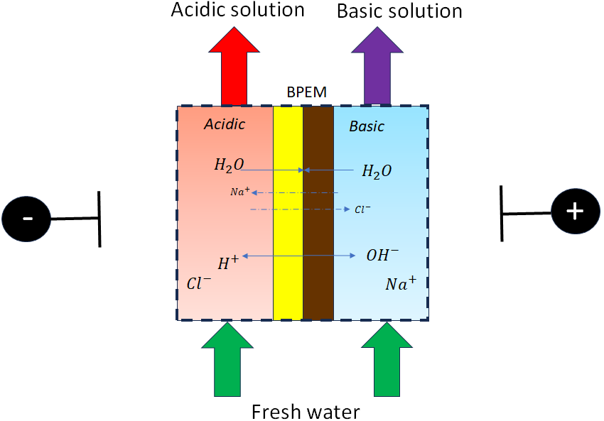

Bipolar Electrodialysis (1D)
============================

.. code-block:: python

   from watertap.unit_models.electrodialysis_bipolar_1D import Electrodialysis_Bipolar_1D

Introduction
------------

Bipolar electrodialysis, an electrochemical separation technology, is primarily used to generate acids and bases from concentrated salt solution [1]_.
Recently, multiple proof of concept studies have shown that, starting from Lithium Chloride solution, bipolar membranes can produce Lithium Hydroxide [2]_ [3]_.
Environmentally hazardous concentrated brine, produced at the end of water purification, can be converted to valuable sodium hydroxide via bipolar membrane electrodialysis, thus creating a new revenue stream [4]_.
The bipolar membrane (BPM) typically is made of an Anion exhcange layer and Cation exchange layer sandwiched together, usually with catalyst added to improve the hydrolysis reaction.
To produce products from salts, the BPM is placed in parallel with a cation exchange membrane (CEM) and an anion exchange membrane (AEM).
To obtain a model for bipolar electrodialysis, we create a model from existing literature.
The unit model uses the reduced order model for water disassociation proposed by Mareev et al. (2020) [5]_. While their work primarily focuses on simulating potential profile within the bipolar membrane, they also find
reasonably good agreements with the voltage-current experiments performed by Wilhelm et al. (2002) [6]_. Hence, the Mareev et al. (2020) [5]_ framework for hydrolysis flux that incorporates catalyst action is used.
Water splitting occurs only when the limiting current on the BPM is exceeded. An expression for the limiting current is obtained from existing literature [7]_ [13]_. These two components are coupled using the best available model for current density [7]_ [13]_.
Combining the BPM with the AEM and CEM, this unit model can be deployed to model acid and base production from concentrated salt solutions. The mass transfer is modelled using rigorously validated conventional electrodialysis equations.
Hence, high fidelity prediction of bipolar electrodialysis process will be possible with this unit model.
A sketch of the bipolar membrane cell stack is shown in Figure 1 with the **diluate**, **basic**, and **acidic** channels that produce low concentration brine, base, and acid, respectively.
Users may choose to add ions via the feed. More overview of the bipolar electrodialysis technology can be found in the *References*.

    Figure 1. Schematic representation of a bipolar electrodialysis unit

One set of BPM, CEM, AEM, along with the **diluate**, **basic**, and **acidic** channels can thus be treated as a modelling unit that can
multiply to larger-scale systems. The presented bipolar electrodialysis model establishes mathematical descriptions of
ion and water transport across the membrane along with water disassociation. Modelled transfer mechanisms include
electrical migration, diffusion of ions, osmosis, electroosmosis, and water splitting. The following are the key
assumptions made:

* The **diluate**, **basic**, and **acidic** channels have identical geometry.
* For each channel, component fluxes in the bulk solution has variation along the vertical direction (l), as depicted in in Figure 1, but uniform in the other two orthogonal directions, b (cell width) and d, (the 1-dimensional assumption).
* Steady state: all variables are independent of time.
* Co-current flow operation. 
* Ideality assumptions: activity, osmotic, and van't Hoff coefficients are set at one.
* Ion transport number, water transport number, and permeability are constant over space.
* Detailed concentration gradient effect at membrane-water interfaces is neglected. 
* Constant pressure and temperature through each channel.
* No boundary layer, electric double layer, or diffusion layer next to the monopolar membranes has been considered. For typical operating conditions of a bipolar membrane system, such low salinity in the **diluate** is not expected.
* All instances of limiting current density, unless explicitly specified, refer to salt ion limiting current density across BPM.
* The hydrolysis limiting current on BPM is expected to be much higher and does not have a suitable model in literature. Hence, it is not included in the unit model.

Control Volumes
---------------

This model has three control volumes for the acidic and basic channels.

* **diluate** channel
* **acidic** channel
* **basic** channel

Ports
-----

On the two control volumes, this model provides six ports (Pyomo notation in parenthesis):

* inlet_diluate (inlet)
* outlet_diluate (outlet)
* inlet_acidic (inlet)
* outlet_acidic (outlet)
* inlet_basic (inlet)
* outlet_basic (outlet)

Sets
----
This model can simulate the water splitting and the transport of multiple species. All solution components
( H\ :sub:`2`\ O, neutral solutes, and ions, including Proton and Hydroxide ions) form a Pyomo set in the model.
For a clear model demonstration, this document uses an aqueous NaCl solution along with the products of water splitting, H\ :sup:`+` and OH\ :sup:`-`, hereafter.

This model can mathematically take a multi-component solution (i.e., one salt molecule to be treated) as an input; nevertheless,
a multi-component solution introduces parameters that are either unknown or difficult to estimate (e.g., electrical transport numbers through membranes,
multi-ion diffusivity, etc.) and physical relationships that may result in ill-posed or ill-conditioned problems, translating to numerical challenges that can make models difficult to solve.'
While we continuously work on advancing our models to incorporate new principles revealed by new
research findings, we advise users to be **cautious** when simulating multi-component systems with the current model, due to the aspects stated above.
This unit model works with the :ref:`MCAS <mcas_tech_ref>` property model.

.. csv-table::
   :header: "Description", "Symbol", "Indices"

   "Time", ":math:`t`", "[t]\ :sup:`1`"
   "Length domain", ":math:`x`", ":math:`l \times(0, 1)` \ :sup:`2`"
   "Phase", ":math:`p`", "['Liq']"
   "Component", ":math:`j`", "['H\ :sub:`2` \O', 'Na\ :sup:`+`', 'Cl\ :sup:`-`', 'H\ :sup:`+`', 'OH\ :sup:`-`']"
   "Ion", ":math:`j`", "['Na\ :sup:`+`', 'Cl\ :sup:`-`', 'H\ :sup:`+`', 'OH\ :sup:`-`'] \  :sup:`3`"
   "Membrane", "n/a", "['AEM','CEM','BPM']"

**Notes**
 :sup:`1` The time set index is set as [0] in this steady-state model and is reserved majorly for the future extension
 to a dynamic model.

 :sup:`2` By the IDAES convention, the index of length domain is normalized to a continuous set of (0, 1), which is discretized
 when differential equations in the model are solved by numerical methods such as "finite difference" discretization. In this
 documentation, :math:`x` refers to the length dimension before normalization and carries a unit of [m].

 :sup:`3` "Ion" is a subset of "Component" and uses the same symbol j.

 :sup:`4` Please note that Na :sup:`+`, \Cl :sup:`-` H\ :sup:`+` and OH\ :sup:`-` information must be supplied. Otherwise an error will be thrown.

 :sup:`5` Additional ions can be added by the user and will not throw errors. However, areal resistance calculation assumes NaOH and HCl in the acid and base concentration. Hence, calculations will not be accurate unless users manually correct for areal resistance computation.

Degrees of Freedom
------------------
The bipolar membrane model has multiple degrees of freedom, among which temperature, pressure, and component molar flow
rate are state variables that are fixed as initial conditions. The rest are parameters that should be provided in order
to fully solve the model. The exact degrees of freedom depend on the mode of operation. For the simplest case where no water
splitting occurs and the bipolar membrane acts like a simple electrodialysis membrane,these degrees of freedom are:

.. csv-table::
   :header: "Description", "Symbol", "Variable Name", "Index", "Units", "DOF Number \ :sup:`1`"

   "Temperature, inlet_diluate", ":math:`T^{diluate}`", "temperature", "None", ":math:`K`", 1
   "Temperature, inlet_acidic", ":math:`T^{acidic}`", "temperature", "None", ":math:`K`", 1
   "Temperature, inlet_basic", ":math:`T^{basic}`", "temperature", "None", ":math:`K`", 1
   "Pressure, inlet_diluate",":math:`p^{diluate}`", "temperature", "None", ":math:`Pa`", 1
   "Pressure, inlet_acidic",":math:`p^{acidic}`", "temperature", "None", ":math:`Pa`", 1
   "Pressure, inlet_basic",":math:`p^{basic}`", "temperature", "None", ":math:`Pa`", 1
   "Component molar flow rate, inlet_diluate", ":math:`N_{j,in}^{diluate}`", "flow_mol_phase_comp", "[t], ['Liq'], ['H\ :sub:`2`\O', 'Na\ :sup:`+`', '\Cl\ :sup:`-`', 'H\ :sup:`+`', 'OH\ :sup:`-`']", ":math:`mol \, s^{-1}`", 5
   "Component molar flow rate, inlet_acidic", ":math:`N_{j,in}^{acidic}`", "flow_mol_phase_comp", "[t], ['Liq'], ['H\ :sub:`2`\O', 'Na\ :sup:`+`', '\Cl\ :sup:`-`', 'H\ :sup:`+`', 'OH\ :sup:`-`']", ":math:`mol \, s^{-1}`", 5
   "Component molar flow rate, inlet_basic", ":math:`N_{j, in}^{basic}`", "flow_mol_phase_comp", "[t], ['Liq'], ['H\ :sub:`2`\O', 'Na\ :sup:`+`', '\Cl\ :sup:`-`', 'H\ :sup:`+`', 'OH\ :sup:`-`']", ":math:`mol \, s^{-1}`", 5
   "Water transport number", ":math:`t_w`", "water_trans_number_membrane", "['AEM','CEM','BPM']", "dimensionless", 3
   "Water permeability", ":math:`L`", "water_permeability_membrane", "['AEM','CEM','BPM']", ":math:`m^{-1}s^{-1}Pa^{-1}`", 3
   "Voltage or Current \ :sup:`2`", ":math:`U` or :math:`I`", "voltage or current", "[t]", ":math:`\text{V}` or :math:`A`", 1
   "Electrode areal resistance", ":math:`r_{el}`", "electrodes_resistance", "None", ":math:`\Omega \,m^2`", 1
   "Cell number", ":math:`n`", "cell_triplet_num", "None", "dimensionless", 1
   "Current utilization coefficient", ":math:`\xi`", "current_utilization", "None", "dimensionless", 1
   "Shadow factor", ":math:`\beta`", "shadow_factor", "None", "dimensionless", 1
   "Spacer thickness", ":math:`s`", "spacer_thickness", "None", ":math:`m` ", 1
   "Cell width", ":math:`b`", "cell_width", "None", ":math:`\text{m}`", 1
   "Cell length", ":math:`l`", "cell_length", "None", ":math:`\text{m}`", 1
   "Channel height", ":math:`d`", "channel_height", "None", ":math:`m` ", 1
   "Thickness of ion exchange membranes", ":math:`\delta`", "membrane_thickness", "['AEM','CEM','BPM']", ":math:`m`", 3
   "Transport number of ions in the membrane phase", ":math:`t_j`", "ion_trans_number_membrane", "['AEM','CEM','BPM'], ['Na\ :sup:`+`', '\Cl\ :sup:`-`', 'H\ :sup:`+`', 'OH\ :sup:`-`']", "dimensionless", 9
   "Diffusivity of solute in the membrane phase", ":math:`D`", "solute_diffusivity_membrane", "['AEM','CEM','BPM'], ['Na\ :sup:`+`', '\Cl\ :sup:`-`', 'H\ :sup:`+`', 'OH\ :sup:`-`']", "dimensionless", 9
   "Constant areal resistance of membrane at infinity-approximated electrolyte concentration", ":math:`r_0`", "membrane_areal_resistance_coef_0", "None", ":math:`\Omega \, m^2`", 1
   "Coefficient of membrane areal resistance to 1/c, where c is the electrolyte concentration", ":math:`r_1`", "membrane_areal_resistance_coef_1", "None", ":math:`\Omega \, Kg\,m^{-1}`", 1
   "Salt diffusivity", ":math:`D^*`", "diffus_mass",  "None", ":math:`m^2\, s^{-1}`", 1
   "Salt concentration, basic side \ :sup:`3`", ":math:`C_{basic}`", "salt_conc_ael_ref", "None", ":math:`mol\, m^{-3}`", 1
   "Salt concentration, acidic side \ :sup:`3`", ":math:`C_{acidic}`", "salt_conc_cel_ref", "None", ":math:`mol \,m^{-3}`", 1
   "Membrane Fixed charge ", ":math:`\sigma`", "membrane_fixed_charge", "None", ":math:`mol \,m^{-3}`", 1
   "Dissociation rate constant, zero electric field ", ":math:`k_2(0)`", "k2_zero", "None", ":math:`s^{-1}`", 1
   "Concentration of water", ":math:`C_{H_2O}`", "conc_water", "None", ":math:`mol\, m^{-3}`", 1
   "Relative permittivity ", ":math:`\epsilon_r`", "relative_permittivity", "None", "Non-dimensional", 1
   "Catalyst concentration on the cation exchange side", ":math:`Q_{m,A}`", "membrane_fixed_catalyst_cel",  "None", ":math:`mol \, m^{-3}`", 1
   "Catalyst concentration on the anion exchange side", ":math:`Q_{m,B}`", "membrane_fixed_catalyst_ael",  "None", ":math:`mol \, m^{-3}`", 1
   "Equilibrium constant of proton disassociation", ":math:`K_A`", "k_a", "None", ":math:`mol \, m^{-3}`", 1
   "Equilibrium constant of hydroxide disassociation", ":math:`K_B`", "k_b", "None", ":math:`mol \, m^{-3}`", 1

**Note**
 :sup:`1` DOF number takes account of the indices of the corresponding parameter.

 :sup:`2` A user should provide either current or voltage as the electrical input, in correspondence to the "Constant_Current"
 or "Constant_Voltage" treatment mode (configured in this model). The user also should provide an electrical magnitude
 that ensures an operational current *above the bipolar membrane limiting current*.

 :sup:`3` 'salt_conc_ael_ref' and 'salt_conc_ael_ref' need to be specified only when ``salt_calculation=False`` is chosen. When ``salt_calculation=True`` :math:`C_{basic}` and :math:`C_{acidic}` salt_conc_ael_x and salt_conc_cel_x are computed with indexes [t,x] and do not need to be specified.

Solution component information
------------------------------
To fully construct solution properties, users need to provide basic component information of the feed solution to use this model. Below is a sample:

.. code-block::

   ion_dict = {
        "solute_list": ["Na_+", "Cl_-", "H_+", "OH_-"],
        "mw_data": {
            "Na_+": 23e-3,
            "Cl_-": 35.5e-3,
            "H_+": 1e-3,
            "OH_-": 17.0e-3,
        },
        "elec_mobility_data": {
            ("Liq", "Na_+"): 5.19e-8,
            ("Liq", "Cl_-"): 7.92e-8,
            ("Liq", "H_+"): 36.23e-8,
            ("Liq", "OH_-"): 20.64e-8,
        },
        "charge": {"Na_+": 1, "Cl_-": -1, "H_+": 1, "OH_-": -1},
        "diffusivity_data": {
            ("Liq", "Na_+"): 1.33e-9,
            ("Liq", "Cl_-"): 2.03e-9,
            ("Liq", "H_+"): 9.31e-9,
            ("Liq", "OH_-"): 5.27e-9,
        },
    }

This model, by default, uses H\ :sub:`2`\ O  as the solvent of the feed solution. Please note that Na :sup:`+`, \Cl :sup:`-` H\ :sup:`+` and OH\ :sup:`-` information must be supplied. Otherwise an error will be thrown.

Information regarding the property package this unit model relies on can be found in the :ref:`MCAS <mcas_tech_ref>` module.

Equations
---------

This model solves mass balances of all solution components (H\ :sub:`2`\ O, Na :sup:`+`, \Cl :sup:`-` H\ :sup:`+` and OH\ :sup:`-` ) on three control volumes (acidic, basic, and diluate channels). Under the 1D treatment, balance equations are expressed
as differential algebraic equations (DAE) when concerned variables are functions of length (x). The DAEs are solved in a
discretization manner using the "finite difference" or "collocation" method implemented in **Pyomo.DAE**.

To create a model for bipolar electrodialysis, we use the mass transfer equations from conventional electrodialysis on the CEM and AEM
(for further details please refer to :ref:`Electrodialysis 1D <ED_1D>`) and couple it with equations developed for BPM.

Across the BPM, water disassociation occurs when the limiting current is exceeded. Assuming the unit model is operated in the hydrolysis regime, the current density consists of
the limiting current and the water splitting current. See equation (3) in  Wilhelm et al. (2001) [7]_ or equations (11) and (12) from González et al. (2023) [13]_ for further details.
The limiting current density is obtained from González et al. (2023) [13]_. It sets the amount of salt ions flowing across the BPM. The governing equations for catalyst induced
water disassociation is derived from the model proposed by Mareev et al. (2020) [5]_. The equations pertaining to the BPM are given below.

.. csv-table::
   :header: "Description", "Equation", "Configuration"

   "Limiting current density", ":math:`i_{lim}(x) =` user input constant", "``limiting_current_density_method_bpm =LimitingCurrentDensitybpmMethod.InitialValue``"
   "", ":math:`i_{lim} (x) = D^*F (C_{acidic,NaCl}(x)+C_{basic,NaCl}(x))^2 / (\sigma \delta)`", "``limiting_current_density_method_bpm =LimitingCurrentDensitybpmMethod.Empirical`` \ :sup:`2`"
   "Water splitting flux \ :sup:`3`", ":math:`S_{diss}(x) =R_{K_A} \lambda(x) + R_{K_B} \lambda(x)`"
   "Water splitting rate \ :sup:`4`", ":math:`R_{K_A}(x) = \frac{Q_{m,A}}{K_{A}}[k_2(0)f[E(x)]C_{H_2O} ]`"
   " ", ":math:`R_{K_B}(x) = \frac{Q_{m,B}}{K_{B}}[k_2(0)f[E(x)]C_{H_2O} ]`"
   "Depletion length \ :sup:`5`", ":math:`\lambda(x) = E(x) \epsilon_0 \epsilon_r / (F \sigma)`"
   "Hydrolysis voltage drop", ":math:`u_{diss}(x) = E(x) \lambda(x)`"
   "Electric current density \ :sup:`6`", ":math:`i(x) = i_{lim}(x) + F S_{diss}(x)`"
   "Potential drop", ":math:`U(x)=n E(x)/\lambda(x) + i(x) r_{tot}(x)`"

**Note**
 :sup:`1` The diffusivity :math:`D^*` used here for the salt and should not be confused with the ion diffusivity.

 :sup:`2` The limiting current density is set by balance of electrical migration and diffusion and obtained from equation (15) in González et al. (2023) [13]_.

 :sup:`3` Water disassociation flux is obtained from equation (35) in Mareev et al. (2020) [5]_.

 :sup:`4` Hydrolysis rate with catalyst present is obtained from equation (16) in Mareev et al. (2020) after neglecting the recombination, in line with the approximation made later in their derivation [5]_.

 :sup:`5` The relationship between the electric field at the junction of the bipolar membrane's charged layers :math:`E`  to the depletion layer has been derived from equations (26-27) in Melnikov (2022) [8]_.

 :sup:`6` Total current density has been obtained from equation (3) in  Wilhelm et al. (2001) [7]_. Alternatively, please refer to equations (11) and (12) from González et al. (2023) [13]_.

Please note that the unit model is assumed to operate in the water splitting regime. Hence, :math:`i_{lim}` is always computed since hydrolysis current is the portion that is in excess of the limiting current.
Below the water splitting regime, the bipolar membrane behaves like a conventional ion exchange membrane, albeit with much lower mass transfer. Most cases do not operate in this regime [2]_ [3]_ [4]_.
Hence, the sub-limiting case has not been implemented in this unit model. :math:`f[E]` is the second Wien effect driven enhancement of the dissociation rate under applied electric field.
It requires input temperature and relative permittivity (:math:`\epsilon_r`), and the full expression has been obtained from Mareev et al. (2020) [5]_. While water is consumed during hydrolysis, there is an
also transport across the membrane. For this component, we use the equations from conventional electrodialysis.

The fluxes on each membrane is collected and presented here. The positive direction for the mass fluxes :math:`J`  is from cathode to anode.
The water dissociation fluxes, :math:`S`, flow out from the central depletion region of the bipolar membrane while water is drawn in. Here, the convention is that the outflow from the bipolar membrane is in the positive direction.

Flux Equations
--------------
.. csv-table::
   :header: "Description", "Equation", "Index set"

   "Mass transfer flux, BPM, ions", ":math:`J^{BPM}_j(x) = t_j^{BPM}\frac{\xi i_{lim}(x)}{ z_j F}`", ":math:`j \in \left['{Na^+} ', '{Cl^-}', '{H^+} ', '{OH^-} '\right]`"
   "Mass transfer flux, BPM, H\ :sub:`2`\ O", ":math:`J^{BPM}_j(x) = t_w^{BPM} \left(\frac{i(x)}{F}\right)+\left(L^{BPM} \right)\left(p_{osm}^{acidic}(x)-p_{osm}^{basic}(x) \right)\left(\frac{\rho_w}{M_w}\right)`", ":math:`j \in \left['H_2 O'\right]`"
   "Water disassociation flux, BPM, ions", ":math:`S^{BPM}_j (x)= S_{diss}(x)`", ":math:`j \in \left['{H^+}, {OH^-}  '\right]`"
   "", ":math:`S^{BPM}_j (x)= 0`", ":math:`j \in \left['{Na^+} ', '{Cl^-}'\right]`"
   "Water disassociation flux, BPM, H\ :sub:`2`\ O", ":math:`S^{BPM}_j(x) = -0.5 S_{diss}(x)`", ":math:`j \in \left['H_2 O'\right]`"
   "Mass transfer flux, CEM, ions", ":math:`J^{AEM}_j(x) = \left(t_j^{AEM} \right)\frac{\xi i(x)}{ z_j F}-\frac{D_j^{AEM}}{\delta ^{AEM} }\left(c_j^{acidic}(x)-c_j^{diluate}(x) \right)`", ":math:`j \in \left['{Na^+} ', '{Cl^-}', '{H^+} ', '{OH^-} '\right]`"
   "Mass transfer flux, AEM, H\ :sub:`2`\ O", ":math:`J^{AEM}_j(x) = t_w^{AEM} \left(\frac{i(x)}{F}\right)+\left(L^{AEM} \right)\left(p_{osm}^{acidic}(x)-p_{osm}^{diluate}(x) \right)\left(\frac{\rho_w}{M_w}\right)`", ":math:`j \in \left['H_2 O'\right]`"
   "Mass transfer flux, CEM, ions", ":math:`J^{CEM}_j(x) = \left(t_j^{CEM} \right)\frac{\xi i(x)}{ z_j F}-\frac{D_j^{CEM}}{\delta ^{CEM} }\left(c_j^{basic}(x)-c_j^{diluate}(x) \right)`", ":math:`j \in \left['{Na^+} ', '{Cl^-}', '{H^+} ', '{OH^-} '\right]`"
   "Mass transfer flux, CEM, H\ :sub:`2`\ O", ":math:`J^{CEM}_j(x) = t_w^{CEM} \left(\frac{i(x)}{F}\right)+\left(L^{CEM} \right)\left(p_{osm}^{basic}(x)-p_{osm}^{diluate}(x) \right)\left(\frac{\rho_w}{M_w}\right)`", ":math:`j \in \left['H_2 O'\right]`"

Appropriately combining the various fluxes and assigning them to the channels the results are given here.

Mass Balance Equations
----------------------
.. csv-table::
   :header: "Description", "Equation", "Index set"

   "Mass balance **basic** channel", ":math:`\left(\frac{\partial N_j (x)}{\partial x}\right)^{\bf{basic}}+(-J_j(x)^{BPM} + J_j(x)^{CEM} + S_j(x)^{BPM} ) b=0`", ":math:`j \in \left['H_2 O', '{Na^+} ', '{Cl^-}', '{H^+} ', '{OH^-} '\right]`"
   "Mass balance **acidic** channel", ":math:`\left(\frac{\partial N_j (x)}{\partial x}\right)^{\bf{acidic}}+(J_j(x)^{BPM} + J_j(x)^{AEM} + S_j(x)^{BPM} ) b=0`", ":math:`j \in \left['H_2 O', '{Na^+} ', '{Cl^-}', '{H^+} ', '{OH^-} '\right]`"
   "Mass balance **diluate** channel", ":math:`\left(\frac{\partial N_j (x)}{\partial x}\right)^{\bf{diluate}}-(J_j(x)^{AEM} + J_j(x)^{CEM}) b=0`", ":math:`j \in \left['H_2 O', '{Na^+} ', '{Cl^-}', '{H^+} ', '{OH^-} '\right]`"

The flux and potential drop on the bipolar membrane are tested against the experimental data available from Wilhelm et al. (2002), [6]_ and we find reasonably good agreement.
Some key inputs for the validation were obtained from Mareev et al. (2020) [5]_. :math:`K_A` is not readily available, so it is determined by best fit.
The mass transfer flux employs the well tested conventional electrodialysis framework. Hence, robust predictions of bipolar electrodialysis operation is expected.
Some of the key operational and performance metrics are reported below.

Electrical and Performance Equations
------------------------------------
.. csv-table::
   :header: "Description", "Equation"

   "Electrical input condition", ":math:`i(x) = \frac{I}{bl}`, for 'Constant_Current';  :math:`u(x) =U` for 'Constant_Voltage'"
   "Potential drop", ":math:`u(x) =  n u_{diss}(x) + i(x) r_{tot}(x)`"
   "Resistance calculation", ":math:`r_{tot}(x)=n\left(r_0 + r_1/(C'_{acidic,HCl}(x)+C'_{basic,NaOH}(x))\right)+r_{el}`"
   "Electrical power consumption", ":math:`P(x)=b\int _0 ^l u(x)i(x) dx`"

**Note**
 :sup:`1` The areal resistance functional form is based on Galama et al. (2014) [9]_.

 :sup:`2` :math:`C'` is expressed in :math:`kg/m^3`.

 :sup:`3` Areal resistance calculation assume NaOH and HCl in the acid and base channels. Additional ions can be added by the user and will not throw errors. However, calculations will not be accurate unless users manually account for areal resistance computation.

All equations are coded as "constraints" (Pyomo). Isothermal and isobaric conditions apply.

The model has been validated against the experimental data available from Wilhelm et al. (2002) [6]_,bipolar membrane information available online: Fumatech, Technical Data Sheet for
Fumasep FBM, 2020 [10]_ (additional inputs were obtained from from  Ionescu, Viorel (2023) [11]_) and bench scale experimental data provided by the New Mexico State University team.

Frictional pressure drop
^^^^^^^^^^^^^^^^^^^^^^^^
This model can optionally calculate pressured drops along the flow path in the diluate and concentrate channels through
config ``has_pressure_change`` and ``pressure_drop_method``.  Under the assumption of identical diluate and concentrate
channels and starting flow rates, the flow velocities in the two channels are approximated equal and invariant over the
channel length when calculating the frictional pressure drops. This approximation is based on the evaluation that the
actual velocity variation over the channel length caused by water mass transfer across the consecutive channels leads to
negligible errors, as compared to the uncertainties carried by the frictional pressure method itself. The
essential equations to simulate the pressure drop are provided here. Among extensive literatures using these equations, a good reference
paper is by Wright et. al., 2018 [12]_.

Essential Pressure Drop Equations
---------------------------------
.. csv-table::
   :header: "Description", "Equation", "Condition"

   "Frictional pressure drop, Darcy_Weisbach", ":math:`p_L=f\frac{\rho v^2}{2d_H}` \ :sup:`1`", "`has_pressure_change == True` and `pressure_drop_method == PressureDropMethod.Darcy_Weisbach`"
   " ", ":math:`p_L=` user-input constant", "`has_pressure_change == True` and `pressure_drop_method == PressureDropMethod.Experimental`"
   "Hydraulic diameter", ":math:`d_H=\frac{2db(1-\epsilon)}{d+b}`", "`hydraulic_diameter_method == HydraulicDiameterMethod.conventional`"
   " ", ":math:`d_H=\frac{4\epsilon}{\frac{2}{h}+(1-\epsilon)S_{v,sp}}`", "`hydraulic_diameter_method == HydraulicDiameterMethod.spacer_specific_area_known`"
   "Reynold number", ":math:`Re=\frac{\rho v d_H}{\mu}`", "`has_pressure_change == True` or `limiting_current_density_method == LimitingCurrentDensityMethod.Theoretical`"
   "Schmidt number", ":math:`Sc=\frac{\mu}{\rho D_b}`", "`has_pressure_change == True` or `limiting_current_density_method == LimitingCurrentDensityMethod.Theoretical`"
   "Sherwood number", ":math:`Sh=0.29Re^{0.5}Sc^{0.33}`", "`has_pressure_change == True` or `limiting_current_density_method == LimitingCurrentDensityMethod.Theoretical`"
   "Darcy's frictional factor", ":math:`f=4\times 50.6\epsilon^{-7.06}Re^{-1}`", "`friction_factor_method == FrictionFactorMethod.Gurreri`"
   " ", ":math:`f=4\times 9.6 \epsilon^{-1} Re^{-0.5}`", "`friction_factor_method == FrictionFactorMethod.Kuroda`"
   "Pressure balance", ":math:`p_{in}-p_L l =p_{out}`", "`has_pressure_change == True`"

**Note**

 :sup:`1` As discussed in the last paragraph, in this section we assumed a constant linear velocity (in the cell length direction), :math:`v`, in both channels and along the flow path. This :math:`v` is calculated from the volume flow rate at :math:`x=0` by the property package.

Nomenclature
------------
.. csv-table::
   :header: "Symbol", "Description", "Unit"
   :widths: 10, 20, 10

   "**Parameters**"
   ":math:`\rho_w`", "Mass density of water", ":math:`kg\  m^{-3}`"
   ":math:`M_w`", "Molecular weight of water", ":math:`kg\  mol^{-1}`"
   "**Variables**"
   ":math:`N`", "Molar flow rate of a component", ":math:`mol\  s^{-1}`"
   ":math:`J`", "Molar flux of a component", ":math:`mol\  m^{-2}s^{-1}`"
   ":math:`b`", "Cell/membrane width", ":math:`m`"
   ":math:`l`", "Cell/membrane length", ":math:`m`"
   ":math:`t`", "Ion transport number", "dimensionless"
   ":math:`I`", "Current input", ":math:`A`"
   ":math:`i`", "Current density", ":math:`A m^{-2}`"
   ":math:`U`", "Voltage input over a stack", ":math:`V`"
   ":math:`u`", "x-dependent voltage over a stack", ":math:`V`"
   ":math:`n`", "Cell number", "dimensionless"
   ":math:`\xi`", "Current utilization coefficient (including ion diffusion and water electroosmosis)", "dimensionless"
   ":math:`\beta`", "Shadow factor", "dimensionless"
   ":math:`z`", "Ion charge", "dimensionless"
   ":math:`F`", "Faraday constant", ":math:`C\ mol^{-1}`"
   ":math:`\epsilon_0`", "permittivity of free space", ":math:`C\ mol^{-1}`"
   ":math:`D`", "Ion Diffusivity", ":math:`F m^-1`"
   ":math:`\delta`", "Membrane thickness", ":math:`m`"
   ":math:`c`", "Solute concentration", ":math:`mol\ m^{-3}`"
   ":math:`t_w`", "Water electroosmotic transport number", "dimensionless"
   ":math:`L`", "Water permeability (osmosis)", ":math:`ms^{-1}Pa^{-1}`"
   ":math:`p_{osm}`", "Osmotic pressure", ":math:`Pa`"
   ":math:`r_{tot}`", "Total areal resistance", ":math:`\Omega\, m^2`"
   ":math:`r`", "Membrane areal resistance", ":math:`\Omega m^2`"
   ":math:`r_{el}`", "Electrode areal resistance", ":math:`\Omega m^2`"
   ":math:`d`", "Spacer thickness", ":math:`m`"
   ":math:`P`", "Power consumption", ":math:`W`"
   ":math:`Q`", "Volume flow rate", ":math:`m^3s^{-1}`"
   ":math:`\phi_d^{ohm}`", "Ohmic potential across a Nernst diffusion layer", ":math:`V`"
   "**Subscripts and superscripts**"
   ":math:`j`", "Component index",
   ":math:`in`", "Inlet",
   ":math:`out`", "Outlet",
   ":math:`acidic`", "Acid channel",
   ":math:`basic`", "Base channel",
   ":math:`diluate`", "Salt channel",

   ":math:`AEM`", "Anion exchange membrane",
   ":math:`CEM`",  "Cation exchange membrane",
   ":math:`BPM`",  "Bipolar membrane",

Class Documentation
-------------------

* :mod:`watertap.unit_models.Bipolar_Electrodialysis_0D`

References
----------
.. [1] Nagasubramanian, K., Chlanda, F. P., & Liu, K. J. (1977). Use of bipolar membranes for generation of acid and base—an engineering and economic analysis. Journal of Membrane Science, 2, 109-124.

.. [2] Xiang, X., Li, X., Wei, Y., Wu, Y., Yin, J., & Yuan, X. (2024). Desalination of mother liquor generated from the precipitation of lithium carbonate during the recycling of retired lithium ion battery. Desalination and Water Treatment, 320, 100665.

.. [3] Foo, Z. H., Lee, T. R., Wegmueller, J. M., Heath, S. M., & Lienhard, J. H. (2024). Toward a Circular Lithium Economy with Electrodialysis: Upcycling Spent Battery Leachates with Selective and Bipolar Ion-Exchange Membranes. Environmental Science & Technology, 58(43), 19486-19500.

.. [4] Raza, S., Hayat, A., Bashir, T., Ghasali, E., Hafez, A. A. A., Chen, C., ... & Lin, H. (2024). Recent progress in green thin film membrane based materials for desalination: Design, properties and applications. Desalination, 117973.

.. [5] Mareev, S. A., Evdochenko, E., Wessling, M., Kozaderova, O. A., Niftaliev, S. I., Pismenskaya, N. D., & Nikonenko, V. V. (2020). A comprehensive mathematical model of water splitting in bipolar membranes: Impact of the spatial distribution of fixed charges and catalyst at bipolar junction. Journal of Membrane Science, 603, 118010.

.. [6] Wilhelm, F. G., Van Der Vegt, N. F. A., Strathmann, H., & Wessling, M. (2002). Comparison of bipolar membranes by means of chronopotentiometry. Journal of membrane science, 199(1-2), 177-190.

.. [7] Wilhelm, F. G., Pünt, I., Van Der Vegt, N. F. A., Wessling, M., & Strathmann, H. (2001). Optimisation strategies for the preparation of bipolar membranes with reduced salt ion leakage in acid–base electrodialysis. Journal of Membrane Science, 182(1-2), 13-28.

.. [8] Melnikov, S. (2022). Ion Transport and Process of Water Dissociation in Electromembrane System with Bipolar Membrane: Modelling of Symmetrical Case. Membranes, 13(1), 47.

.. [9] Galama, A. H., Vermaas, D. A., Veerman, J., Saakes, M., Rijnaarts, H. H. M., Post, J. W., & Nijmeijer, K. (2014). Membrane resistance: The effect of salinity gradients over a cation exchange membrane. Journal of membrane science, 467, 279-291.

.. [10] Fumatech, Technical Data Sheet for Fumasep FBM, 2020.

.. [11] Ionescu, V. (2023, March). A simple one-dimensional model for analysis of a bipolar membrane used in electrodialysis desalination. In Advanced Topics in Optoelectronics, Microelectronics, and Nanotechnologies XI (Vol. 12493, pp. 520-529). SPIE.

.. [12] Campione, A., Gurreri, L., Ciofalo, M., Micale, G., Tamburini, A., & Cipollina, A. (2018). Electrodialysis for water desalination: A critical assessment of recent developments on process fundamentals, models and applications. Desalination, 434, 121-160.

.. [13] González, A., Grágeda, M., & Ushak, S. (2023). Modeling and validation of a LiOH production process by bipolar membrane electrodialysis from concentrated LiCl. Membranes, 13(2), 187.