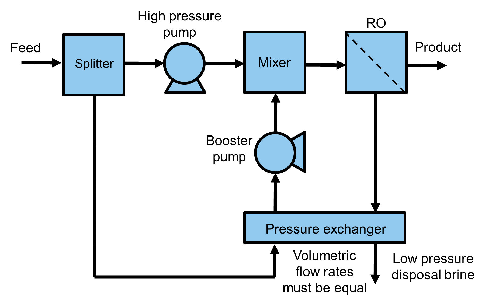

.. _pressure_exchanger:

Pressure Exchanger
==================

.. code-block:: python

   from watertap.unit_models.pressure_exchanger import PressureExchanger

This pressure exchanger unit model:
    * is 0-dimensional
    * is isothermal
    * supports a single liquid phase only
    * supports steady-state only
    * supports leakage and mixing effect

.. index::
   pair: watertap.unit_models.pressure_exchanger;pressure_exchanger

.. currentmodule:: watertap.unit_models.pressure_exchanger

Degrees of Freedom
------------------
Generally, pressure exchangers are not used in isolation and are part of an energy recovery system that includes a mixer,
splitter, and a booster pump, as shown in Figure 1. This energy recovery system only adds one degree of freedom to the overall model.

Typically, the following variables are fixed to fully specify the energy recovery system:
    * the pressure exchanger efficiency (`efficiency_pressure_exchanger` located on the pressure exchanger unit model)
    * the booster pump efficiency (`efficiency_pump` located on the pump unit model)

Where the system is also subject to following constraints:
    * volumetric flowrate is equal on both sides of the pressure exchanger (constraint is included in pressure exchanger unit model)
    * booster pump matches the high pressure pump outlet pressure (constraint must be added by the user or at the mixer with the equality momentum mixing type option)

    
    Figure 1. Schematic representation of an energy recovery system using a pressure exchanger.

When setting the ``has_mixing`` configuration option to ``True``, there is 1 additional variable ``mixing_vol`` that must be fixed.

When setting the ``has_leakage`` configuration option to ``True``, there is 1 additional variable ``leakage_vol`` that must be fixed.

When setting the ``pressure_exchange_calculation`` configuration option to ``PressureExchangeType.high_pressure_difference``,
there are 2 additional variables ``high_pressure_difference`` and ``low_pressure_difference`` that must be fixed. Instead, ``efficiency_pressure_exchanger`` is unfixed.

Model Structure
------------------
The pressure exchanger model consists of 2 `ControlVolume0DBlocks`: one for the feed side and brine side.

Sets
----
.. csv-table::
   :header: "Description", "Symbol", "Indices"

   "Time", ":math:`t`", "[0]"
   "Phases", ":math:`p`", "['Liq']"
   "Components", ":math:`j`", "['H2O', 'NaCl']*"

\*Solute depends on the imported property package; example shown here is for the NaCl property model.

Variables
----------

The pressure exchanger unit model includes the following variables:

.. csv-table::
   :header: "Description", "Symbol", "Variable Name", "Index", "Units", "Pyomo Type" 

   "Efficiency", ":math:`\eta`", "efficiency_pressure_exchanger", "[t]", ":math:`\text{dimensionless}`", "Var"
   "Volumetric leakage fraction", ":math:`\delta`", "leakage_vol", "[t]", ":math:`\text{dimensionless}`", "Var"
   "Volumetric mixing fraction", ":math:`\chi`", "mixing_vol", "[t]", ":math:`\text{dimensionless}`", "Var"
   "High pressure difference*", ":math:`HPD`", "high_pressure_difference", "[t]", ":math:`\text{Pa}`", "Var"
   "Low pressure difference*", ":math:`LPD`", "low_pressure_difference", "[t]", ":math:`\text{Pa}`", "Var"

\*High pressure difference and low pressure difference are non-negative values

Each control volume (i.e. `feed_side`, and `brine_side`) has the following variables of interest:

.. csv-table::
   :header: "Description", "Symbol", "Variable Name", "Index", "Units", "Pyomo Type" 

   "Pressure change", ":math:`ΔP`", "deltaP", "[t]", "\*", "Var"
   "Work", ":math:`W`", "work", "[t]", "\*", "Expression"

\*Units depends on the imported property package

Each property block on both control volumes (i.e. `properties_in` and `properties_out`) has the following variables of interest:

.. csv-table::
   :header: "Description", "Symbol", "Variable Name", "Index", "Units", "Pyomo Type" 

   "Mass flowrate", ":math:`M`", "flow_mass_phase_comp", "[p, j]", "\*", "Var"
   "Volumetric flowrate", ":math:`Q`", "flow_vol", "None", "\*", "Var"
   "Concentration", ":math:`C`", "conc_mass_phase_comp", "[p, j]", "\*", "Var"
   "Temperature", ":math:`T`", "temperature", "[t]", "\*", "Var"
   "Pressure", ":math:`P`", "pressure", "[t]", "\*", "Var"

\*Units depends on the imported property package
   

Equations
-----------
if ``has_leakage`` and ``has_mixing`` are set to default (``False``):

.. csv-table::
   :header: "Description", "Equation"

   "Mass balance for each side", ":math:`M_{out, j} = M_{in, j}`"
   "Momentum balance for each side", ":math:`P_{out} = P_{in} + ΔP`"
   "Isothermal assumption for each side", ":math:`T_{out} = T_{in}`"
   "Equal volumetric flowrate*", ":math:`Q_{out, F} = Q_{in, F}`"
   "Equal pressure*", ":math:`P_{out, B} = P_{in, F}`"
   "Pressure transfer*", ":math:`ΔP_{F} = - \eta ΔP_{B}`"

\* F stands for feed side, B stands for brine side

if ``has_leakage`` is set to ``True``, then the equal volumetric flowrate equation is replaced by:

.. csv-table::
   :header: "Description", "Equation"

   "Equal volumetric flowrate", ":math:`Q_{out, F} = (1 - \delta) Q_{in, B}`"

if ``has_mixing`` is set to ``True``, the mass balance equations for each side become:

.. csv-table::
   :header: "Description", "Equation"

   "Mass balance for each side*", ":math:`M_{out, j} = M_{in, j} + MTT_{j}`"

\* MTT is mass transfer term into the control volume

and there are 3 additional constraints:

.. csv-table::
   :header: "Description", "Equation"

   "Mixing effect of solute*", ":math:`C_{out, F} = C_{in, F} (1-\chi) + C_{in, B} \chi`"
   "Linking mass transfer terms", ":math:`MTT_{j, F} = -MTT_{j, B}`"
   "Equal feed side volumetric flowrate", ":math:`Q_{out, F} = Q_{in, F}`"

\* C represents solute concentration

if ``pressure_change_calculation`` is set to ``PressureExchangeType.high_pressure_difference``,
then there is 1 additional constraint and the equal pressure equation is replaced:

.. csv-table::
   :header: "Description", "Equation"

   "Pressure drop across B,in and F, out", ":math:`P_{out, F} + HPD = P_{in, B}`"
   "Pressure drop across B, out and F, in", ":math:`P_{out, B} = P_{in, F} + LPD`"

Class Documentation
-------------------

* :mod:`watertap.unit_models.pressure_exchanger`
