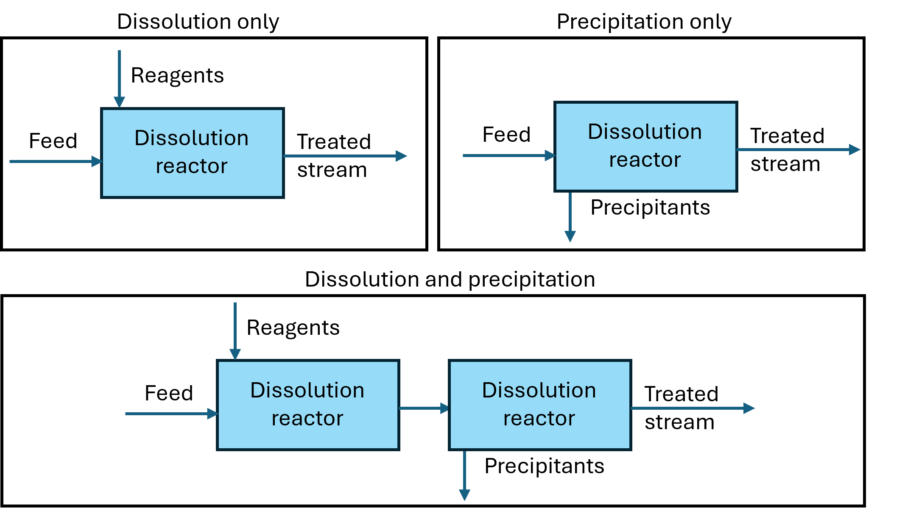

Stoichiometric reactor
======================

.. index::
   pair: watertap.unit_models.stoichiometric_reactor;stoichiometric_reactor

The main assumptions of the implemented model are as follows:

1) Single liquid phase only (solids are not explicitly modeled)
2) Steady state only
3) Has no volume
4) Reaction phenomena is not modeled (e.g. exothermic, endothermic, reaction rate, etc.)
   User must provide amount of reagent to add, and amount of precipitant that would form

Introduction
------------
This is a basic stoichiometric reactor designed to provide a simple mass balanced method for adding reactants and
removing solids from a stream, for more comprehesive reactor models please use IDAES Stoichiometric
`IDAES Stoichiometric reactor model <https://idaes-pse.readthedocs.io/en/latest/reference_guides/model_libraries/generic/unit_models/stoichiometric_reactor.html>`_.

The stoichiometric reactor is a basic unit operation designed to aid in modeling 
addition of reagent to a feed stream and removal of ions from a stream through precipitation.
A basic example for using this model is the lime/soda ash softening process. 
The reactor can be configured to include only dissolution of a 
reagent or precipitation of specific species, and both as shown in figure below.

    
    Figure 1. Schematic representation of a processes considered in stoichiometric reactor

Degrees of Freedom
------------------
The degrees of freedom in a stoichiometric reactor unit model are as follows:

For inlet conditions:
    * temperature
    * pressure
    * component mass compositions

If reagents are supplied:
   * reagent mass flow rate or reagent dose

If precipitants are supplied 
   * precipitant mass flow rate 
   * mass fraction of solids in precipitant (solid) waste stream

Model Structure and usage
-------------------------
The stoichiometric reactor uses control volumes to perform the dissolution reaction and 
precipitation reaction, while an IDAES separator is used to separate precipitated solids 
from the feed stream. The model should be used with MCAS property package 
`Multi-Component Aqueous Solution (MCAS) Property Package <https://watertap.readthedocs.io/en/stable/technical_reference/property_models/mc_aq_sol.html>`_. The user needs to specify how supplied reagent and precipitant dissolve or precipitate 
out of the feed stream using ions present in the feed. 

Example dictionary for dissolving Soda ash and Lime into their ions  

.. code-block::

   reagents = {
         "Na2CO3": {
               "mw": 105.99 * pyunits.g / pyunits.mol,
               "dissolution_stoichiometric": {"Na_+": 2, "HCO3_-": 1},
         },
         "CaO": {
               "mw": 56.0774 * pyunits.g / pyunits.mol,
               "dissolution_stoichiometric": {"Ca_2+": 1, "H2O": 1},
         },
      }

Example dictionary for defined precipitant that would form during reaction (Calcite - CaCO3, and Brucite - MgOH)

.. code-block::

   precipitants = {
      "Calcite": {
            "mw": 100.09 * pyunits.g / pyunits.mol,
            "precipitation_stoichiometric": {"Ca_2+": 1, "HCO3_-": 1},
      },
      "Brucite": {
            "mw": 58.3197 * pyunits.g / pyunits.mol,
            "precipitation_stoichiometric": {"Mg_2+": 1, "H2O": 1},
      },
   }

The user can then provide the model with specified dictionary to produce a stoichiometric reactor that only perform dissolution, precipitation, or both. 

.. code-block::

   # unit for only adding a reagent
   m.fs.chemical_addition = StoichiometricReactor(property_package=m.fs.properties,  reagent=reagents)
   # The user must the specify how much reagent to add
   m.fs.chemical_addition.reagent_dose["Na2CO3"].fix(1e-3)
   m.fs.chemical_addition.reagent_dose["CaO"].fix(1e-3)
   
   # unit for only precipitating specified species out of the feed
   m.fs.precipitation_reactor = StoichiometricReactor(property_package=m.fs.properties, precipitants=precipitants)
   # The user must then specify how much precipitant to form 
   m.fs.precipitation_reactor.flow_mass_precipitate["Calcite"].fix(1e-3)
   m.fs.precipitation_reactor.flow_mass_precipitate["Brucite"].fix(1e-4)
   # The user must also specify solids fraction in waste stream
   m.fs.unit.waste_mass_frac_precipitate.fix(0.2)
   
   # unit for addition and precipitation (e.g. traditional Lime/Soda ash softening process)
   m.fs.lime_soda_softening = StoichiometricReactor(property_package=m.fs.properties, reagent=reagents, precipitants=precipitants)
   # The user must the specify how much reagent to add and precipitant to form
   m.fs.lime_soda_softening.reagent_dose["Na2CO3"].fix(1e-3)
   m.fs.lime_soda_softening.reagent_dose["CaO"].fix(1e-3)
   m.fs.lime_soda_softening.flow_mass_precipitate["Calcite"].fix(1e-3)
   m.fs.lime_soda_softening.flow_mass_precipitate["Brucite"].fix(1e-4)
   # The user must also specify solids fraction in waste stream
   m.fs.lime_soda_softening.waste_mass_frac_precipitate.fix(0.2)

Sets
----
.. csv-table::
   :header: "Description", "Symbol", "Indices"

   "time", ":math:`t`", "[0]"
   "phases", ":math:`p`", "['Liq']"
   "components", ":math:`j`", "['H2O', solutes]"
   "reagents", ":math:`\text{reagents}`",[reagent]
   "precipitants", ":math:`\text{precipitants}`",[precipitants]

Variables
----------

.. csv-table::
   :header: "Description", "Variable Name", "Index", "Units"
   
   "Reagent dose", reagent_dose,[reagent],kg/:math:`\text{m}^3`
   "Reagent density", density_reagent,[reagent],kg/:math:`\text{m}^3`
   "Reagent flow mass", flow_mass_reagent,[reagent],kg/s
   "Reagent flow volume", flow_vol_reagent,[reagent],:math:`\text{m}^3`/s
   "Stoichiometric coefficients for dissolution", dissolution_stoich_comp, "[reagent, :math:`j`]",dimensionless
   "Flow mass of precipitant",flow_mass_precipitate,[precipitant],kg/s
   "Mass concentration of precipitant",conc_mass_precipitate,[precipitant],kg/:math:`\text{m}^3`
   "Stoichiometric coefficients for precipitation", precipitation_stoich_comp, "[precipitant, :math:`j`]",dimensionless
   "Fraction of solids in waste stream",  waste_mass_frac_precipitate, None, fraction

   
Costing method
--------------

Currently, the costing method is implemented for lime and soda ash softening and acidification which only include
the capital cost of building the reactor. The capital cost of lime soda ash is a function of 
total reagent mass being added to the softening process and is only valid when both precipitant and reagents are provided.
While acid additon capital cost is only consutructed if only reagents are provided. Acid addition costing is 
base on folume flow of acid per day. 

.. math::

      C_{softening}=C_{base capital value}*\sum{M_{reagent}}

      C_{acidification}=C_{base capital value}*\sum{Q_{reagent}}

Where default value C_{basecapitalvalue} is 374.9 $/lb of reagent (soda ash + lime)/day, 
while for acid adition the cost is 127.8$/gallon of reagent (HCl)/day

To cost reagent dosing, user must manually register the mass flow of each reagent and supply
a cost as follows

.. code-block::

   # build the unit model 
   m.fs.chemical_addition = StoichiometricReactor(
         property_package=m.fs.properties,
         reagent=reagents,
      )
   # The user must the specify how much reagent to add
   m.fs.chemical_addition.reagent_dose["Na2CO3"].fix(1e-3)
   m.fs.chemical_addition.reagent_dose["CaO"].fix(1e-3)

   # specify the costs for lime (CaO)
   blk.lime_cost = Param(
      initialize=0.13,
      units=m.fs.costing.base_currency / pyunits.kg,
      mutable=True,
   )
   # specify the costs for soda ash (Na2CO3)
   blk.soda_ash_cost = Param(
      initialize=0.13,
      units=m.fs.costing.base_currency / pyunits.kg,
      mutable=True,
   )
   # Register the flow for each chemical being added
   m.fs.costing.register_flow_type("lime_cost", blk.lime_cost )
   m.fs.costing.register_flow_type("soda_ash_cost", blk.soda_ash_cost )
   
   # Register the flow for each chemical being added
   m.fs.costing.cost_flow(
      blk.lime_cost,
      "lime_cost",
   )
   m.fs.costing.cost_flow(
      blk.soda_ash_cost,
      "soda_ash_cost",
   )

Class Documentation
-------------------

* :mod:`watertap.unit_models.stoichiometric_reactor`