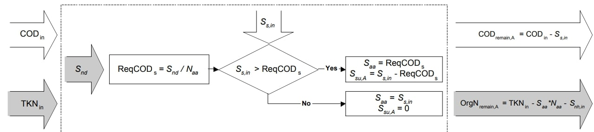
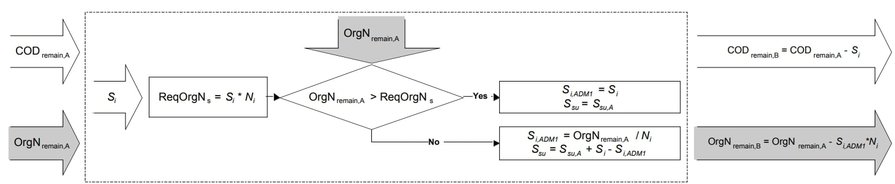
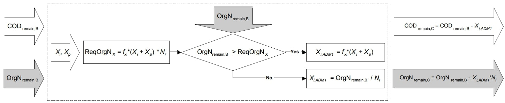
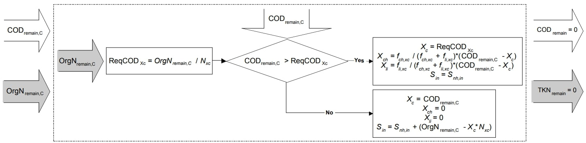

ASM1 to ADM1 Translator
=======================

Introduction
------------

A link is required to translate between biological and physically- or chemically-mediated processes
to develop whole-plant modeling of wastewater treatment. This model mediates the interaction between
the Activated Sludge Model 1 (ASM1)  and the Anaerobic Digester Model 1 (ADM1).

The model relies on the following key assumptions:

   * supports only liquid phase
   * supports only ASM1 to ADM1 translations

.. index::
   pair: watertap.unit_models.translators.translator_asm1_adm1;translator_asm1_adm1

.. currentmodule:: watertap.unit_models.translators.translator_asm1_adm1

Degrees of Freedom
------------------
The translator degrees of freedom are the inlet feed state variables:

    * temperature
    * pressure
    * volumetric flowrate
    * solute compositions
    * cations
    * anions

Ports
-----

This model provides two ports:

* inlet
* outlet

Sets
----
.. csv-table::
   :header: "Description", "Symbol", "Indices"

   "Time", ":math:`t`", "[0]"
   "Inlet/outlet", ":math:`x`", "['in', 'out']"
   "Phases", ":math:`p`", "['Liq']"
   "Inlet Components", ":math:`j`", "['H2O', 'S_I', 'S_S', 'X_I', 'X_S', 'X_BH', 'X_BA', 'X_P', 'S_O', 'S_NO', 'S_NH', 'S_ND', 'X_ND', 'S_ALK']"
   "Ion", ":math:`j`", "['S_cat', 'S_an'] \  :sup:`*`"
   "Outlet Components", ":math:`j`", "['H2O', 'S_su', 'S_aa', 'S_fa', 'S_va', 'S_bu', 'S_pro', 'S_ac', 'S_h2', 'S_ch4', 'S_IC', 'S_IN', 'S_I', 'X_c', 'X_ch', 'X_pr', 'X_li', 'X_su', 'X_aa', 'X_fa', 'X_c4', 'X_pro', 'X_ac', 'X_h2', 'X_I', 'S_cat', 'S_an', 'S_co2']"

**Notes**
 :sup:`*` Ion" is a subset of "Component" and uses the same symbol j.

ASM1 Components
---------------
Additional documentation on the ASM1 property model can be found here: `Activated Sludge Model 1 Documentation <https://watertap.readthedocs.io/en/latest/technical_reference/property_models/ASM1.html>`_

.. csv-table::
  :header: "Description", "Symbol", "Variable"

  "Soluble inert organic matter, S_I", ":math:`S_I`", "S_I"
  "Readily biodegradable substrate, S_S", ":math:`S_S`", "S_S"
  "Particulate inert organic matter, X_I", ":math:`X_I`", "X_I"
  "Slowly biodegradable substrate, X_S", ":math:`X_S`", "X_S"
  "Active heterotrophic biomass, X_BH", ":math:`X_{BH}`", "X_BH"
  "Active autotrophic biomass, X_BA", ":math:`X_{BA}`", "X_BA"
  "Particulate products arising from biomass decay, X_P", ":math:`X_P`", "X_P"
  "Oxygen, S_O", ":math:`S_O`", "S_O"
  "Nitrate and nitrite nitrogen, S_NO", ":math:`S_{NO}`", "S_NO"
  ":math:`{NH_{4}}^{+}` + :math:`NH_{3}` Nitrogen, S_NH", ":math:`S_{NH}`", "S_NH"
  "Soluble biodegradable organic nitrogen, S_ND", ":math:`S_{ND}`", "S_ND"
  "Particulate biodegradable organic nitrogen, X_ND", ":math:`X_{ND}`", "X_ND"
  "Alkalinity, S_ALK", ":math:`S_{ALK}`", "S_ALK"

ADM1 Components
---------------
Additional documentation on the ADM1 property model can be found here: `Anaerobic Digestion Model 1 Documentation <https://watertap.readthedocs.io/en/latest/technical_reference/property_models/ADM1.html>`_

.. csv-table::
  :header: "Description", "Symbol", "Variable"

  "Monosaccharides, S_su", ":math:`S_{su}`", "S_su"
  "Amino acids, S_aa", ":math:`S_{aa}`", "S_aa"
  "Long chain fatty acids, S_fa", ":math:`S_{fa}`", "S_fa"
  "Total valerate, S_va", ":math:`S_{va}`", "S_va"
  "Total butyrate, S_bu", ":math:`S_{bu}`", "S_bu"
  "Total propionate, S_pro", ":math:`S_{pro}`", "S_pro"
  "Total acetate, S_ac", ":math:`S_{ac}`", "S_ac"
  "Hydrogen gas, S_h2", ":math:`S_{h2}`", "S_h2"
  "Methane gas, S_ch4", ":math:`S_{ch4}`", "S_ch4"
  "Inorganic carbon, S_IC", ":math:`S_{IC}`", "S_IC"
  "Inorganic nitrogen, S_IN", ":math:`S_{IN}`", "S_IN"
  "Soluble inerts, S_I", ":math:`S_I`", "S_I"
  "Composites, X_c", ":math:`X_c`", "X_c"
  "Carbohydrates, X_ch", ":math:`X_{ch}`", "X_ch"
  "Proteins, X_pr", ":math:`X_{pr}`", "X_pr"
  "Lipids, X_li", ":math:`X_{li}`", "X_li"
  "Sugar degraders, X_su", ":math:`X_{su}`", "X_su"
  "Amino acid degraders, X_aa", ":math:`X_{aa}`", "X_aa"
  "Long chain fatty acid (LCFA) degraders, X_fa", ":math:`X_{fa}`", "X_fa"
  "Valerate and butyrate degraders, X_c4", ":math:`X_{c4}`", "X_c4"
  "Propionate degraders, X_pro", ":math:`X_{pro}`", "X_pro"
  "Acetate degraders, X_ac", ":math:`X_{ac}`", "X_ac"
  "Hydrogen degraders, X_h2", ":math:`X_{h2}`", "X_h2"
  "Particulate inerts, X_I", ":math:`X_I`", "X_I"
  "Total cation equivalents concentration, S_cat", ":math:`S_{cat}`", "S_cat"
  "Total anion equivalents concentration, S_an", ":math:`S_{an}`", "S_an"
  "Carbon dioxide, S_co2", ":math:`S_{co2}`", "S_co2"

**NOTE:** :math:`S_{h2}` **and** :math:`S_{ch4}` **have vapor phase and liquid phase,** :math:`S_{co2}` **only has vapor phase, and the other components only have liquid phase. The amount of** :math:`CO_2` **dissolved in the liquid phase is equivalent to** :math:`S_{IC} - S_{HCO3^{-}}` **.**

Parameters
----------

.. csv-table::
   :header: "Description", "Symbol", "Parameter Name", "Value", "Units"

   "Nitrogen fraction in particulate products", ":math:`i_{xe}`", "i_xe", 0.06, ":math:`\text{dimensionless}`"
   "Nitrogen fraction in biomass", ":math:`i_{xb}`", "i_xb", 0.08, ":math:`\text{dimensionless}`"
   "Anaerobic degradable fraction of :math:`X_I` and:math:`X_P`", ":math:`f_{xI}`", "f_xI", 0.05, ":math:`\text{dimensionless}`"

Equations and Relationships
---------------------------
.. csv-table::
   :header: "Description", "Equation"

   "Pressure balance", ":math:`P_{out} = P_{in}`"
   "Temperature balance", ":math:`T_{out} = T_{in}`"
   "Volumetric flow equality", ":math:`F_{out} = F_{in}`"

COD Equations
-------------
The total incoming COD is reduced in a step-wise manner until the COD demand has been satisfied. The reduction is based on a
hierarchy of ASM1 state variables such that :math:`S_s` is reduced by the COD demand first. If there is insufficient
:math:`S_s` present, then :math:`S_s` is reduced to zero and the remaining demand is subtracted from :math:`X_s`. If necessary, :math:`X_{BH}` and :math:`X_{BA}` may also need to be reduced.

.. csv-table::
   :header: "Description", "Equation"

   "COD demand", ":math:`COD_{demand} = S_{o} + 2.86S_{NO}`"
   "Readily biodegradable substrate remaining (step 1)", ":math:`S_{S, inter} = S_{S} - COD_{demand}`"
   "Slowly biodegradable substrate remaining (step 2)", ":math:`X_{S, inter} = X_{S} - COD_{demand, 2}`"
   "Active heterotrophic biomass remaining (step 3)", ":math:`X_{BH, inter} = X_{BH} - COD_{demand, 3}`"
   "Active autotrophic biomass remaining (step 4)", ":math:`X_{BA, inter} = X_{BA} - COD_{demand, 4}`"
   "Soluble COD", ":math:`COD_{s} = S_{I} + S_{S, inter}`"
   "Particulate COD", ":math:`COD_{p} = X_{I} + X_{S, inter} + X_{BH, inter} + X_{BA, inter} + X_{P}`"
   "Total COD", ":math:`COD_{t} = COD_{s} + COD_{p}`"

TKN Equation
------------
The Total incoming Kjeldahl nitrogen is calculated with components updated in the anaerobic environment.

.. csv-table::
   :header: "Description", "Equation"

   "Total Kjeldahl nitrogen", ":math:`TKN = S_{NH} + S_{ND} + X_{ND} + i_{xb}(X_{BH, inter} + X_{BA, inter}) + i_{xe}(X_{I} + X_{P})`"

:math:`S_{nd}` and :math:`S_s` Mapping Equations
------------------------------------------------

    Figure 1. Schematic illustration of :math:`S_{nd}` and :math:`S_s` mapping (Copp et al. 2006)

.. csv-table::
   :header: "Description", "Equation"

   "Required soluble COD", ":math:`ReqCOD_{s} = \frac{S_{ND}}{N_{aa} * 14}`"
   "Amino acids mapping (if :math:`S_{S,inter} > ReqCOD_{s}`)", ":math:`S_{aa} = ReqCOD_{s}`"
   "Amino acids mapping (if :math:`S_{S,inter} ≤ ReqCOD_{s}`)", ":math:`S_{aa} = S_{S, inter}`"
   "Monosaccharides mapping step A (if :math:`S_{S,inter} > ReqCOD_{s}`)", ":math:`S_{su, A} = S_{S, inter} - ReqCOD_{s}`"
   "Monosaccharides mapping step A (if :math:`S_{S,inter} ≤ ReqCOD_{s}`)", ":math:`S_{su, A} = 0`"
   "COD remaining from step A", ":math:`COD_{remain, A} = COD_{t} - S_{S,inter}`"
   "Organic nitrogen pool remaining from step A", ":math:`OrgN_{remain, A} = TKN - (S_{aa} * N_{aa} * 14) - S_{NH}`"

Soluble Inert COD Mapping Equations
-----------------------------------

    Figure 2. Schematic illustration of soluble inert COD mapping (Copp et al. 2006)

.. csv-table::
   :header: "Description", "Equation"

   "Required soluble inert organic nitrogen", ":math:`OrgN_{s, req} = S_{I} * N_{I} * 14`"
   "Soluble inert mapping step B (if :math:`OrgN_{remain, A} > OrgN_{s, req}`)", ":math:`S_{I, ADM1} = S_{I}`"
   "Soluble inert mapping step B (if :math:`OrgN_{remain, A} ≤ OrgN_{s, req}`)", ":math:`S_{I, ADM1} = \frac{OrgN_{remain, A}}{N_{I} * 14}`"
   "Monosaccharides mapping step B (if :math:`OrgN_{remain, A} > OrgN_{s, req}`)", ":math:`S_{su} = S_{su, A}`"
   "Monosaccharides mapping step B (if :math:`OrgN_{remain, A} ≤ OrgN_{s, req}`)", ":math:`S_{su} = S_{su, A} + S_{I} - S_{I, ADM1}`"
   "COD remaining from step B", ":math:`COD_{remain, B} = COD_{remain, A} - S_{I}`"
   "Organic nitrogen pool remaining from step B", ":math:`OrgN_{remain, B} = OrgN_{remain, A} - (S_{I, ADM1} * N_{I} * 14)`"

Particulate Inert COD Mapping Equations
---------------------------------------

    Figure 3. Schematic illustration of particulate inert COD mapping (Copp et al. 2006)

.. csv-table::
   :header: "Description", "Equation"

   "Required particulate inert material", ":math:`OrgN_{x, req} = f_{xi} * (X_{P} + X_{I}) * N_{I} * 14`"
   "Particulate inert mapping step C (if :math:`OrgN_{remain, B} > OrgN_{x, req}`)", ":math:`X_{I, ADM1} = f_{xi} * (X_{P} + X_{I})`"
   "Particulate inert mapping step C (if :math:`OrgN_{remain, B} ≤ OrgN_{x, req}`)", ":math:`X_{I, ADM1} = \frac{OrgN_{remain, B}}{N_{I} * 14}`"
   "COD remaining from step C", ":math:`COD_{remain, C} = COD_{remain, B} - X_{I, ADM1}`"
   "Organic nitrogen pool remaining from step C", ":math:`OrgN_{remain, C} = OrgN_{remain, B} - (X_{I_ADM1} * N_{I} * 14)`"

Final COD and TKN Mapping Equations
-----------------------------------

    Figure 4. Schematic illustration of final COD and TKN mapping (Copp et al. 2006)

.. csv-table::
   :header: "Description", "Equation"

   "Required soluble COD", ":math:`COD_{Xc, req} = \frac{OrgN_{remain, C}}{N_{xc} * 14}`"
   "Composites mapping (if :math:`COD_{remain, C} > COD_{Xc, req}`)", ":math:`X_{C} = COD_{Xc, req}`"
   "Composites mapping (if :math:`COD_{remain, C} ≤ COD_{Xc, req}`)", ":math:`X_{C} = COD_{remain, C}`"
   "Carbohydrates mapping (if :math:`COD_{remain, C} > COD_{Xc, req}`)", ":math:`X_{ch} = \frac{f_{ch, xc} (COD_{remain, C} - X_{C})}{f_{ch, xc} - f_{li, xc}}`"
   "Carbohydrates mapping (if :math:`COD_{remain, C} ≤ COD_{Xc, req}`)", ":math:`X_{ch} = 0`"
   "Lipids mapping (if :math:`COD_{remain, C} > COD_{Xc, req}`)", ":math:`X_{li} = \frac{f_{li, xc} (COD_{remain, C} - X_{C})}{f_{ch, xc} - f_{li, xc}}`"
   "Lipdis mapping (if :math:`COD_{remain, C} ≤ COD_{Xc, req}`)", ":math:`X_{li} = 0`"
   "Inorganic nitrogen mapping (if :math:`COD_{remain, C} > COD_{Xc, req}`)", ":math:`S_{IN} = S_{NH, in}`"
   "Inorganic nitrogen mapping (if :math:`COD_{remain, C} ≤ COD_{Xc, req}`)", ":math:`S_{IN} = S_{NH, in} + (OrgN_{remain, C} - X_{C} * N_{xc} * 14)`"
   "Anions balance", ":math:`S_{an} = \frac{S_{IN}}{14}`"
   "Cations balance", ":math:`S_{cat} = \frac{S_{IC}}{12}`"

Classes
-------
.. currentmodule:: watertap.unit_models.translators.translator_asm1_adm1

.. autoclass:: TranslatorDataASM1ADM1
    :members:
    :noindex:

References
----------
[1] Copp J. and Jeppsson, U., Rosen, C., 2006.
Towards an ASM1 - ADM1 State Variable Interface for Plant-Wide Wastewater Treatment Modeling.
Proceedings of the Water Environment Federation, 2003, pp 498-510.
https://www.accesswater.org/publications/proceedings/-290550/towards-an-asm1---adm1-state-variable-interface-for-plant-wide-wastewater-treatment-modeling
